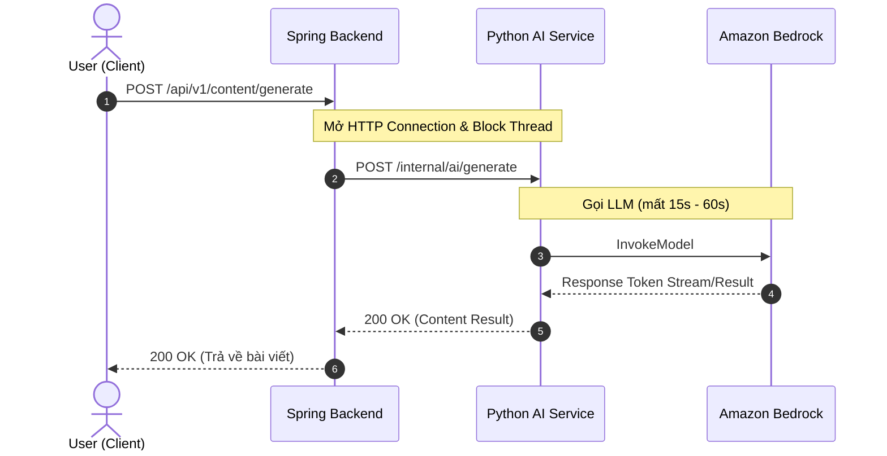
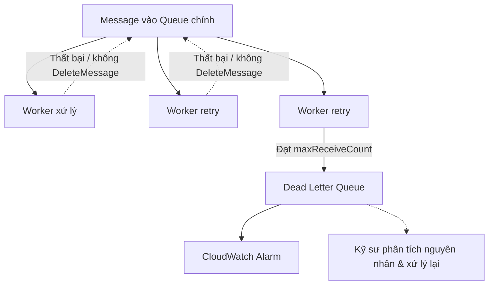

import { Card, Cards } from 'fumadocs-ui/components/card';
import { Callout } from 'fumadocs-ui/components/callout';
import { Step, Steps } from 'fumadocs-ui/components/steps';
import { Tab, Tabs } from 'fumadocs-ui/components/tabs';
import { Zap, ShieldAlert, AlertTriangle, CheckCircle2, RefreshCw, Layers, Database, Code2, Server, Scale, Clock, Box, Cpu, AlertCircle } from 'lucide-react';

## 1. Vấn đề khi Spring Boot gọi trực tiếp Python AI Service

Trước khi đưa hàng đợi vào hệ thống, hãy xem xét mô hình Spring Boot gọi trực tiếp Python AI Service REST API:



<div className="text-center">
**Luồng User cần sinh bài viết từ ý tưởng đã đề xuất**
</div>

Khi triển khai theo luồng trên, hệ thống gặp phải các rủi ro:

### 1.1. Nghẽn Thread Pool tại Spring Boot và giới hạn xử lý tại Python
Mỗi HTTP request từ client vào Spring Boot có thể chiếm dụng một thread trong Tomcat Worker Thread Pool. Với cấu hình mặc định, Tomcat có tối đa khoảng 200 worker threads.

- Vì API call sang Python AI Service có thể kéo dài 15–60 giây, thread của Spring Boot phải chờ response và không thể xử lý request khác trong thời gian đó.
- Khi số lượng request đồng thời vượt quá khả năng xử lý của Thread Pool, các request mới phải chờ hoặc có thể bị từ chối.
- Hậu quả là các API nhẹ khác như đăng nhập, xem danh sách bài viết hoặc lấy thông tin user cũng có thể bị ảnh hưởng (Cascading Failure).
- Tương tự, Python AI Service cũng có giới hạn xử lý đồng thời. Các tác vụ RAG có thể tiêu tốn CPU, RAM, GPU hoặc giới hạn worker; khi lượng job vượt quá khả năng xử lý, các job phải chờ hoặc bị quá tải.

### 1.2. Trải nghiệm người dùng kém
Người dùng phải chờ màn hình loading trong nhiều chục giây trong khi AI xử lý. Với request đồng bộ kéo dài 15–60 giây, kết nối HTTP giữa trình duyệt/mobile app và backend có thể bị timeout hoặc ngắt kết nối nếu Reverse Proxy như NGINX, Cloudflare hoặc client có thời gian timeout ngắn hơn thời gian xử lý.

Khi kết nối bị ngắt, người dùng có thể không nhận được kết quả dù Python AI Service vẫn đang tiếp tục xử lý request.

### 1.3. Service Python sập gây mất dữ liệu
Xử lý AI/RAG có thể tiêu tốn đáng kể RAM/CPU/GPU và phụ thuộc vào các dịch vụ bên ngoài như Amazon Bedrock. Trong quá trình xử lý có thể xảy ra các lỗi như OOM (Out of Memory), Python process crash hoặc Bedrock Rate Limit/ThrottlingException.

Khi Python AI Service gặp lỗi trong quá trình xử lý:

- Với mô hình đồng bộ, request đang chờ có thể kết thúc với lỗi 500 Internal Server Error hoặc 504 Gateway Timeout.
- Nếu request bị ngắt giữa chừng, backend không có cơ chế lưu giữ và xử lý lại job một cách bền bỉ nếu chỉ dựa trên HTTP request.
- Người dùng có thể phải thực hiện lại yêu cầu, gây mất công việc đang xử lý và trải nghiệm không tốt.

---

## 2. Giải pháp: Asynchronous Messaging với AWS SQS  

Hệ thống chuyển từ mô hình xử lý đồng bộ sang Asynchronous Messaging, sử dụng AWS SQS làm message queue trung gian giữa Spring Boot và Python AI Service. Hai service được tách rời về thời gian xử lý, cho phép Python xử lý AI job độc lập với HTTP request của người dùng.


## Luồng xử lý mới

<Steps>

<Step>

### Khởi tạo Job và Reponse

Khi người dùng yêu cầu sinh nội dung, Spring Boot tạo metadata của Job trong **RDS** với trạng thái `PENDING`, lưu dữ liệu đầu vào hoặc thông tin tham chiếu vào **S3**, sau đó gửi message vào **AWS SQS**.

```json
{
  "jobId": "job-984c-4a21",
  "userId": "usr-102",
  "articleIds": ["art-01", "art-02"],
  "modelParams": {
    "temperature": 0.7
  }
}
```

Sau khi Job được ghi nhận thành công, Spring Boot lập tức trả về **HTTP `202 Accepted`** kèm `jobId` cho Client. Request không cần chờ quá trình AI hoàn thành nên thread của Spring Boot được giải phóng sớm.

</Step>

<Step>

### Python AI Worker chủ động lấy Job

Python AI Service chạy dưới dạng **Worker**, chủ động lấy message từ SQS bằng **Long Polling** thay vì nhận và xử lý trực tiếp HTTP request từ Spring Boot.

Worker kiểm soát số lượng Job xử lý đồng thời dựa trên khả năng xử lý của hệ thống và giới hạn của **Amazon Bedrock**.

Sau khi nhận Job, Worker:

* Đọc dữ liệu đầu vào từ S3.
* Thực hiện quá trình **RAG**.
* Gọi **Amazon Bedrock** để sinh nội dung.
* Lưu kết quả xử lý vào S3.

</Step>

<Step>

### Lưu kết quả và cập nhật trạng thái Job

Sau khi xử lý thành công, Python AI Worker cập nhật kết quả vào **S3** và cập nhật trạng thái Job trong RDS:

```text
PENDING → COMPLETED
```

Nếu xử lý thất bại, message không được xác nhận thành công và có thể được xử lý lại sau khi **Visibility Timeout** kết thúc. Có thể kết hợp **Retry** và **Dead-Letter Queue (DLQ)** để xử lý các Job thất bại nhiều lần.

Client có thể lấy trạng thái và kết quả thông qua `jobId`:

```http
GET /jobs/{jobId}
```

Có thể sử dụng **Polling**, **SSE** hoặc **WebSocket** tùy yêu cầu về trải nghiệm realtime.

</Step>

</Steps>


---

### Trade-off: Lựa chọn giải pháp Queue

Tại sao hệ thống chọn **AWS SQS** thay vì giữ mô hình **Synchronous**, sử dụng **In-Memory Queue**, hoặc tự vận hành **RabbitMQ/Kafka**?

| Giải pháp           | Ưu điểm                                                                                              | Nhược điểm                                                                                                 | Đánh giá                               |
| ------------------- | ---------------------------------------------------------------------------------------------------- | ---------------------------------------------------------------------------------------------------------- | -------------------------------------- |
| **Synchronous**     | Đơn giản, dễ triển khai và debug                                                                     | Giữ HTTP request trong thời gian AI xử lý; dễ timeout và làm cạn kiệt thread pool; khó retry bền bỉ        | Không phù hợp với AI job 15–60 giây    |
| **In-Memory Queue** | Rất đơn giản, latency thấp, không cần thêm infrastructure                                            | Mất Job khi application restart/crash; khó scale nhiều instance; không có durability và retry đáng tin cậy | Chỉ phù hợp workload nhỏ hoặc tạm thời |
| **RabbitMQ**        | Message routing mạnh, nhiều tính năng messaging, kiểm soát tốt                                       | Phải tự vận hành cluster, monitoring, scaling, HA và backup                                                | Mạnh nhưng overkill với scope hiện tại |
| **Kafka**           | Throughput rất cao, event streaming và replay tốt                                                    | Kiến trúc và vận hành phức tạp hơn; không cần thiết nếu chỉ xử lý AI Job dạng queue                        | Không phù hợp với nhu cầu hiện tại     |
| **AWS SQS**         | Managed service, durable, retry qua Visibility Timeout, hỗ trợ DLQ, dễ scale và tích hợp tốt với AWS | Có thêm chi phí và phải xử lý duplicate message trong Standard Queue                                       | Phù hợp nhất                           |

Do hệ thống đã sử dụng các dịch vụ AWS như **RDS, S3 và Amazon Bedrock**, việc sử dụng SQS cũng giúp giảm thêm phần infrastructure cần quản lý.

> SQS không phải lựa chọn mạnh nhất về messaging hay throughput, nhưng cung cấp đúng những tính năng mà AI-Content cần với mức độ vận hành thấp hơn. Đổi lại, hệ thống phải chấp nhận **eventual consistency** và xử lý trường hợp **duplicate message** khi sử dụng SQS Standard.

---

## 3. AWS SQS

Khi sử dụng Amazon SQS trong môi trường Production cho các tác vụ AI/RAG, cần nắm rõ các cơ chế hoạt động để tránh lỗi logic.


### 4.1. Standard Queue vs. FIFO Queue

AWS SQS cung cấp 2 loại Queue với đặc tính hoàn toàn khác nhau:

<Tabs items={['Standard Queue', 'FIFO Queue']}>
<Tab value="Standard Queue">

* **Throughput:** Gần như không giới hạn (Unlimited Throughput).
* **Delivery:** **At-Least-Once Delivery** (Đảm bảo message được gửi ít nhất 1 lần, có xác suất nhỏ bị gửi trùng lặp - Duplicate).
* **Thứ tự (Ordering):** **Best-Effort Ordering** (Thứ tự gửi có thể bị đảo lộn đôi chút khi chịu tải cao).
* **Ứng dụng trong AI-Content:** Phù hợp với bài toán sinh nội dung độc lập theo `jobId`. Mỗi job xử lý một bài viết riêng biệt, không phụ thuộc vào thứ tự của các job khác. Cần thiết kế Consumer đảm bảo tính **Idempotency** (kiểm tra trạng thái Job trong DB trước khi xử lý lại).

</Tab>
<Tab value="FIFO Queue">

* **Throughput:** Mặc định tối đa 300 msg/sec (hoặc 3,000 msg/sec với High Throughput Mode).
* **Delivery:** **Exactly-Once Processing** (Không bao giờ duplicate nhờ Deduplication ID).
* **Thứ tự (Ordering):** **Strict First-In-First-Out** theo Message Group ID.
* **Tên Queue:** Bắt buộc phải có hậu tố `.fifo`.
* **Ứng dụng:** Thích hợp cho các luồng xử lý tài chính, giao dịch đặt vé ghế ngồi, hoặc cập nhật trạng thái yêu cầu đúng tuần tự tuyệt đối.

</Tab>
</Tabs>

### 4.2. Visibility Timeout & Bài toán Job AI chạy lâu

Khi Python Worker nhận một message từ SQS via `ReceiveMessage`, message đó **không bị xóa ngay**, mà chỉ bị **ẩn đi** đối với các worker khác trong một khoảng thời gian gọi là **Visibility Timeout** (mặc định: 30 giây).

<Callout type="warn">
**Cạm bẫy thực tế:** 
Nếu tác vụ gọi Bedrock AI mất **45 giây**, nhưng Visibility Timeout của Queue chỉ cấu hình là **30 giây**:
1. Ở giây thứ 31, SQS coi như Worker 1 đã chết vì chưa nhận được lệnh `DeleteMessage`.
2. SQS làm message hiện trở lại queue.
3. Worker 2 lấy lại chính message đó và tiếp tục gọi Bedrock lần 2.
4. Hậu quả: Tốn gấp đôi chi phí API Bedrock và có thể sinh ra 2 bản ghi nội dung trùng lặp.
</Callout>

**Giải pháp:**
* **Cấu hình Visibility Timeout:** Tăng Visibility Timeout lên mức an toàn (ví dụ: `5 phút` hoặc `15 phút` tùy thuộc vào SLA tối đa của tác vụ AI).
* **Gia hạn Visibility Timeout (Heartbeat Pattern):** Python Worker có một thread phụ định kỳ gọi API `ChangeMessageVisibility` để "gia hạn" nếu tác vụ xử lý đang kéo dài hơn dự kiến.

```python
# python_worker.py - Cơ chế nhận và xóa message chuẩn chỉ
import boto3
import json
import time

sqs = boto3.client('sqs', region_name='ap-southeast-1')
QUEUE_URL = 'https://sqs.ap-southeast-1.amazonaws.com/123456789012/ai-content-jobs'

def process_ai_task(message_body):
    data = json.loads(message_body)
    job_id = data['jobId']
    print(f"Bắt đầu xử lý Job: {job_id}")
    # Giả lập gọi Bedrock LLM xử lý bài viết
    time.sleep(10)
    print(f"Xử lý xong Bedrock cho Job: {job_id}")

def poll_queue():
    while True:
        response = sqs.receive_message(
            QueueUrl=QUEUE_URL,
            MaxNumberOfMessages=1,
            WaitTimeSeconds=20, # Long Polling
            VisibilityTimeout=120 # Đặt an toàn 2 phút cho tác vụ AI
        )
        
        messages = response.get('Messages', [])
        if not messages:
            continue
            
        for msg in messages:
            receipt_handle = msg['ReceiptHandle']
            try:
                process_ai_task(msg['Body'])
                # Sau khi xử lý thành công, bắt buộc phải XÓA message
                sqs.delete_message(
                    QueueUrl=QUEUE_URL,
                    ReceiptHandle=receipt_handle
                )
                print("Đã xóa message khỏi SQS.")
            except Exception as e:
                print(f"Lỗi khi xử lý job: {e}")
                # Không xóa message để SQS chuyển lại cho retry hoặc DLQ
```

### 4.3. Long Polling vs. Short Polling

- Short Polling (WaitTimeSeconds = 0): Worker gọi ReceiveMessage và SQS trả về ngay lập tức. Nếu Queue không có message, response sẽ rỗng. Worker phải liên tục gọi lại API để kiểm tra message mới, dẫn đến nhiều empty responses, tăng số lượng API requests và chi phí.
- Long Polling (WaitTimeSeconds = 1 → 20): Worker gọi ReceiveMessage và yêu cầu SQS chờ tối đa thời gian được chỉ định nếu Queue chưa có message. Khi có message, SQS trả về ngay mà không cần đợi hết thời gian chờ. Điều này giúp giảm empty responses, giảm số lần gọi API và tiết kiệm chi phí.
### 4.4. Dead Letter Queue (DLQ) & Redrive Policy

Khi một Job liên tục thất bại, ví dụ prompt bị Amazon Bedrock từ chối, file đầu vào trên S3 bị lỗi hoặc Python Worker gặp exception không thể xử lý, message có thể được retry nhiều lần.

Nếu không có cơ chế giới hạn retry, một message lỗi có thể trở thành **Poison Pill**, liên tục được đưa lại cho Worker và tiêu tốn tài nguyên xử lý.



### Cơ chế hoạt động

* Worker nhận message bằng `ReceiveMessage`.
* Nếu xử lý thành công, Worker gọi `DeleteMessage`.
* Nếu xử lý thất bại và không gọi `DeleteMessage`, message sẽ trở lại Queue sau khi **Visibility Timeout** hết hạn.
* Khi message được nhận lại, `ApproximateReceiveCount` tăng lên.
* Khi số lần nhận đạt giới hạn `maxReceiveCount` trong **Redrive Policy**, SQS sẽ chuyển message sang **Dead Letter Queue (DLQ)**.


## 5. Tổng kết

Việc sử dụng **AWS SQS** trong hệ thống **AI-Content** mang lại các lợi ích kiến trúc chính:

* **Tách biệt xử lý (Decoupling):** Spring Boot nhanh chóng tiếp nhận request và tạo Job, trong khi Python AI Worker xử lý tác vụ RAG/AI độc lập theo năng lực xử lý của mình.

* **Khả năng chịu lỗi (Fault Tolerance):** Job được lưu trong SQS và không phụ thuộc vào vòng đời của Python Worker. Nếu Worker gặp sự cố trước khi `DeleteMessage`, message có thể được SQS đưa trở lại để xử lý lại sau khi Visibility Timeout hết hạn.

* **Kiểm soát tài nguyên và Rate Limit:** Worker có thể giới hạn số lượng Job xử lý đồng thời và điều tiết tốc độ gọi **Amazon Bedrock**, giúp tránh tạo quá nhiều request cùng lúc và giảm nguy cơ gặp `ThrottlingException`.

* **Vận hành ổn định:** Kết hợp **Long Polling**, **Visibility Timeout**, **Retry** và **Dead Letter Queue (DLQ)** giúp hệ thống xử lý Job dài, cô lập Job lỗi và có khả năng mở rộng Worker khi lượng Job tăng.

Tổng thể, SQS phù hợp với AI-Content vì giúp chuyển quá trình tạo nội dung từ mô hình **synchronous request-response** sang **asynchronous job processing**, cho phép hệ thống tiếp nhận nhiều yêu cầu mà không buộc Spring Boot phải chờ quá trình AI hoàn thành.
