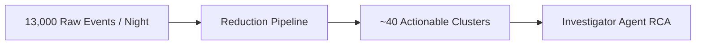
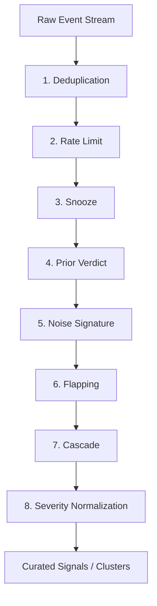
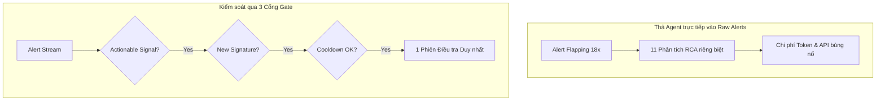
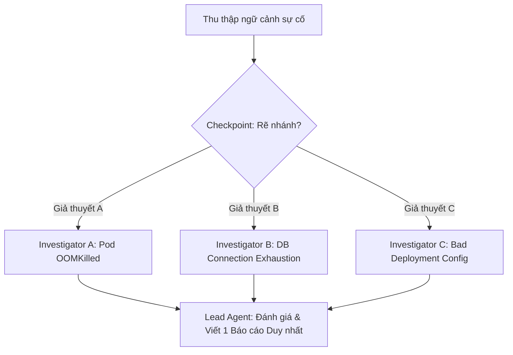
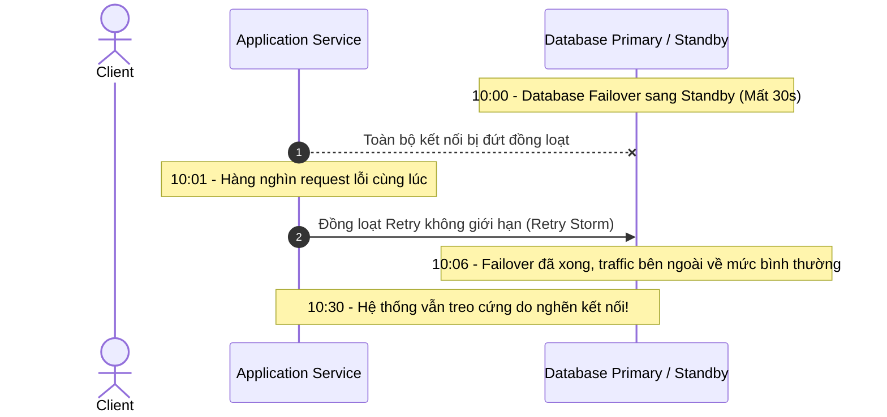
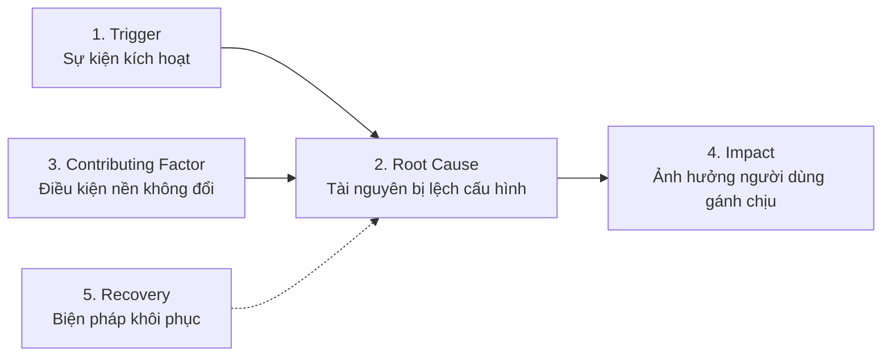

import { Card, Cards } from 'fumadocs-ui/components/card';
import { Callout } from 'fumadocs-ui/components/callout';
import { Step, Steps } from 'fumadocs-ui/components/steps';
import { Tab, Tabs } from 'fumadocs-ui/components/tabs';
import { ShieldAlert, Terminal, Cloud, Cpu, Layers, CheckCircle2, AlertTriangle, Lock, UserCheck, Search, FileText, Filter, Zap, Activity, Clock, Database, GitBranch, ArrowRight } from 'lucide-react';

Ở **Day 01**, chúng ta đã thiết lập ranh giới kiểm soát an toàn cho Agent (**Govern**): Agent chạy với quyền Read-Only, không thể tự ý thay đổi hạ tầng và mọi nhận định đều phải có chứng cứ xác thực. 

Bước sang **Day 02**, bài toán chuyển sang một câu hỏi phức tạp hơn: **Điều gì thực sự gây ra sự cố trên hệ thống ngay lúc này?** Để trả lời được câu hỏi này, ranh giới đầu tiên cần thiết lập không phải là quyền hạn của Agent, mà chính là **ranh giới kiểm soát tín hiệu (Signal Boundary)** trước khi dữ liệu đến được Agent.

---

## 1. Không thể điều tra thứ không thể xếp hạng

Trong một ca trực đêm thực tế, hệ thống không bao giờ gửi đến một cảnh báo đơn lẻ. Nó đổ về như một dòng lũ tín hiệu (Signal Stream):
- **02:14:** Một cảnh báo phân quyền kích hoạt trên một Production IAM Role.
- **02:14:** 180 dòng log `AccessDenied` xuất hiện đồng loạt trong Audit Log.
- **02:15:** 3 cảnh báo có nội dung gần như giống hệt nhau đổ về từ 3 microservices khác nhau.
- **02:16:** Kỹ sư On-call mở cùng lúc 5 dashboard và tab giám sát khác nhau cho cùng một vấn đề cốt lõi.

Trong thực tế, một workspace vận hành có thể ghi nhận khoảng **13,000 raw events** mỗi đêm. Sau khi xử lý, con số này cần được gom nhóm lại thành khoảng **40 clusters** thực sự có ý nghĩa để hành động. Lúc nửa đêm, khó khăn không nằm ở kỹ năng điều tra, mà nằm ở việc **chọn đúng vấn đề cần điều tra**.



### Cái giá của các giải pháp xử lý cảnh báo truyền thống

Hầu hết các đội ngũ kỹ thuật đều từng thử qua 4 cách tiếp cận dưới đây, và mỗi cách đều phải trả một cái giá đắt:

| Cách xử lý truyền thống | Cái giá phải trả |
| :--- | :--- |
| **Tuyển thêm kỹ sư On-call** | Kiệt sức (Burnout), và lượng cảnh báo vẫn tiếp tục tăng vào quý tiếp theo. |
| **Nâng ngưỡng cảnh báo (Thresholds)** | Bỏ lọt sự cố nghiêm trọng (Critical) vì nó nằm dưới ngưỡng vừa nâng. |
| **Mute các kênh thông báo ồn ào** | Tạo ra điểm mù trong hệ thống mà không ai sở hữu hay nhớ lý do đã tắt. |
| **Dựng thêm Dashboard mới** | Thêm một màn hình không ai kịp đọc vào lúc 02:14 sáng. |

<Callout type="warn">

Mỗi cách xử lý trên thực chất là một quyết định ngầm về việc **bạn chấp nhận đánh mất thông tin gì**. Chúng thường được đưa ra vội vã, không được ghi chép và tạo ra lỗ hổng quản trị nghiêm trọng đối với luồng dữ liệu giám sát.

</Callout>

---

## 2. Giảm nhiễu theo tầng, không phải qua một bộ lọc đơn lẻ

Quy trình xử lý tín hiệu (**Signal Reduction Pipeline**) chuẩn bao gồm 4 giai đoạn: **Ingest (Thu nạp) → Suppress (Ẩn/Triệt tiêu) → Correlate (Tương quan) → Classify & Route (Phân loại & Định tuyến)**.

Trọng tâm của quy trình nằm ở bước **Suppress**. Đây không phải là một bộ lọc duy nhất, mà là **8 tầng lọc có thứ tự ưu tiên (Priority Order)**. Tầng nào khớp trước sẽ quyết định số phận của event đó.



### Chi tiết 8 tầng triệt tiêu nhiễu

| Thứ tự | Tầng lọc (Layer) | Đối tượng triệt tiêu / Xử lý |
| :---: | :--- | :--- |
| **1** | **Deduplication** | Loại bỏ các bản sao chính xác (Exact repeats) của cùng một event. |
| **2** | **Rate Limit** | Cắt các đợt bùng phát lưu lượng vượt ngưỡng cho phép trên mỗi định danh (Key). |
| **3** | **Snooze** | Các tín hiệu mà con người chủ động tạm ẩn trong một khoảng thời gian. |
| **4** | **Prior Verdict** | Các mẫu tín hiệu đã được kỹ sư thẩm định và đóng lại là "Noise" trong quá khứ. |
| **5** | **Noise Signature** | Các mẫu tĩnh đã biết là vô hại trong hệ thống (Known benign patterns). |
| **6** | **Flapping** | Tín hiệu metric dao động liên tục qua lại quanh ngưỡng kích hoạt cảnh báo. |
| **7** | **Cascade** | Các tác động dây chuyền hạ nguồn sinh ra từ một tín hiệu gốc đã được ghi nhận. |
| **8** | **Severity Normalization** | Không loại bỏ event, mà chuẩn hóa lại mức độ nghiêm trọng mà công cụ nguồn gán nhãn sai. |

<Callout type="info">

**Hai tầng quan trọng cần lưu ý:**
- **Cascade:** Là tầng loại bỏ lượng nhiễu lớn nhất. Tuy nhiên, nếu tín hiệu gốc mà nó quy tụ vào bị xác định sai, tầng này có nguy cơ che giấu một sự cố nghiêm trọng khác đang diễn ra song song.
- **Prior Verdict (Học từ quá khứ):** Một Background Agent liên tục đọc các sự cố kỹ sư đã xử lý và đóng lại, trích xuất các pattern nhiễu lặp lại để cập nhật vào tầng này. Nhờ đó, danh sách lọc tự động thông minh hơn theo thời gian mà không cần bảo trì thủ công.

</Callout>

---

## 3. Mọi quy tắc ẩn tín hiệu đều cần cơ chế thoát (Escape Hatch)

Một quy tắc im lặng (Silence rule) nếu không có hạn sử dụng hoặc không thể ghi đè sẽ biến thành **điểm mù vĩnh viễn**.

### 3 nguyên tắc bảo vệ quy tắc lọc

| Cơ chế | Cách thức vận hành |
| :--- | :--- |
| **Cửa sổ thời gian mở rộng (Growing Window)** | Mẫu nhiễu được xác nhận lần 1 sẽ ẩn trong **6 giờ**. Xác nhận lại: **24 giờ**. Xác nhận tiếp: **7 ngày**. |
| **Ghi đè khi có tín hiệu nghiêm trọng (Bypass)** | Nếu một tín hiệu **High** hoặc **Critical** khớp pattern, nó vẫn được cho qua và reset cửa sổ thời gian về 0. |
| **Mở khóa thủ công (Release)** | Khi một kỹ sư bấm Unmute hoặc tín hiệu được liên kết vào một Incident thực tế, quy tắc ẩn lập tức bị hủy bỏ. |

<Callout type="warn">

**Nguyên tắc lưu trữ:** Tín hiệu bị ẩn (**Suppressed**) chỉ bị chặn không đánh thức On-call, chứ **không bị xóa khỏi hệ thống**. Bạn luôn có thể truy vấn lại để kiểm tra hệ thống đã ẩn những gì trong đêm qua.

</Callout>

---

## 4. Giảm nhiễu là điều kiện để AI Investigator Agent khả thi về chi phí

Việc đưa AI Agent vào điều tra sự cố không phải vì mục đích "phép thuật hóa", mà xuất phát từ **bài toán kinh tế**.

Xét một ví dụ thực tế: Một CloudWatch Alarm dao động (flapping) 18 lần trong 53 phút. Nếu mỗi lần kích hoạt đều tự động gọi một LLM Agent để chạy phân tích nguyên nhân gốc rễ (RCA), bạn sẽ có **11 phiên điều tra riêng biệt cho cùng một vấn đề và phải thanh toán 11 hóa đơn API**.



### 3 Cổng kiểm soát (Gates) trước khi kích hoạt Agent

Một cụm tín hiệu (Cluster) chỉ được phép kích hoạt AI Investigator Agent khi thỏa mãn cả 3 điều kiện:

1. **Có ít nhất một tín hiệu hành động được (Actionable Signal):** Một cụm chỉ chứa toàn các tín hiệu đã bị suppress sẽ không bao giờ kích hoạt Agent.
2. **Chữ ký mới, không trùng lặp (New Signature):** Chỉ riêng lưu lượng alert tăng lên không đủ điều kiện kích hoạt lại. Phải có yếu tố mới về pattern.
3. **Không có phiên điều tra nào gần đây trên cùng Cluster (Cooldown):** Áp dụng thời gian hồi chiêu được cấu hình trên toàn workspace.

---

## 5. Phân rã giả thuyết, không phân rã khối lượng công việc

Khi điều tra sự cố, cách Agent phân chia công việc quyết định độ chính xác và chi phí của toàn bộ quá trình.

Quy trình điều tra tiêu chuẩn: **Thu thập ngữ cảnh ban đầu → Checkpoint quyết định rẽ nhánh → Chạy song song các giả thuyết → Trả về một kết luận duy nhất.**



### Nguyên tắc phân bổ giả thuyết

- **Fan-out theo giả thuyết, không theo workload:** Kích hoạt từ 2 đến 4 Read-Only Investigator Agent chạy song song (tối đa là 8). Mỗi Agent kiểm chứng một lời giải thích khác nhau trên cùng một tập bằng chứng.
- **Các Sub-agent không ghi đè kết luận:** Các sub-agent chỉ thu thập và đối soát bằng chứng; duy nhất **Lead Agent** tổng hợp và đưa ra một báo cáo phân tích duy nhất.
- **Kỹ năng tìm kiếm Discriminating Query (Truy vấn phân định):** Đây là năng lực quan trọng nhất. Đó là câu truy vấn mà kết quả trả về sẽ khác nhau tùy thuộc vào giả thuyết nào là đúng.

<Callout type="info">

**Ví dụ về Truy vấn phân định:** Nếu giả thuyết A là "Lỗi do cạn kiệt Connection Pool" và giả thuyết B là "Lỗi do Pod bị OOMKilled", thì việc truy vấn `kubectl get pods -o jsonpath='{.status.containerStatuses[*].state.terminated.reason}'` là một câu hỏi phân định. Nếu kết quả là `OOMKilled`, giả thuyết A lập tức bị loại trừ.

</Callout>

---

## 6. Thứ tự thời gian không phải bằng chứng của quan hệ nhân quả

Trong điều tra sự cố Cloud, sự trùng hợp về mặt thời gian rất dễ đánh lừa kỹ sư. Có 3 bẫy tư duy phổ biến:

| Bẫy tư duy | Biểu hiện thực tế |
| :--- | :--- |
| **Xảy ra sau không có nghĩa là do cái trước gây ra (After is not because)** | Deploy lúc 10:02, Latency tăng lúc 10:05. Nếu không vẽ được đường dẫn logic kết nối giữa bản deploy và latency, đó chỉ là sự trùng hợp về thời gian. |
| **Cả hai đều là triệu chứng của nguyên nhân chung (Shared Cause)** | Hai metric cùng tăng đột biến vì một dịch vụ phía trên thay đổi. Bản thân hai metric này không gây ra nhau. |
| **Tác nhân kích hoạt đã biến mất (Trigger is gone)** | Cơn bùng phát tải bắt đầu sự cố đã kết thúc từ 1 tiếng trước, nhưng hệ thống vẫn nghẽn. Thứ thay đổi ban đầu không còn hiện diện để tìm nữa. |

### Case Study: Khi Retry trở thành tải chính

Hãy xem xét kịch bản kinh điển sau:



Phân tích bản chất sự cố:
- **Trigger (Tác nhân kích hoạt):** Database failover (đã hoàn thành, không còn gì để rollback).
- **Root Cause (Nguyên nhân gốc rễ):** Cấu hình Retry policy không có giới hạn (cap) và không có thuật toán lùi thời gian ngẫu nhiên (Exponential Backoff & Jitter). Đây là thứ cấu hình sai và **vẫn đang sai**.
- **Contributing Factor (Yếu tố góp phần):** Thiếu Circuit Breaker để ngắt mạch khi hạ nguồn quá tải.

---

## 7. Nguyên nhân gốc rễ là tài nguyên có cấu hình bị thay đổi

Một đồ thị nhân quả (**Causal Graph**) trong sự cố gồm 5 loại thành phần:



### Phân định 5 loại node trong Causal Graph

| Loại Node | Ý nghĩa kỹ thuật |
| :--- | :--- |
| **Trigger** | Sự kiện khởi phát sự cố (có thể đã kết thúc và biến mất). |
| **Root cause** | **Duy nhất một tài nguyên** có cấu hình thực tế bị lệch (diverged) so với baseline, phiên bản trước đó, hoặc các tài nguyên đồng cấp. |
| **Contributing factor** | Một điều kiện góp phần gây ra lỗi nhưng bạn **không thể chứng minh là nó vừa mới thay đổi**. |
| **Impact** | Thiệt hại người dùng thực tế phải chịu (đo bằng trải nghiệm/nghiệp vụ của họ). |
| **Recovery** | Hành động thực tế đã giúp đưa hệ thống trở lại trạng thái bình thường. |

<Callout type="error">

**Tránh nhầm lẫn giữa Victim và Root Cause:** Tài nguyên hiển thị triệu chứng tồi tệ nhất trên dashboard thường chỉ là **Nạn nhân (Victim)**. Sửa chữa trên tài nguyên nạn nhân chỉ là giải pháp tạm thời (Workaround), không giải quyết được gốc rễ vấn đề.

</Callout>

---

## 8. Hệ thống tự chấm điểm không chứng minh được điều gì

Một hệ thống tự động đáng tin cậy được định nghĩa bởi **những tuyên bố mà nó từ chối đưa ra nếu thiếu bằng chứng**.

| Tuyên bố | Điều kiện bắt buộc để chứng minh |
| :--- | :--- |
| **"Độ chính xác 92%"** | Phải dựa trên đánh giá thực tế do con người nghiệm thu. Tuyệt đối không để Agent tự chấm điểm cho phiên chạy của chính nó. |
| **"A gây ra B"** | Phải vẽ được đường dẫn truy vết logic từ thay đổi của A đến tác động người dùng tại B. |
| **"Bản sửa lỗi đã thành công"** | Phải có một tiến trình kiểm tra lại (Re-check) thực sự được thực thi sau khoảng 30 phút. |
| **"Chúng tôi tự tin vào kết luận này"** | Phải có ít nhất một giả thuyết đối trọng đã được đưa ra kiểm chứng và bị bác bỏ bằng dữ liệu. |

---

### Các câu hỏi mẫu dùng để điều tra cùng Agent

```text
1. "Hệ thống đang bị suy giảm hiệu năng. Hãy mô tả triệu chứng dưới góc nhìn của người dùng cuối, và cho tôi biết những tài nguyên nào mà role của bạn không có quyền đọc."

2. "Hãy đưa ra ít nhất 2 giả thuyết khác nhau giải thích cho triệu chứng này, cả 2 đều phải phù hợp với dữ liệu hiện có."

3. "Truy vấn duy nhất nào sẽ cho ra kết quả khác nhau tùy thuộc vào giả thuyết nào là đúng? Hãy thực thi nó và hiển thị output thô."

4. "Tài nguyên nào bạn có thể chứng minh là thực sự đã thay đổi cấu hình (kèm timestamp)? Tài nguyên nào bạn chỉ đang suy đoán là đã thay đổi?"
```

---

## Thuật ngữ cốt lõi (Glossary)

<Cards>
  <Card title="Signal" icon={<Zap />}>
    Một sự kiện vận hành đơn lẻ sau khi đã chạy qua các tầng lọc triệt tiêu nhiễu.
  </Card>
  <Card title="Cluster" icon={<Layers />}>
    Tập hợp các tín hiệu có liên quan được gom nhóm lại thành một ứng viên sự cố cần xem xét.
  </Card>
  <Card title="Trigger" icon={<Activity />}>
    Sự kiện kích hoạt chuỗi sự cố ban đầu (thường đã kết thúc khi bắt đầu điều tra).
  </Card>
  <Card title="Root Cause" icon={<GitBranch />}>
    Tài nguyên duy nhất có cấu hình thực tế bị lệch so với baseline hoặc revision trước đó.
  </Card>
  <Card title="Contributing Factor" icon={<Database />}>
    Điều kiện nền làm trầm trọng thêm sự cố nhưng không thể chứng minh là vừa mới thay đổi.
  </Card>
  <Card title="Blocked Finding" icon={<Lock />}>
    Trạng thái không thể kiểm tra do thiếu quyền. Đây là một kết quả hợp lệ cần được ghi nhận vào báo cáo.
  </Card>
</Cards>

---

## Tài liệu tham khảo

- [Day 01 · Tại sao AI Agent gặp khó khăn trên Cloud?](/blogs/cloud-thinker/day-01)
