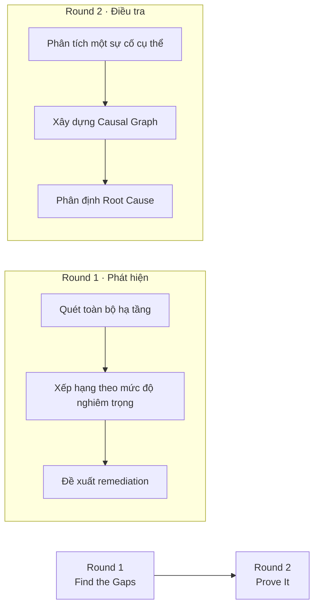
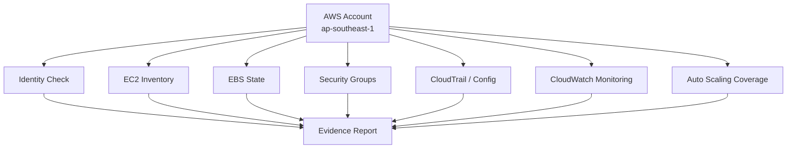
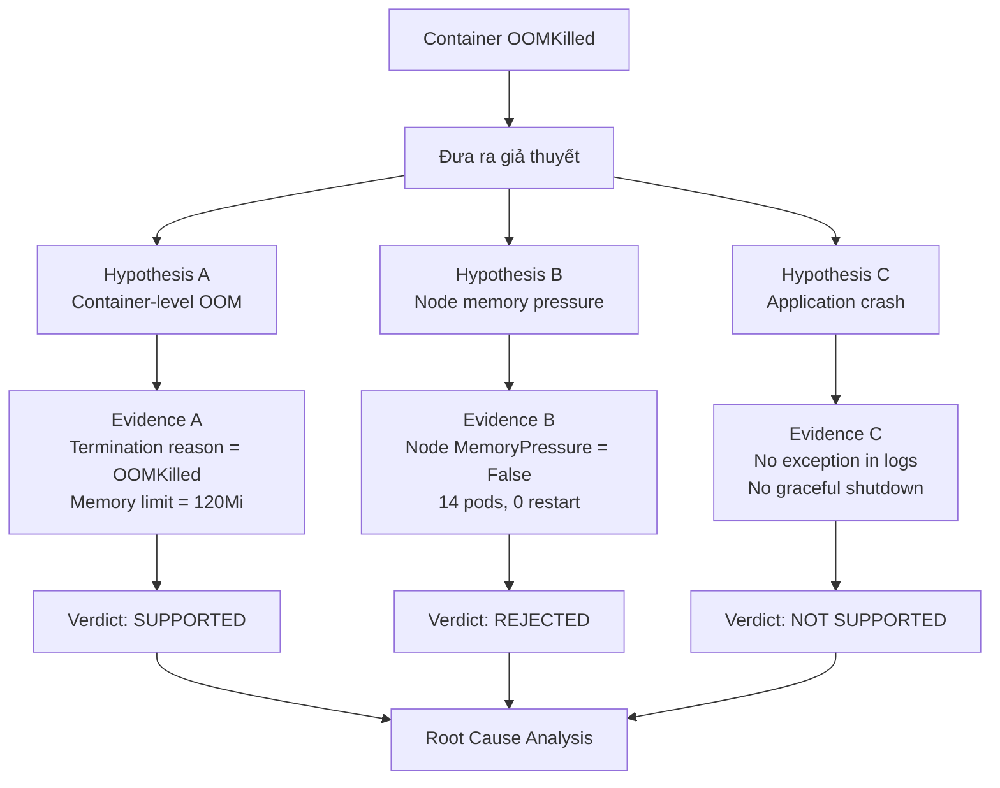
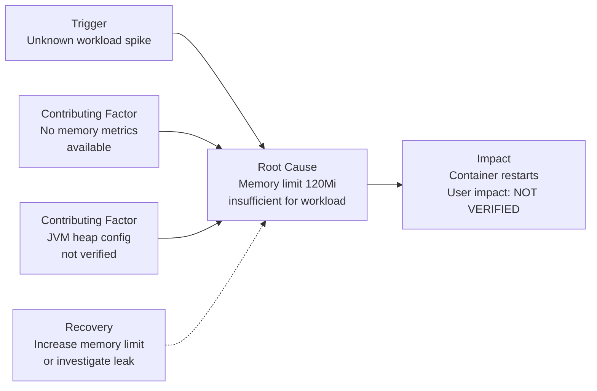
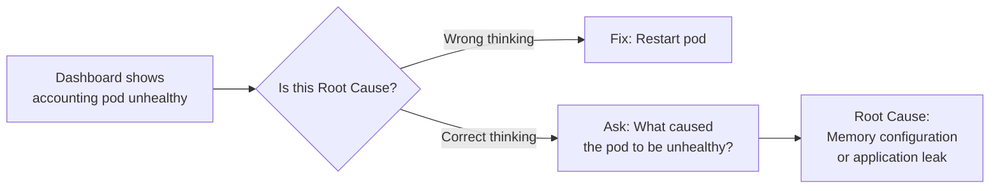

import { Card, Cards } from 'fumadocs-ui/components/card';
import { Callout } from 'fumadocs-ui/components/callout';
import { Step, Steps } from 'fumadocs-ui/components/steps';
import { Tab, Tabs } from 'fumadocs-ui/components/tabs';
import { ShieldAlert, Terminal, Cloud, Cpu, Layers, CheckCircle2, AlertTriangle, Lock, UserCheck, Search, FileText, Filter, Zap, Activity, Clock, Database, GitBranch, ArrowRight, Award, Target, Eye, Shield } from 'lucide-react';

Sau hai ngày xây dựng nền tảng kiểm soát (**Govern**) và phương pháp điều tra (**Investigate**), **Day 03** chuyển sang một thử thách thực chiến: **Prove It Arena** — một sân đấu mô phỏng môi trường Production thực tế, nơi các đội phải chứng minh khả năng phát hiện lỗ hổng và điều tra sự cố trong thời gian giới hạn.

Arena không yêu cầu đội thi sửa lỗi hay triển khai giải pháp. Thay vào đó, nó đặt trọng tâm vào **chất lượng của báo cáo điều tra**: Bạn đã kiểm chứng điều gì? Bằng chứng nào hỗ trợ? Giả thuyết nào đã bị loại trừ? Và phần nào bạn không thể kết luận do giới hạn quyền truy cập?

---

## 1. Format thi đấu: Evidence-Led Investigation

Arena chia thành hai vòng với phương pháp luận khác nhau:



### Nguyên tắc chung cho cả hai vòng

| Nguyên tắc | Ý nghĩa |
| :--- | :--- |
| **Read-only investigation** | Không được thay đổi workload, configuration hoặc infrastructure. |
| **Evidence-required claims** | Mọi nhận định phải gắn với bằng chứng cụ thể và trạng thái verification. |
| **Transparent limitation** | Phải báo cáo rõ những gì không thể kiểm tra do thiếu quyền hoặc công cụ. |
| **No remediation execution** | Chỉ đề xuất biện pháp, không thực thi sửa lỗi trong môi trường thi đấu. |

<Callout type="info">

**Tại sao không cho phép sửa lỗi?** Bởi vì trong môi trường Production thực tế, việc thay đổi hệ thống yêu cầu approval workflow, change window và rollback plan. Arena đánh giá năng lực điều tra và đưa ra khuyến nghị có chứng cứ, không phải năng lực vận hành hệ thống.

</Callout>

---

## 2. Round 1 — Find the Gaps (Tìm lỗ hổng)

Round 1 mô phỏng nhiệm vụ **Well-Architected Review**: Một đội mới tiếp quản một tài khoản AWS hoặc cluster Kubernetes và cần đánh giá nhanh tình trạng bảo mật, chi phí, độ tin cậy và vận hành.

### Phạm vi điều tra thực tế

Trong trường hợp của team **Ngũ Hành**, phạm vi được giao là:
- **Cloud Provider:** AWS
- **Region:** `ap-southeast-1`
- **Time:** 2026-09-19
- **Permission:** Read-only với một số API bị chặn (Cost Explorer, S3 posture)



### Kết quả phát hiện được xếp hạng

Sau khi quét xong hạ tầng, các phát hiện được phân loại theo mức độ ưu tiên:

<Cards>
  <Card title="P0 — Root principal in use" icon={<ShieldAlert />}>
    Caller identity resolved to `:root`. Routine operational access should use assumed role instead.
  </Card>
  <Card title="P0 — 59 unencrypted EBS volumes" icon={<Lock />}>
    EBS encryption by default is disabled. 59 volumes are unencrypted in production environment.
  </Card>
  <Card title="P0 — No audit trail" icon={<Eye />}>
    Zero CloudTrail trails and zero AWS Config recorders were returned for this account.
  </Card>
  <Card title="P1 — $215/month waste" icon={<AlertTriangle />}>
    Four detached gp2 volumes (250GB, 400GB, 600GB, 900GB) are estimated at $215 USD/month if unnecessary.
  </Card>
</Cards>

### Cấu trúc báo cáo Round 1

Một báo cáo Round 1 chất lượng cao phải bao gồm 3 block:

<Steps>

<Step>

### Block 01 · What you looked at

Liệt kê đầy đủ những gì đã kiểm tra, công cụ sử dụng, và phạm vi coverage.

**Ví dụ:**
```text
✓ Verified: 50 running instances, 55 in-use EBS volumes
✓ Verified: Security groups, CloudTrail, AWS Config state
✗ Blocked: Cost Explorer (permission unavailable)
✗ Blocked: S3 posture (transient platform error)
```

</Step>

<Step>

### Block 02 · What you would fix

Các phát hiện được xếp hạng theo priority (P0/P1/P2) với 4 cột:

| Priority | Pillar | Finding | Evidence | Owner |
| :--- | :--- | :--- | :--- | :--- |
| P0 | Security | Root principal in use | Verified condition | IAM / Security owner |
| P0 | Security | 59 unencrypted EBS | Verified | Cloud Security + Storage |
| P1 | Cost | 4 detached volumes | Verified candidate | Application + Storage |

</Step>

<Step>

### Block 03 · What needs a person

Liệt kê các quyết định quan trọng cần sự chấp thuận của con người trước khi thực thi remediation.

**Ví dụ:**
- Enable EBS encryption by default → Cần approval từ Cloud Security owner
- Migrate 59 volumes → Cần data classification và migration plan
- Delete detached volumes → Cần xác nhận purpose và retention obligation

</Step>

</Steps>

### Ba trạng thái verification quan trọng

Mỗi phát hiện phải được gắn nhãn rõ ràng:

```text
Verified
→ Có evidence trực tiếp từ API response hoặc command output.

Inferred
→ Suy luận logic từ evidence, nhưng chưa có measurement trực tiếp.

Blocked
→ Không thể thu thập evidence do thiếu quyền hoặc công cụ không khả dụng.
```

<Callout type="warn">

**Bẫy phổ biến:** Nhiều đội tham gia có xu hướng báo cáo "Unencrypted EBS volumes pose a security risk" mà không phân biệt giữa:
- Condition (điều kiện): 59 volumes không được mã hóa → **Verified**
- Impact (tác động): Data exposure risk → **Inferred** (vì chưa phân loại data classification)

Báo cáo chất lượng cao phải tách biệt hai layer này.

</Callout>

---

## 3. Round 2 — Prove It (Chứng minh sự cố)

Round 2 chuyển sang một sự cố đang diễn ra trên **Kubernetes cluster**, nơi một service đang liên tục bị restart với lý do `OOMKilled`.

### Bối cảnh sự cố

```yaml
Namespace: astronomy-shop
Pod: accounting-5897477844-lbn6s
Container: accounting
Status: CrashLoopBackOff

Memory Configuration:
  request: 120Mi
  limit: 120Mi

Latest Termination:
  timestamp: 2026-09-19T04:36:29Z
  reason: OOMKilled
  exitCode: 137
  
Restart Count: 55
```

### Quy trình điều tra có cấu trúc

Điều tra Round 2 tuân theo framework **Hypothesis-Driven Investigation**:



### Phân tích ba giả thuyết chính

<Tabs items={['Hypothesis A', 'Hypothesis B', 'Hypothesis C']}>

<Tab value="Hypothesis A">

#### Container bị OOM do vượt memory limit

**Evidence hỗ trợ:**
```text
✓ Termination reason: OOMKilled
✓ Exit code: 137
✓ Memory limit: 120Mi (request = limit)
✓ Repeated OOM cycle: 55 restarts
✓ Timestamps correlation:
  - 04:26:08Z → OOMKilled
  - 04:26:09Z → Container restarted
  - 04:36:29Z → OOMKilled again
  - 04:36:30Z → Container restarted
```

**Kết luận:** **SUPPORTED / VERIFIED**

Đây là failure mechanism trực tiếp được chứng minh bởi container lifecycle state.

</Tab>

<Tab value="Hypothesis B">

#### Node đang gặp memory pressure

**Evidence kiểm chứng:**
```text
✓ Node MemoryPressure: False (since 2026-09-18T14:52Z)
✓ Node Ready: True
✓ Other 14 pods: restartCount = 0
✗ No evidence of node-level eviction
```

**Kết luận:** **REJECTED**

Evidence hiện tại không hỗ trợ giả thuyết node-wide memory pressure. Failure pattern tập trung vào một container cụ thể.

</Tab>

<Tab value="Hypothesis C">

#### Application tự crash

**Evidence kiểm chứng:**
```text
✓ Application logs: Still processing orders at 04:36:29.236Z
✗ No unhandled exception
✗ No graceful shutdown sequence
✓ Process stopped abruptly
✓ Termination reason: OOMKilled (not application exit)
```

**Kết luận:** **NOT SUPPORTED**

Termination reason trực tiếp xác nhận OOMKilled. Absence of exception không chứng minh là không có lỗi, nhưng cũng không hỗ trợ giả thuyết application crash thông thường.

</Tab>

</Tabs>

### Phân định Root Cause với Causal Graph

Sau khi loại trừ các giả thuyết, đội điều tra cần xây dựng **Causal Graph** phân định rõ các thành phần:



### Phân loại các mắt xích trong Causal Graph

| Node Type | Finding | Status |
| :--- | :--- | :--- |
| **Trigger** | Workload spike causing memory growth | **Not Verified** |
| **Root Cause** | Container memory limit 120Mi | **Verified as constraint** |
| **Root Cause** | Why memory exceeds 120Mi | **Not Fully Verified** |
| **Contributing Factor** | JVM heap configuration | **Not Verified** |
| **Contributing Factor** | No metrics-server | **Blocked** |
| **Impact** | User-facing errors | **Not Verified** |
| **Recovery** | Increase limit or fix leak | **Proposal only** |

<Callout type="error">

**Điểm mấu chốt:** Đội thi có thể chứng minh rằng container bị OOMKilled với limit 120Mi, nhưng **chưa thể chứng minh 120Mi là không đủ cho workload bình thường** hay có memory leak.

Thiếu runtime metrics (do metrics-server không khả dụng) là một **Blocked finding** hợp lệ cần ghi nhận trong báo cáo.

</Callout>

---

## 4. Các bẫy suy luận phổ biến trong Arena

Trong môi trường thi đấu có giới hạn thời gian, các đội thường rơi vào những bẫy tư duy sau:

### Bẫy 1: Nhầm lẫn giữa Victim và Root Cause



**Nguyên tắc:** Tài nguyên hiển thị triệu chứng tồi tệ nhất thường chỉ là **Victim** (nạn nhân). Root Cause là thứ **thay đổi cấu hình** khiến victim gặp vấn đề.

### Bẫy 2: Tự chấm điểm bằng LLM

```text
❌ Sai: "Agent confidence score: 92%"
   → Hệ thống tự đánh giá kết quả của chính nó

✅ Đúng: "Evidence strength: VERIFIED
         Limitation: No memory time-series available"
   → Báo cáo trung thực về khả năng kiểm chứng
```

### Bẫy 3: Giả định Time Correlation = Causation

| Timeline | Event | Trap |
| :--- | :--- | :--- |
| 10:02 | Deploy new version | |
| 10:05 | Latency spike | ❌ "Deploy caused latency" |
| 10:05 | Database failover | ✅ Actual root cause |

**Discriminating Query (Truy vấn phân định):** Nếu latency do deploy gây ra, rollback sẽ giải quyết vấn đề. Nếu latency do database failover, rollback deploy sẽ không có tác dụng.

### Bẫy 4: Over-claim khi thiếu evidence

```text
❌ "120Mi is too low for this workload"
   → Chưa có memory measurement trước OOM

✅ "Container repeatedly OOMKilled with 120Mi limit.
    Exact memory peak: BLOCKED (no metrics-server)"
   → Báo cáo trung thực về limitation
```

---

## 5. Scoring criteria: Chất lượng báo cáo quan trọng hơn tốc độ

Arena không chỉ đánh giá số lượng phát hiện, mà đánh giá **độ tin cậy của báo cáo điều tra**.

### Ma trận đánh giá

| Tiêu chí | Trọng số | Cách tính điểm |
| :--- | :---: | :--- |
| **Evidence quality** | 40% | Mỗi claim có citation rõ ràng từ API response hoặc command output |
| **Hypothesis coverage** | 25% | Đưa ra ít nhất 2 giả thuyết đối trọng và kiểm chứng cả hai |
| **Limitation transparency** | 20% | Báo cáo rõ những gì không thể kiểm tra (Blocked findings) |
| **Causal reasoning** | 15% | Phân biệt Trigger / Root Cause / Contributing Factor / Impact |

<Callout type="info">

**Điểm đặc biệt:** Một đội báo cáo "BLOCKED: Cannot measure memory peak due to missing metrics-server" sẽ được đánh giá cao hơn một đội tuyên bố "Memory leak confirmed" mà không có time-series evidence hỗ trợ.

</Callout>

---

## 6. Các câu hỏi mẫu cho AI Agent trong Arena

Khi làm việc với Agent trong môi trường thi đấu, các câu hỏi sau giúp duy trì discipline:

<Steps>

<Step>

### Mô tả triệu chứng và limitation

```text
"Hệ thống đang bị suy giảm hiệu năng. Hãy mô tả triệu chứng 
dưới góc nhìn của người dùng cuối, và cho tôi biết những 
tài nguyên nào mà role của bạn không có quyền đọc."
```

</Step>

<Step>

### Yêu cầu đưa ra giả thuyết đối trọng

```text
"Hãy đưa ra ít nhất 2 giả thuyết khác nhau giải thích cho 
triệu chứng này, cả 2 đều phải phù hợp với dữ liệu hiện có."
```

</Step>

<Step>

### Yêu cầu discriminating query

```text
"Truy vấn duy nhất nào sẽ cho ra kết quả khác nhau tùy thuộc 
vào giả thuyết nào là đúng? Hãy thực thi nó và hiển thị 
output thô."
```

</Step>

<Step>

### Phân biệt Verified vs Inferred

```text
"Tài nguyên nào bạn có thể chứng minh là thực sự đã thay đổi 
cấu hình (kèm timestamp)? Tài nguyên nào bạn chỉ đang suy 
đoán là đã thay đổi?"
```

</Step>

</Steps>

---

## 7. Từ Arena đến Production: Áp dụng phương pháp luận

Các nguyên tắc từ Arena có thể áp dụng trực tiếp vào quy trình vận hành Production:

### Template báo cáo sự cố chuẩn

```markdown
## 01 · Scope and Limitation
- Investigated on: 2026-09-19, 04:00 - 06:00 UTC
- Permission: Read-only, CloudWatch logs available
- Blocked: No X-Ray traces, Cost Explorer unavailable

## 02 · Verified Findings
| Finding | Evidence | Status |
|---------|----------|--------|
| accounting OOMKilled | exitCode=137, reason=OOMKilled | VERIFIED |
| Memory limit 120Mi | pod spec | VERIFIED |
| Node healthy | MemoryPressure=False | VERIFIED |

## 03 · Hypothesis Evaluation
- Hypothesis A (Container OOM): SUPPORTED
- Hypothesis B (Node pressure): REJECTED
- Hypothesis C (Application crash): NOT SUPPORTED

## 04 · Root Cause
- Immediate: Container memory exceeds 120Mi limit
- Underlying: BLOCKED (no runtime metrics available)

## 05 · Recommended Actions
- [ ] Enable metrics-server for future incidents
- [ ] Review accounting JVM configuration
- [ ] Proposal: Increase memory limit to 200Mi (needs approval)
```

### Checklist cho On-call Engineer

<Callout type="info">

Khi nhận alert lúc 02:00 sáng, hãy tự hỏi:

1. **Tôi đang nhìn thấy Victim hay Root Cause?**
2. **Evidence nào chứng minh A gây ra B?**
3. **Có ít nhất 1 giả thuyết đối trọng đã bị loại trừ chưa?**
4. **Phần nào tôi không thể kiểm tra do thiếu quyền?**
5. **User thực sự bị ảnh hưởng hay chỉ là metric noise?**

</Callout>

---

## Thuật ngữ cốt lõi (Glossary)

<Cards>
  <Card title="Verified" icon={<CheckCircle2 />}>
    Có evidence trực tiếp từ API response, command output hoặc log entry.
  </Card>
  <Card title="Inferred" icon={<Activity />}>
    Suy luận logic từ evidence, nhưng chưa có measurement trực tiếp chứng minh.
  </Card>
  <Card title="Blocked" icon={<Lock />}>
    Không thể thu thập evidence do thiếu quyền, công cụ không khả dụng, hoặc API timeout.
  </Card>
  <Card title="Discriminating Query" icon={<Search />}>
    Truy vấn mà kết quả trả về sẽ khác nhau tùy thuộc vào giả thuyết nào là đúng.
  </Card>
  <Card title="Victim vs Root Cause" icon={<Target />}>
    Victim là tài nguyên hiển thị triệu chứng. Root Cause là tài nguyên có cấu hình thực tế bị lệch.
  </Card>
  <Card title="Causal Graph" icon={<GitBranch />}>
    Đồ thị mô tả quan hệ nhân quả giữa Trigger / Root Cause / Contributing Factor / Impact / Recovery.
  </Card>
</Cards>

---

## Tài liệu tham khảo

- [Day 01 · Tại sao AI Agent gặp khó khăn trên Cloud?](/blogs/cloud-thinker/day-01)
- [Day 02 · Điều tra sự cố Cloud bằng AI Agent và Bài toán giảm nhiễu](/blogs/cloud-thinker/day-02)
- [CloudThinker Prove It Workshop](https://docs.cloudthinker.io/learn/workshops/prove-it/)
