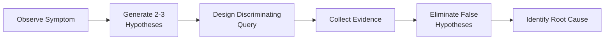

import { Card, Cards } from 'fumadocs-ui/components/card';
import { Callout } from 'fumadocs-ui/components/callout';
import { Award, Users, Trophy, Target, Shield, Search } from 'lucide-react';
import Image from 'next/image';

# Cloud Thinker Prove It Workshop

**Prove It Workshop** là một chương trình intensive 3 ngày do CloudThinker tổ chức, tập trung vào việc xây dựng phương pháp luận điều tra sự cố Cloud Production với AI Agent — từ thiết lập ranh giới kiểm soát (Govern) đến thực hành điều tra có chứng cứ (Evidence-Led Investigation).

<Callout type="info" title="Workshop Timeline">

**Ngày 19 - 21 tháng 9, 2026**  
Format: Hands-on workshop + Competitive arena  
Location: Ho Chi Minh City & Online

</Callout>

---

## 🏆 Kết quả thi đấu

Team **Ngũ Hành** (Ho Chi Minh City) đạt giải **2nd Runner-up** tại **Prove It Arena** với phương pháp Evidence-Led Investigation và báo cáo điều tra có cấu trúc chặt chẽ.

  <Image 
    src="/images/cloud-thinker/my-team.jpg" 
    alt="Team Ngũ Hành - 2nd Runner-up at Prove It Arena" 
    width={800} 
    height={600}
    className="rounded-lg border"
  />
  

    Team Ngũ Hành tại Prove It Arena 2026
  

### Điểm mạnh của team

<Cards>
  <Card title="Evidence-first reporting" icon={<Search />}>
    Mọi phát hiện đều được gắn với API response cụ thể, command output và verification status rõ ràng.
  </Card>
  <Card title="Hypothesis-driven approach" icon={<Target />}>
    Đưa ra 3 giả thuyết cho mỗi sự cố, kiểm chứng cả ba, và loại trừ bằng evidence thay vì suy đoán.
  </Card>
  <Card title="Transparent limitation" icon={<Shield />}>
    Báo cáo trung thực về những gì không thể kiểm tra do giới hạn quyền hoặc công cụ (Blocked findings).
  </Card>
  <Card title="Structured causality" icon={<Trophy />}>
    Phân biệt rõ ràng Trigger / Root Cause / Contributing Factor / Impact trong Causal Graph.
  </Card>
</Cards>

---

## Workshop Structure

Workshop được thiết kế theo mô hình progressive learning, mỗi ngày xây dựng trên nền tảng của ngày trước:

### Day 01 · Govern — Ranh giới kiểm soát Agent

Thiết lập các ranh giới an toàn để AI Agent có thể hoạt động trên môi trường Production:
- Read-only investigation principle
- Evidence-required claims
- RBAC và permission boundary
- Audit trail cho mọi hành động

[Xem chi tiết Day 01 →](/blogs/cloud-thinker/day-01)

### Day 02 · Investigate — Phương pháp điều tra

Xây dựng Signal Reduction Pipeline 8 tầng để giảm nhiễu và phương pháp Hypothesis-Driven Investigation:
- Từ 13,000 raw events → 40 actionable clusters
- Deduplication, Rate Limit, Cascade suppression
- Discriminating Query technique
- Causal Graph construction

[Xem chi tiết Day 02 →](/blogs/cloud-thinker/day-02)

### Day 03 · Prove It Arena — Thi đấu thực chiến

Áp dụng toàn bộ phương pháp luận vào môi trường thi đấu với hai vòng:
- **Round 1:** Find the Gaps — AWS Well-Architected Review
- **Round 2:** Prove It — Kubernetes OOMKilled investigation
- Scoring: Evidence quality > Speed

[Xem chi tiết Day 03 →](/blogs/cloud-thinker/day-03)

---

## Phương pháp luận cốt lõi

Workshop trang bị một framework có thể áp dụng trực tiếp vào Production:

### 1. Three-state verification

Mỗi finding phải được gắn nhãn rõ ràng:

| State | Meaning |
| :--- | :--- |
| **Verified** | Có evidence trực tiếp từ API, logs hoặc metrics |
| **Inferred** | Suy luận logic từ evidence, chưa có measurement trực tiếp |
| **Blocked** | Không thể thu thập evidence do giới hạn quyền/công cụ |

### 2. Hypothesis-driven investigation

### 3. Causal Graph structure

Phân biệt các thành phần trong chuỗi sự cố:

- **Trigger:** Sự kiện kích hoạt (có thể đã kết thúc)
- **Root Cause:** Tài nguyên có cấu hình thực tế bị lệch
- **Contributing Factor:** Điều kiện nền không thể chứng minh vừa thay đổi
- **Impact:** Thiệt hại người dùng thực tế chịu
- **Recovery:** Hành động khôi phục hệ thống

---

## Key Takeaways

<Callout type="warn" title="Những bài học quan trọng">

1. **Victim ≠ Root Cause**  
   Tài nguyên hiển thị triệu chứng tồi tệ nhất thường chỉ là nạn nhân, không phải nguyên nhân gốc rễ.

2. **Time Correlation ≠ Causation**  
   Hai sự kiện xảy ra gần nhau về thời gian không chứng minh quan hệ nhân quả.

3. **Transparent Limitation > False Confidence**  
   Báo cáo "BLOCKED: Cannot verify" tốt hơn tuyên bố không có chứng cứ.

4. **Evidence First, Story Later**  
   Thu thập evidence trước, xây dựng narrative sau. Không được đặt câu chuyện trước evidence.

</Callout>

---

## Công cụ và môi trường

Workshop sử dụng môi trường thực tế với các công cụ production-grade:

- **Cloud Platform:** AWS (ap-southeast-1), Kubernetes
- **Observability:** CloudWatch, CloudTrail, AWS Config
- **Investigation Tools:** kubectl, aws-cli, Read-only IAM roles
- **AI Agent:** Claude với specialized investigator agents

---

## Tài liệu tham khảo

<Cards>
  <Card title="Day 01 · Govern" href="/blogs/cloud-thinker/day-01">
    Ranh giới kiểm soát AI Agent trên Cloud Production
  </Card>
  <Card title="Day 02 · Investigate" href="/blogs/cloud-thinker/day-02">
    Signal Reduction Pipeline và Hypothesis-Driven Investigation
  </Card>
  <Card title="Day 03 · Prove It Arena" href="/blogs/cloud-thinker/day-03">
    Thi đấu điều tra sự cố AWS và Kubernetes thực tế
  </Card>
</Cards>

---

## Về CloudThinker

[CloudThinker](https://cloudthinker.io) là tổ chức đào tạo chuyên sâu về Cloud Operations, Site Reliability Engineering và AI-assisted investigation. Prove It Workshop là một trong những chương trình intensive training với focus vào hands-on practice và competitive learning.

**Workshop Links:**
- [Official Documentation](https://docs.cloudthinker.io/learn/workshops/prove-it/)
- [CloudThinker Website](https://cloudthinker.io)
