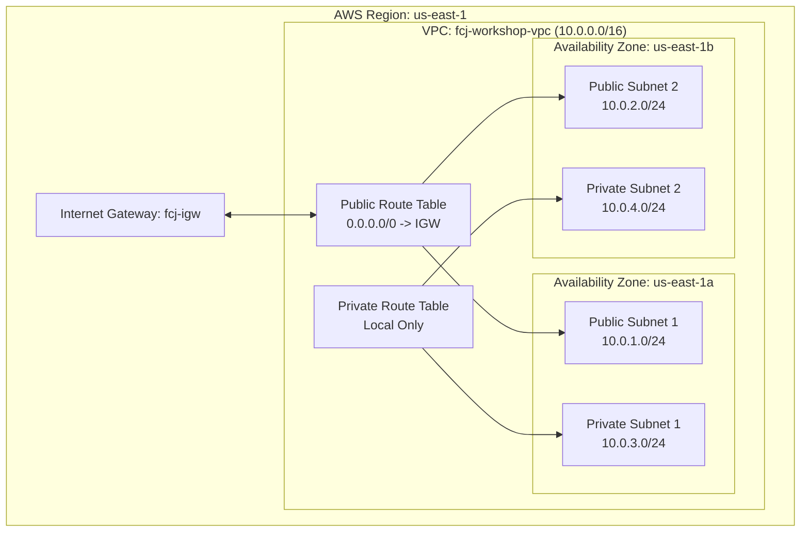

import { Step, Steps } from 'fumadocs-ui/components/steps';
import { Callout } from 'fumadocs-ui/components/callout';
import { Tab, Tabs } from 'fumadocs-ui/components/tabs';
import { Card, Cards } from 'fumadocs-ui/components/card';
import { Network, ShieldCheck, Globe, Route, Server, Layers } from 'lucide-react';

# Part 1: Khởi tạo VPC & Hạ tầng Mạng Chuẩn Production

Hạ tầng mạng (Networking Infrastructure) là xương sống của mọi hệ thống trên AWS. Một thiết kế VPC không chuẩn có thể dẫn đến rủi ro lộ dữ liệu nhạy cảm, nghẽn dải IP (CIDR exhaustion) hoặc khó khăn trong việc mở rộng theo chiều ngang (Horizontal Scaling) về sau.

Trong phần đầu tiên của series **FCJ Workshop**, chúng ta sẽ tự tay khởi tạo một Virtual Private Cloud (VPC) đạt chuẩn **AWS Well-Architected Framework** với mô hình Multi-AZ (Multi Availability Zone).

---

## Mục tiêu Kiến trúc

Sau bài lab này, bạn sẽ nắm vững và triển khai được:

<Cards>
  <Card icon={<Network className="text-blue-500" />} title="Custom VPC (10.0.0.0/16)">
    Dải IP CIDR `10.0.0.0/16` cung cấp 65,536 địa chỉ IP, kích hoạt DNS Hostnames & DNS Support.
  </Card>
  <Card icon={<Globe className="text-green-500" />} title="Multi-AZ Public Subnets">
    2 Public Subnets rải đều ở 2 AZs (`us-east-1a`, `us-east-1b`) dành cho Application Load Balancer.
  </Card>
  <Card icon={<ShieldCheck className="text-purple-500" />} title="Multi-AZ Private Subnets">
    2 Private Subnets rải đều ở 2 AZs dành cho Backend App Tasks và Database Cluster (RDS).
  </Card>
  <Card icon={<Route className="text-amber-500" />} title="Internet Gateway & Route Tables">
    Internet Gateway (IGW) cửa ngõ Internet và phân tách nghiêm ngặt Route Tables Public/Private.
  </Card>
</Cards>



<Callout type="info">
  **Chi phí dịch vụ:** Tất cả các thành phần trong bài lab này (VPC, Subnet, IGW, Route Table) đều **miễn phí 100%** trên mọi tài khoản AWS.
</Callout>

---

## Bảng Quy hoạch Dải Mạng (IP Planning)

Việc chọn dải CIDR phù hợp giúp hệ thống tránh bị đụng độ dải IP khi thực hiện Peering VPC hoặc kết nối VPN về On-premise datacenter sau này.

| Tên Subnet | Loại Phân vùng | Availability Zone | CIDR Block | Số IP khả dụng | Mục đích sử dụng |
| :--- | :--- | :--- | :--- | :--- | :--- |
| `fcj-public-subnet-1` | **Public** | `us-east-1a` | `10.0.1.0/24` | 251 | Public Load Balancer (ALB) |
| `fcj-public-subnet-2` | **Public** | `us-east-1b` | `10.0.2.0/24` | 251 | Public Load Balancer (ALB) Standby |
| `fcj-private-subnet-1` | **Private** | `us-east-1a` | `10.0.3.0/24` | 251 | Backend App Server & Worker |
| `fcj-private-subnet-2` | **Private** | `us-east-1b` | `10.0.4.0/24` | 251 | Database Cluster (RDS PostgreSQL/MySQL) |

<Callout type="warn">
  **Tại sao chỉ có 251 IP khả dụng thay vì 256?**  
  AWS luôn dành riêng **5 địa chỉ IP** đầu/cuối trong mỗi Subnet cho các mục đích quản trị mạng (Network Address, VPC Router, DNS Server, Future Use & Broadcast Address).
</Callout>

---

## Hướng dẫn Triển khai Từng bước

Bạn có thể lựa chọn thao tác qua **AWS Management Console (Giao diện web)** hoặc dùng **AWS CLI (Dòng lệnh)** bên dưới.

<Tabs items={['AWS Console (Web)', 'AWS CLI', 'Infrastructure as Code (Terraform)']}>

<Tab value="AWS Console (Web)">

<Steps>

<Step>
### Bước 1: Khởi tạo Virtual Private Cloud (VPC)
1. Đăng nhập **AWS Management Console** và tìm kiếm dịch vụ **VPC**.
2. Chọn menu **Your VPCs** bên thanh điều hướng trái $\rightarrow$ chọn **Create VPC**.
3. Chọn tùy chọn **VPC only** (để tự tay dựng từng thành phần chuẩn hóa kiến thức):
   - **Name tag:** `fcj-workshop-vpc`
   - **IPv4 CIDR block:** `10.0.0.0/16`
   - **IPv6 CIDR block:** No IPv6 CIDR block
   - **Tenancy:** Default
4. Bấm **Create VPC**.
5. Chọn VPC vừa tạo $\rightarrow$ **Actions** $\rightarrow$ **Edit VPC settings** $\rightarrow$ Tích chọn **Enable DNS hostnames** và **Enable DNS resolution** $\rightarrow$ Bấm **Save**.
</Step>

<Step>
### Bước 2: Khởi tạo các Subnets (Mạng con)
1. Chuyển sang mục **Subnets** $\rightarrow$ bấm **Create subnet**.
2. Tại mục **VPC ID**, chọn `fcj-workshop-vpc` vừa tạo.
3. Lần lượt tạo 4 Subnets theo đúng thông số ở bảng **Quy hoạch dải mạng**:
   - Thêm Subnet 1: Name `fcj-public-subnet-1`, AZ `us-east-1a`, CIDR `10.0.1.0/24`.
   - Thêm Subnet 2: Name `fcj-public-subnet-2`, AZ `us-east-1b`, CIDR `10.0.2.0/24`.
   - Thêm Subnet 3: Name `fcj-private-subnet-1`, AZ `us-east-1a`, CIDR `10.0.3.0/24`.
   - Thêm Subnet 4: Name `fcj-private-subnet-2`, AZ `us-east-1b`, CIDR `10.0.4.0/24`.
4. Bấm **Create subnet**.

<Callout type="tip">
  **Bật tính năng Auto-assign Public IP cho Public Subnet:**  
  Tích chọn `fcj-public-subnet-1` $\rightarrow$ bấm **Actions** $\rightarrow$ **Edit subnet settings** $\rightarrow$ Tích chọn **Enable auto-assign public IPv4 address** $\rightarrow$ Bấm **Save**. Làm tương tự cho `fcj-public-subnet-2`.
</Callout>
</Step>

<Step>
### Bước 3: Khởi tạo & Gắn Internet Gateway (IGW)
Subnet sẽ chưa thể kết nối ra bên ngoài nếu thiếu một cổng Internet Gateway.

1. Chọn mục **Internet Gateways** $\rightarrow$ bấm **Create internet gateway**.
2. Đặt **Name tag:** `fcj-igw` $\rightarrow$ bấm **Create internet gateway**.
3. Chọn nút **Actions** ở góc trên $\rightarrow$ chọn **Attach to VPC**.
4. Chọn `fcj-workshop-vpc` từ danh sách $\rightarrow$ bấm **Attach internet gateway**.
</Step>

<Step>
### Bước 4: Thiết lập Bảng định tuyến (Route Tables)

Chúng ta cần tạo 2 Bảng định tuyến độc lập:

#### A. Public Route Table (Cho phép traffic đi ra Internet)
1. Chọn mục **Route Tables** $\rightarrow$ bấm **Create route table**.
2. Đặt tên **Name:** `fcj-public-rt`, chọn VPC `fcj-workshop-vpc` $\rightarrow$ bấm **Create route table**.
3. Chuyển sang thẻ **Routes** $\rightarrow$ chọn **Edit routes** $\rightarrow$ bấm **Add route**:
   - **Destination:** `0.0.0.0/0` (Tất cả traffic đi ra ngoài)
   - **Target:** chọn **Internet Gateway** $\rightarrow$ chọn `fcj-igw`.
4. Chuyển sang thẻ **Subnet associations** $\rightarrow$ bấm **Edit subnet associations**:
   - Tích chọn 2 Public Subnets: `fcj-public-subnet-1` và `fcj-public-subnet-2`.
   - Bấm **Save associations**.

#### B. Private Route Table (Cô lập hoàn toàn với Internet bên ngoài)
1. Bấm **Create route table**, đặt tên **Name:** `fcj-private-rt`, VPC `fcj-workshop-vpc`.
2. Ở phần **Routes**, giữ nguyên mặc định (chỉ có dòng `10.0.0.0/16` $\rightarrow$ `local`).
3. Chuyển sang thẻ **Subnet associations** $\rightarrow$ bấm **Edit subnet associations**:
   - Tích chọn 2 Private Subnets: `fcj-private-subnet-1` và `fcj-private-subnet-2`.
   - Bấm **Save associations**.
</Step>

</Steps>

</Tab>

<Tab value="AWS CLI">

Nếu bạn yêu thích dòng lệnh, chỉ cần thực thi tập lệnh Bash sau để hoàn thành toàn bộ công việc trên trong **10 giây**:

```bash
# 1. Khởi tạo VPC & Bật DNS Hostnames
VPC_ID=$(aws ec2 create-vpc --cidr-block 10.0.0.0/16 \
  --tag-specifications 'ResourceType=vpc,Tags=[{Key=Name,Value=fcj-workshop-vpc}]' \
  --query 'Vpc.VpcId' --output text)

aws ec2 modify-vpc-attribute --vpc-id $VPC_ID --enable-dns-hostnames '{"Value": true}'
aws ec2 modify-vpc-attribute --vpc-id $VPC_ID --enable-dns-support '{"Value": true}'

echo "VPC Created: $VPC_ID"

# 2. Tạo Subnets
PUB_SUB_1=$(aws ec2 create-subnet --vpc-id $VPC_ID --cidr-block 10.0.1.0/24 --availability-zone us-east-1a \
  --tag-specifications 'ResourceType=subnet,Tags=[{Key=Name,Value=fcj-public-subnet-1}]' --query 'Subnet.SubnetId' --output text)

PUB_SUB_2=$(aws ec2 create-subnet --vpc-id $VPC_ID --cidr-block 10.0.2.0/24 --availability-zone us-east-1b \
  --tag-specifications 'ResourceType=subnet,Tags=[{Key=Name,Value=fcj-public-subnet-2}]' --query 'Subnet.SubnetId' --output text)

PRIV_SUB_1=$(aws ec2 create-subnet --vpc-id $VPC_ID --cidr-block 10.0.3.0/24 --availability-zone us-east-1a \
  --tag-specifications 'ResourceType=subnet,Tags=[{Key=Name,Value=fcj-private-subnet-1}]' --query 'Subnet.SubnetId' --output text)

PRIV_SUB_2=$(aws ec2 create-subnet --vpc-id $VPC_ID --cidr-block 10.0.4.0/24 --availability-zone us-east-1b \
  --tag-specifications 'ResourceType=subnet,Tags=[{Key=Name,Value=fcj-private-subnet-2}]' --query 'Subnet.SubnetId' --output text)

# Bật tự động cấp IP Public cho Public Subnets
aws ec2 modify-subnet-attribute --subnet-id $PUB_SUB_1 --map-public-ip-on-launch
aws ec2 modify-subnet-attribute --subnet-id $PUB_SUB_2 --map-public-ip-on-launch

# 3. Tạo và gắn IGW
IGW_ID=$(aws ec2 create-internet-gateway \
  --tag-specifications 'ResourceType=internet-gateway,Tags=[{Key=Name,Value=fcj-igw}]' \
  --query 'InternetGateway.InternetGatewayId' --output text)

aws ec2 attach-internet-gateway --vpc-id $VPC_ID --internet-gateway-id $IGW_ID

# 4. Tạo Route Tables & Định tuyến
# Public Route Table
PUB_RT=$(aws ec2 create-route-table --vpc-id $VPC_ID \
  --tag-specifications 'ResourceType=route-table,Tags=[{Key=Name,Value=fcj-public-rt}]' \
  --query 'RouteTable.RouteTableId' --output text)

aws ec2 create-route --route-table-id $PUB_RT --destination-cidr-block 0.0.0.0/0 --gateway-id $IGW_ID

aws ec2 associate-route-table --subnet-id $PUB_SUB_1 --route-table-id $PUB_RT
aws ec2 associate-route-table --subnet-id $PUB_SUB_2 --route-table-id $PUB_RT

# Private Route Table
PRIV_RT=$(aws ec2 create-route-table --vpc-id $VPC_ID \
  --tag-specifications 'ResourceType=route-table,Tags=[{Key=Name,Value=fcj-private-rt}]' \
  --query 'RouteTable.RouteTableId' --output text)

aws ec2 associate-route-table --subnet-id $PRIV_SUB_1 --route-table-id $PRIV_RT
aws ec2 associate-route-table --subnet-id $PRIV_SUB_2 --route-table-id $PRIV_RT
```

</Tab>

<Tab value="Infrastructure as Code (Terraform)">

Dành cho bạn nào muốn áp dụng chuẩn GitOps / IaC:

```hcl
# 1. VPC & IGW
resource "aws_vpc" "main" {
  cidr_block           = "10.0.0.0/16"
  enable_dns_hostnames = true
  enable_dns_support   = true

  tags = {
    Name = "fcj-workshop-vpc"
  }
}

resource "aws_internet_gateway" "igw" {
  vpc_id = aws_vpc.main.id

  tags = {
    Name = "fcj-igw"
  }
}

# 2. Subnets
resource "aws_subnet" "public_1" {
  vpc_id                  = aws_vpc.main.id
  cidr_block              = "10.0.1.0/24"
  availability_zone       = "us-east-1a"
  map_public_ip_on_launch = true

  tags = { Name = "fcj-public-subnet-1" }
}

resource "aws_subnet" "public_2" {
  vpc_id                  = aws_vpc.main.id
  cidr_block              = "10.0.2.0/24"
  availability_zone       = "us-east-1b"
  map_public_ip_on_launch = true

  tags = { Name = "fcj-public-subnet-2" }
}

resource "aws_subnet" "private_1" {
  vpc_id            = aws_vpc.main.id
  cidr_block        = "10.0.3.0/24"
  availability_zone = "us-east-1a"

  tags = { Name = "fcj-private-subnet-1" }
}

resource "aws_subnet" "private_2" {
  vpc_id            = aws_vpc.main.id
  cidr_block        = "10.0.4.0/24"
  availability_zone = "us-east-1b"

  tags = { Name = "fcj-private-subnet-2" }
}

# 3. Route Tables & Associations
resource "aws_route_table" "public" {
  vpc_id = aws_vpc.main.id

  route {
    cidr_block = "0.0.0.0/0"
    gateway_id = aws_internet_gateway.igw.id
  }

  tags = { Name = "fcj-public-rt" }
}

resource "aws_route_table" "private" {
  vpc_id = aws_vpc.main.id

  tags = { Name = "fcj-private-rt" }
}

resource "aws_route_table_association" "public_1" {
  subnet_id      = aws_subnet.public_1.id
  route_table_id = aws_route_table.public.id
}

resource "aws_route_table_association" "public_2" {
  subnet_id      = aws_subnet.public_2.id
  route_table_id = aws_route_table.public.id
}

resource "aws_route_table_association" "private_1" {
  subnet_id      = aws_subnet.private_1.id
  route_table_id = aws_route_table.private.id
}

resource "aws_route_table_association" "private_2" {
  subnet_id      = aws_subnet.private_2.id
  route_table_id = aws_route_table.private.id
}
```

</Tab>

</Tabs>

---

## Kiểm tra & Xác nhận Cấu hình (Verification)

Để chắc chắn hạ tầng mạng của bạn đã hoạt động đúng như thiết kế, hãy chạy các câu lệnh kiểm tra trạng thái Route Table thông qua AWS CLI:

```bash
# 1. Kiểm tra Route Table của Public Subnet xem đã có route 0.0.0.0/0 trỏ tới IGW chưa
aws ec2 describe-route-tables \
  --filters "Name=tag:Name,Values=fcj-public-rt" \
  --query 'RouteTables[*].Routes[?DestinationCidrBlock==`0.0.0.0/0`]'

# 2. Kiểm tra các Subnet đã liên kết đúng Route Tables chưa
aws ec2 describe-route-tables \
  --filters "Name=vpc-id,Values=$VPC_ID" \
  --query 'RouteTables[*].{TableID:RouteTableId, Tags:Tags, Associations:Associations[*].SubnetId}'
```

**Kết quả mong đợi:**  
Đầu ra JSON hiển thị chi tiết `GatewayId` bắt đầu bằng `igw-xxxxxxxx` với `State: active`, đồng thời 2 public subnets gắn liền với `fcj-public-rt` và 2 private subnets gắn liền với `fcj-private-rt`.

---

## Bài học Cốt lõi (Takeaways)

1. **Security Isolation:** Luôn giữ tài nguyên quan trọng (Database, Backend Service) trong **Private Subnet** không có route trực tiếp ra Internet.
2. **High Availability:** Triển khai hạ tầng qua tối thiểu 2 Availability Zones (`us-east-1a` & `us-east-1b`) nhằm sẵn sàng cho các tình huống sự cố tại một Datacenter của AWS.
3. **Explicit Subnet Association:** Nên chủ động Associate từng Subnet vào Route Table cụ thể thay vì phụ thuộc hoàn toàn vào Main Route Table mặc định của VPC.
4. **DNS Settings Requirement:** Bật `enableDnsHostnames` và `enableDnsSupport` cho VPC để đảm bảo tính năng phân giải tên miền nội bộ (ví dụ: RDS DNS endpoint) hoạt động chính xác.

---

## Bước Tiếp Theo

Chúc mừng bạn! Bạn đã hoàn thành việc xây dựng hạ tầng mạng vững chắc.

Hãy chuyển sang [Part 2: Compute & Database Layer](./02-compute-rds) để bắt đầu khởi tạo máy chủ EC2/ECS và cụm cơ sở dữ liệu Amazon RDS!
