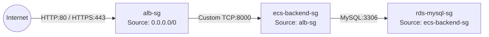
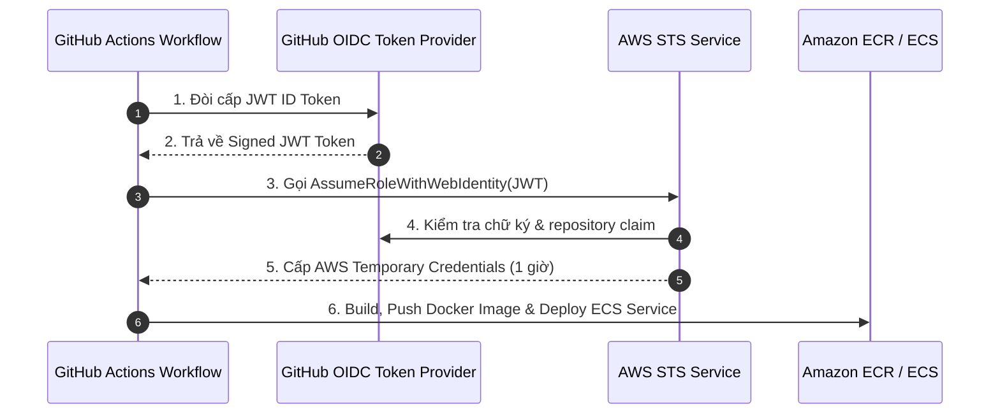

import { Step, Steps } from 'fumadocs-ui/components/steps';
import { Callout } from 'fumadocs-ui/components/callout';
import { Tab, Tabs } from 'fumadocs-ui/components/tabs';
import { Card, Cards } from 'fumadocs-ui/components/card';
import { ShieldCheck, Key, Lock, GitBranch, Terminal, Server, Shield } from 'lucide-react';

# Part 4: Security, IAM Roles & GitHub Actions CI/CD Pipeline

Trong phần này, chúng ta sẽ áp dụng các chuẩn mực bảo mật nâng cao (**AWS Well-Architected Security Pillar**) và tự động hóa toàn bộ quy trình kiểm thử, đóng gói Docker Image và triển khai (CI/CD) thông qua **GitHub Actions**.

---

## Mô hình Security Group Chaining

Chúng ta không mở cổng dựa trên địa chỉ IP cố định đối với các thành phần nội bộ. Thay vào đó, **Security Group này sẽ được dùng làm nguồn (Source) tham chiếu cho Security Group khác**.



### Bảng Ma trận Rule Security Group

| Security Group ID | Inbound Type | Port | Allowed Source | Diễn giải |
| :--- | :--- | :--- | :--- | :--- |
| `alb-sg` | HTTP / HTTPS | `80` / `443` | `0.0.0.0/0` | Tiếp nhận lưu lượng công cộng từ Internet |
| `ecs-backend-sg` | Custom TCP | `8000` | `alb-sg` | Chỉ tiếp nhận kết quả chuyển tiếp từ ALB |
| `rds-mysql-sg` | MySQL/Aurora | `3306` | `ecs-backend-sg` | Chỉ nhận câu lệnh SQL gửi từ các ECS Tasks |

---

## Phân định Trách nhiệm IAM Roles trong ECS

<Cards>
  <Card icon={<Server className="text-blue-500" />} title="Task Execution Role (NeonFoodmap-TaskExecution-Role)">
    Gán cho **ECS Agent (Hạ tầng AWS)**:
    - Pull Docker images từ Amazon ECR.
    - Ghi container logs vào CloudWatch Log Groups.
    - Trích xuất mật khẩu từ AWS Secrets Manager.
  </Card>
  <Card icon={<Key className="text-green-500" />} title="Task Role (NeonFoodmap-ECS-Backend-Role)">
    Gán cho **Mã nguồn Django Application**:
    - Đọc/Ghi dữ liệu file media trên Amazon S3 Buckets (`neonfoodmap-media-*`).
  </Card>
</Cards>

---

## GitHub Actions CI/CD với OpenID Connect (OIDC)

Nói KHÔNG với việc lưu trữ `AWS_ACCESS_KEY_ID` cố định trong GitHub Secrets. Chúng ta thiết lập **AWS IAM OIDC Identity Provider** cho phép GitHub Actions tự động xin cấp temporary credentials có thời hạn tối đa 1 giờ.



### File Cấu hình Workflow GitHub Actions (`.github/workflows/deploy.yml`)

```yaml
name: Deploy NeonFoodMap Backend to AWS ECS

on:
  push:
    branches:
      - main

permissions:
  id-token: write   # Bắt buộc để xin OIDC JWT Token
  contents: read

jobs:
  deploy:
    runs-on: ubuntu-latest
    steps:
      - name: Checkout repository
        uses: actions/checkout@v3

      - name: Configure AWS Credentials via OIDC
        uses: aws-actions/configure-aws-credentials@v2
        with:
          role-to-assume: arn:aws:iam::123456789012:role/NeonFoodmap-GitHub-Actions-Role
          aws-region: us-east-1

      - name: Login to Amazon ECR
        id: login-ecr
        uses: aws-actions/amazon-ecr-login@v1

      - name: Build, tag, and push Docker image
        env:
          ECR_REGISTRY: ${{ steps.login-ecr.outputs.registry }}
          ECR_REPOSITORY: neonfoodmap-backend
          IMAGE_TAG: ${{ github.sha }}
        run: |
          docker build -t $ECR_REGISTRY/$ECR_REPOSITORY:$IMAGE_TAG .
          docker push $ECR_REGISTRY/$ECR_REPOSITORY:$IMAGE_TAG
          docker tag $ECR_REGISTRY/$ECR_REPOSITORY:$IMAGE_TAG $ECR_REGISTRY/$ECR_REPOSITORY:latest
          docker push $ECR_REGISTRY/$ECR_REPOSITORY:latest

      - name: Update ECS Service
        run: |
          aws ecs update-service --cluster neonfoodmap-cluster --service neonfoodmap-backend-service --force-new-deployment
```

---

## Bài học Cốt lõi (Takeaways)

<Cards>
  <Card icon={<ShieldCheck className="text-green-500" />} title="Zero Hardcoded Keys">
    Tuyệt đối không dùng Access Keys vĩnh viễn trong CI/CD. Sử dụng OIDC Identity Provider để cấp quyền truy cập tạm thời an toàn.
  </Card>
  <Card icon={<Shield className="text-blue-500" />} title="Security Group Isolation">
    Dùng Security Group Referencing (chaining) làm nguồn Inbound rule thay cho dải mạng IP giúp bảo mật hạ tầng nội bộ tuyệt đối.
  </Card>
</Cards>

---

## Bước Tiếp Theo

Tiếp tục chuyển sang [Part 5: Neon Operations — Auto-Scaling, Monitoring & Observability](./05-operations-monitoring) để thiết lập ECS Auto Scaling, CloudWatch Dashboards và Alarms!
