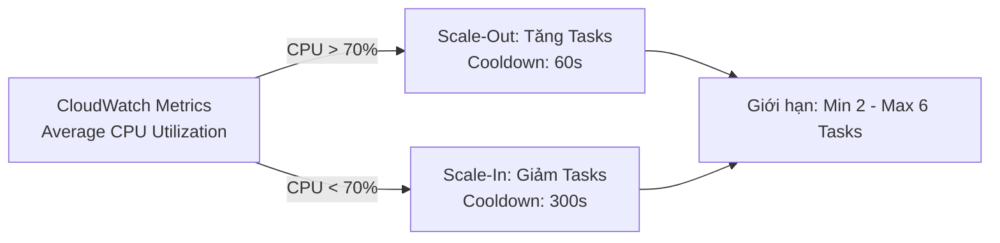

import { Step, Steps } from 'fumadocs-ui/components/steps';
import { Callout } from 'fumadocs-ui/components/callout';
import { Tab, Tabs } from 'fumadocs-ui/components/tabs';
import { Card, Cards } from 'fumadocs-ui/components/card';
import { Activity, Bell, Cpu, LineChart, Search, Server } from 'lucide-react';

# Part 5: Neon Operations — Auto-Scaling, Monitoring & Observability

Triển khai thành công ứng dụng chỉ là một nửa chặng đường. Một hệ thống vận hành chuẩn Production đòi hỏi khả năng **tự động co giãn (Auto Scaling)** để ứng phó với lưu lượng tăng đột biến và **hệ thống giám sát tập trung (Observability)** giúp phát hiện sự cố sớm trước khi người dùng phát hiện.

Trong Part 5 này, chúng ta sẽ thiết lập trọn bộ giải pháp giám sát cho **NeonFoodMap**:
1. **ECS Service Auto Scaling** với Target Tracking Policy dựa trên CPU Utilization.
2. **CloudWatch Operational Dashboard** hiển thị thông số thời gian thực của ECS, ALB, RDS và S3.
3. **CloudWatch Alarms & Amazon SNS** gửi thông báo sự cố tức thì qua Email.
4. **CloudWatch Log Insights** truy vấn log lỗi tập trung.

---

## 1. Cấu hình ECS Service Auto Scaling

Để vừa đảm bảo tính sẵn sàng cao, vừa kiểm soát tối ưu chi phí, ta thiết lập hạn mức số lượng Fargate Task hoạt động từ **2 đến 6 tasks**.



### Các bước thiết lập Target Tracking Policy

<Steps>

<Step>
### Bước 1: Bật Service Auto Scaling
1. Truy cập **Amazon ECS Console** $\rightarrow$ **Clusters** $\rightarrow$ `neonfoodmap-cluster`.
2. Select service `neonfoodmap-backend-service` $\rightarrow$ bấm **Update**.
3. Tại mục **Service auto scaling**, tích chọn **Use service auto scaling**.
4. Cấu hình **Capacity limits**:
   - Minimum number of tasks: `2`
   - Maximum number of tasks: `6`
</Step>

<Step>
### Bước 2: Tạo Scaling Policy theo CPU
1. **Scaling policy type:** Chọn **Target tracking**.
2. **Policy name:** `cpu-70-target-tracking`.
3. **ECS service metric:** `ECSServiceAverageCPUUtilization`.
4. **Target value:** `70` (%).
5. **Scale-out cooldown period:** `60 seconds` (Cho phép task mới có 1 phút để boot up và nhận traffic).
6. **Scale-in cooldown period:** `300 seconds` (Chờ 5 phút để tránh hiện tượng trồi sụt tải làm scale liên tục - Flapping).
7. Bấm **Save**.
</Step>

</Steps>

---

## 2. Xây dựng CloudWatch Operational Dashboard

Tập trung toàn bộ chỉ số vận hành quan trọng vào một màn hình giám sát duy nhất (**Single Pane of Glass**).

<Cards>
  <Card icon={<Cpu className="text-blue-500" />} title="ECS Metrics Widget">
    - `CPUUtilization` & `MemoryUtilization` trung bình của cluster backend service.
  </Card>
  <Card icon={<Server className="text-green-500" />} title="ALB Metrics Widget">
    - `RequestCount`, `TargetResponseTime`, `HealthyHostCount`, `UnHealthyHostCount` và `HTTPCode_Target_5XX_Count`.
  </Card>
  <Card icon={<Activity className="text-purple-500" />} title="RDS Database Widget">
    - `CPUUtilization`, `DatabaseConnections`, `ReadLatency`, `WriteLatency`, `FreeStorageSpace`.
  </Card>
  <Card icon={<Search className="text-amber-500" />} title="Log Insights Widget">
    - Bảng hiển thị 20 dòng log lỗi gần nhất (`ERROR`, `Exception`, `500`).
  </Card>
</Cards>

---

## 3. Cấu hình CloudWatch Alarms & Amazon SNS Email Notifications

Khi CPU Backend vượt quá 80% liên tục trong 5 phút, hệ thống sẽ tự động kích hoạt Alarm và gửi email cảnh báo cho đội ngũ SRE/DevOps.

<Steps>

<Step>
### Bước 1: Tạo Amazon SNS Topic & Email Subscription
1. Mở **Amazon SNS Console** $\rightarrow$ **Topics** $\rightarrow$ bấm **Create topic**.
2. Type: **Standard**, Name: `NeonFoodMap-Alerts-Topic` $\rightarrow$ bấm **Create topic**.
3. Chọn tab **Subscriptions** $\rightarrow$ **Create subscription**.
4. **Protocol:** Select `Email`.
5. **Endpoint:** Nhập địa chỉ email cá nhân hoặc email nhóm vận hành.
6. Mở Hộp thư đến Email và bấm **Confirm Subscription**.
</Step>

<Step>
### Bước 2: Khai báo CloudWatch Alarm
1. Mở **CloudWatch Console** $\rightarrow$ **Alarms** $\rightarrow$ bấm **Create alarm**.
2. Select metric: `ECS` $\rightarrow$ `ClusterName, ServiceName` $\rightarrow$ `CPUUtilization`.
3. **Conditions:**
   - Threshold type: Static
   - Whenever CPUUtilization is: **Greater than 80**
   - Period: **5 minutes**
4. **Actions:** Under *In ALARM state*, select SNS Topic `NeonFoodMap-Alerts-Topic`.
5. **Alarm name:** `ECS-Backend-High-CPU-Alarm` $\rightarrow$ Bấm **Create alarm**.
</Step>

</Steps>

---

## 4. Truy vấn Log tập trung với CloudWatch Log Insights

Thay vì SSH vào từng máy chủ (điều không thể làm với Serverless Fargate), ta sử dụng câu truy vấn SQL-like để lọc ra tất cả các ngoại lệ phát sinh:

```sql
SOURCE "/ecs/neonfoodmap-backend"
| fields @timestamp, @message, @logStream
| filter @message like /ERROR|Exception|500/
| sort @timestamp desc
| limit 50
```

---

## Bài học Cốt lõi (Takeaways)

<Cards>
  <Card icon={<LineChart className="text-blue-500" />} title="Cooldown Periods Matter">
    Đặt scale-out cooldown ngắn (60s) để xử lý nhanh spike traffic, nhưng scale-in cooldown phải đủ dài (300s) để tránh task bị bật/tắt liên tục.
  </Card>
  <Card icon={<Search className="text-green-500" />} title="Centralized Log Analytics">
    Serverless đòi hỏi tư duy Log Aggregation tập trung qua CloudWatch Logs thay cho việc lưu log cục bộ trên đĩa.
  </Card>
</Cards>

---

## Bước Tiếp Theo

Chuyển sang [Part 6: Safe Cleanup, FinOps & Lessons Learned](./06-cleanup-summary) để hoàn tất quy trình tiêu hủy tài nguyên an toàn và thiết lập ngân sách cảnh báo AWS Budgets!
