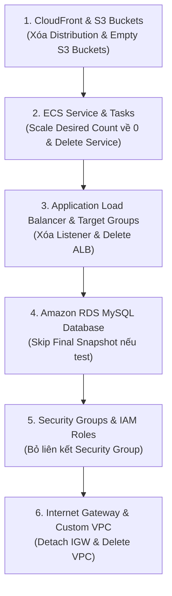

import { Step, Steps } from 'fumadocs-ui/components/steps';
import { Callout } from 'fumadocs-ui/components/callout';
import { Tab, Tabs } from 'fumadocs-ui/components/tabs';
import { Card, Cards } from 'fumadocs-ui/components/card';
import { Trash2, AlertTriangle, DollarSign, CheckCircle2, ShieldCheck, Layers, RefreshCw, Network, Server, Globe, Key, Activity } from 'lucide-react';

# Part 6: Safe Cleanup, FinOps & Lessons Learned

Chúc mừng bạn đã hoàn thành việc triển khai toàn bộ hạ tầng, ứng dụng và hệ thống vận hành giám sát trên AWS!

Tuy nhiên, công việc thực sự chỉ hoàn tất khi bạn dọn dẹp (Cleanup) sạch sẽ các tài nguyên thử nghiệm hoặc thiết lập các công cụ quản trị chi phí (FinOps) tự động. Việc quên xóa một **Application Load Balancer**, một **Amazon RDS Instance** hay một **CloudFront Distribution** có thể tiêu tốn chi phí ngoài ý muốn mỗi tháng.

---

## Thứ tự Cleanup Chuẩn Tránh Lỗi Dependency

Khi tiêu hủy hạ tầng AWS thủ công hoặc qua CLI, bạn **không thể xóa VPC** nếu các tài nguyên bên trong (như ECS Tasks, ALB, RDS hay Security Groups) vẫn đang hoạt động. Bạn bắt buộc phải thực hiện xóa theo đúng quy trình **từ tầng ngoài cùng vào tầng lõi mạng**.



---

## Hướng dẫn Cleanup Từng Bước (Step-by-Step)

<Callout type="error" title="Cảnh báo trước khi dọn dẹp">
  Hãy đảm bảo bạn đã lưu lại mọi tài liệu, log hoặc code quan trọng. Hành động xóa tài nguyên bên dưới **không thể hoàn tác**.
</Callout>

<Steps>

<Step>
### Bước 1: Dừng & Tiêu hủy ECS Service, Tasks & Cluster
```bash
# Update desired count về 0 để ECS không khởi chạy lại task mới
aws ecs update-service --cluster neonfoodmap-cluster --service neonfoodmap-backend-service --desired-count 0

# Xóa ECS Service
aws ecs delete-service --cluster neonfoodmap-cluster --service neonfoodmap-backend-service --force

# Xóa ECS Cluster
aws ecs delete-cluster --cluster neonfoodmap-cluster
```
</Step>

<Step>
### Bước 2: Xóa Application Load Balancer (ALB) & Target Groups
ALB gán các IP ENI vào Subnet, do đó phải được xóa trước khi xóa Subnet và VPC:

```bash
# Xóa ALB (Thay ARN bằng ARN của ALB bạn)
aws elbv2 delete-load-balancer --load-balancer-arn $ALB_ARN

# Chờ ALB xóa hoàn tất, sau đó xóa Target Group
aws elbv2 delete-target-group --target-group-arn $TG_ARN
```
</Step>

<Step>
### Bước 3: Tiêu hủy Cơ sở dữ liệu Amazon RDS
Khi xóa RDS Instance, nếu chỉ làm lab thử nghiệm, bạn có thể chọn bỏ qua bước chụp **Final Snapshot** để tránh phát sinh chi phí lưu trữ snapshot:

```bash
aws rds delete-db-instance \
  --db-instance-identifier neonfoodmap-mysql-db \
  --skip-final-snapshot \
  --delete-automated-backups
```
</Step>

<Step>
### Bước 4: Làm rỗng S3 Buckets & Xóa CloudFront Distribution
```bash
# Xóa toàn bộ file media trong 4 buckets
aws s3 rm s3://neonfoodmap-frontend-dev --recursive
aws s3 rm s3://neonfoodmap-media-dev --recursive
aws s3 rm s3://neonfoodmap-audio-dev --recursive
aws s3 rm s3://neonfoodmap-logs-dev --recursive

# Xóa S3 Buckets
aws s3 rb s3://neonfoodmap-frontend-dev
aws s3 rb s3://neonfoodmap-media-dev
aws s3 rb s3://neonfoodmap-audio-dev
aws s3 rb s3://neonfoodmap-logs-dev
```
</Step>

<Step>
### Bước 5: Gỡ liên kết Internet Gateway & Xóa VPC
```bash
# Detach Internet Gateway khỏi VPC
aws ec2 detach-internet-gateway --internet-gateway-id $IGW_ID --vpc-id $VPC_ID

# Xóa Internet Gateway
aws ec2 delete-internet-gateway --internet-gateway-id $IGW_ID

# Xóa Subnets & Route Tables
aws ec2 delete-subnet --subnet-id $PUB_SUB_1
aws ec2 delete-subnet --subnet-id $PUB_SUB_2
aws ec2 delete-subnet --subnet-id $PRIV_SUB_1
aws ec2 delete-subnet --subnet-id $PRIV_SUB_2

# Xóa VPC
aws ec2 delete-vpc --vpc-id $VPC_ID
```
</Step>

</Steps>

---

## Quản trị Chi phí & FinOps (AWS Budgeting)

Để không bao giờ bị "sốc hóa đơn" khi học tập hay làm dự án thực tế trên AWS, bạn nên thiết lập **AWS Budget** kèm cảnh báo qua Email.

### Cấu hình 3 Ngưỡng Cảnh báo Chi phí (Alert Thresholds)

Khuyên dùng thiết lập hạn mức **$40.00/tháng** cho môi trường Dev/Test:

<Cards>
  <Card icon={<DollarSign className="text-green-500" />} title="Cảnh báo 50% ($20.00)">
    Gửi thông báo khi chi phí thực tế chạm mức 50% ngân sách. Giúp bạn nhận biết hệ thống đang tiêu tốn chi phí bình thường.
  </Card>
  <Card icon={<AlertTriangle className="text-amber-500" />} title="Cảnh báo 70% ($28.00)">
    Cảnh báo khi chi phí đạt 70%. Cần kiểm tra lại các dịch vụ có tính phí theo giờ như RDS hay ALB.
  </Card>
  <Card icon={<Trash2 className="text-red-500" />} title="Dự báo > 90% ($36.00)">
    Kích hoạt cảnh báo khi **AWS AI Forecast** dự đoán tổng chi phí cuối tháng sẽ vượt 90% hạn mức.
  </Card>
</Cards>

---

## Tổng kết Series Bài học Cốt lõi (Lessons Learned)

Sau khi hoàn thành 6 phần thực hành của **FCJ Workshop**, bạn đã tích lũy được những kinh nghiệm thực chiến giá trị:

<Cards>
  <Card icon={<Network className="text-blue-500" />} title="Well-Architected Networking">
    Thiết kế VPC chia làm 3 tầng độc lập (Public, Private App, Private DB) rải đều Multi-AZ giúp tăng 99.99% khả năng chịu lỗi cho hệ thống.
  </Card>
  <Card icon={<Server className="text-green-500" />} title="Modern Containerization">
    Đưa backend lên AWS Fargate loại bỏ hoàn toàn gánh nặng quản lý HĐH (OS patching), giúp tự động mở rộng (Auto-scaling) mượt mà.
  </Card>
  <Card icon={<Globe className="text-cyan-500" />} title="Global Content Delivery">
    Phân phối React SPA qua S3 private & CloudFront OAC tối ưu tốc độ phản hồi cho người dùng.
  </Card>
  <Card icon={<Key className="text-purple-500" />} title="Identity Federation (OIDC)">
    Nói KHÔNG với việc lưu Access Keys trong GitHub Secrets. Luôn chọn OIDC để cấp quyền tạm thời cho CI/CD pipeline.
  </Card>
  <Card icon={<Activity className="text-rose-500" />} title="Observability & Auto Scaling">
    Giám sát thời gian thực với CloudWatch Dashboards, Alarms, Log Insights và Fargate CPU Auto Scaling.
  </Card>
</Cards>

---

## Kết thúc Chuỗi Workshop

Bạn đã sẵn sàng để tự tay xây dựng và triển khai các ứng dụng Cloud-Native quy mô lớn hơn trên AWS. Hãy tiếp tục khám phá các bài viết chuyên sâu khác tại `camdao.dev`!
