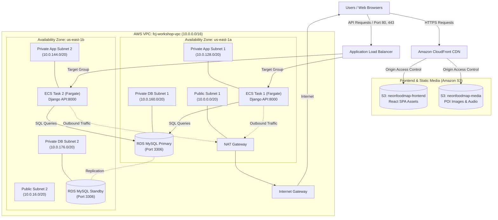

import { Card, Cards } from 'fumadocs-ui/components/card';
import { Callout } from 'fumadocs-ui/components/callout';
import { Step, Steps } from 'fumadocs-ui/components/steps';
import { Server, Network, ShieldCheck, DollarSign, Layers, Globe, Activity } from 'lucide-react';

# FCJ Workshop: Triển khai Ứng dụng Web Cloud-Native NeonFoodMap lên AWS

Chuỗi bài lab thực hành từng bước giúp bạn thiết kế, xây dựng, triển khai, vận hành và tối ưu hạ tầng điện toán đám mây theo tiêu chuẩn **AWS Well-Architected Framework**.

---

## Mục tiêu bài học

<Cards>
  <Card icon={<Network className="text-blue-500" />} title="Part 1: VPC & Hạ tầng Mạng">
    Xây dựng Custom VPC, phân tách Public/Private Subnets Multi-AZ an toàn.
  </Card>
  <Card icon={<Server className="text-green-500" />} title="Part 2: Compute & Database">
    Triển khai ECS Fargate Tasks, Application Load Balancer (ALB) và Amazon RDS MySQL.
  </Card>
  <Card icon={<Globe className="text-cyan-500" />} title="Part 3: Frontend & CloudFront CDN">
    Cấu hình S3 Private Buckets, CloudFront CDN và Origin Access Control (OAC).
  </Card>
  <Card icon={<ShieldCheck className="text-purple-500" />} title="Part 4: Security, IAM & CI/CD">
    Kiểm soát Security Group Chaining, phân định Execution vs Task Role và GitHub Actions OIDC.
  </Card>
  <Card icon={<Activity className="text-rose-500" />} title="Part 5: Neon Operations">
    Thiết lập ECS Auto Scaling, CloudWatch Operational Dashboards, Alarms & Log Insights.
  </Card>
  <Card icon={<DollarSign className="text-amber-500" />} title="Part 6: Cleanup & FinOps">
    Hướng dẫn dọn dẹp hạ tầng an toàn theo thứ tự dependency và quản lý AWS Budgets.
  </Card>
</Cards>

---

## Sơ đồ Kiến trúc Tổng quan

Dưới đây là mô hình hạ tầng hoàn chỉnh bạn sẽ tự tay dựng lên sau khi hoàn thành chuỗi bài thực hành:



---

## Điều kiện Tiên quyết

Để thực hành bài lab hiệu quả nhất, hãy chuẩn bị trước các tài nguyên và mã nguồn sau:

<Steps>
  <Step>
    ### Mã nguồn Dự án (Source Code)
    Mã nguồn mẫu của ứng dụng NeonFoodMap được lưu trữ tại GitHub:
    - **Repository:** [HaoWasabi/NeonFoodmap](https://github.com/HaoWasabi/NeonFoodmap)
    - Clone mã nguồn về máy bằng lệnh:
      ```bash
      git clone https://github.com/HaoWasabi/NeonFoodmap.git
      ```
  </Step>
  <Step>
    ### Tài khoản AWS
    Sử dụng tài khoản AWS đang hoạt động (khuyên dùng gói **AWS Free Tier**).
  </Step>
  <Step>
    ### Công cụ CLI & Git
    Cài đặt **AWS CLI v2**, **Git** trên máy cá nhân và đã cấu hình thành công:
    ```bash
    aws configure
    ```
  </Step>
  <Step>
    ### Kiến thức nền tảng
    Hiểu sơ bộ về câu lệnh Linux cơ bản, khái niệm Docker container và chia dải mạng IP/CIDR.
  </Step>
</Steps>

<Callout type="warn" title="Lưu ý quan trọng về chi phí">
  Hầu hết các tài nguyên trong workshop đều nằm trong **AWS Free Tier**. Tuy nhiên, bạn bắt buộc phải thực hiện bước **Cleanup ở Part 6** ngay sau khi hoàn thành bài lab để tránh bị tính phí duy trì.
</Callout>

---

## Danh sách các Bài thực hành

Hãy chọn bài thực hành bạn muốn bắt đầu:

<Cards>
  <Card 
    icon={<Network />}
    title="Part 1: VPC & Hạ tầng Mạng" 
    href="./01-vpc-networking"
  >
    Khởi tạo VPC, Public/Private Subnets, Internet Gateway và Route Tables.
  </Card>
  <Card 
    icon={<Server />}
    title="Part 2: Compute, Container & Database Layer" 
    href="./02-compute-rds"
  >
    Triển khai ECS Fargate Tasks, Application Load Balancer (ALB) và Amazon RDS MySQL.
  </Card>
  <Card 
    icon={<Globe />}
    title="Part 3: Frontend SPA với S3 & CloudFront CDN" 
    href="./03-frontend-cdn"
  >
    Khởi tạo 4 S3 Buckets private, Origin Access Control (OAC) và CloudFront Distribution.
  </Card>
  <Card 
    icon={<ShieldCheck />}
    title="Part 4: Security, IAM Roles & GitHub Actions CI/CD" 
    href="./04-security-iam-cicd"
  >
    Cấu hình Security Group Chaining, Task Role vs Execution Role, OIDC và CI/CD Pipeline.
  </Card>
  <Card 
    icon={<Activity />}
    title="Part 5: Operations — Auto-Scaling & Monitoring" 
    href="./05-operations-monitoring"
  >
    Cấu hình ECS Auto Scaling theo CPU, CloudWatch Dashboards, Alarms và Log Insights.
  </Card>
  <Card 
    icon={<Layers />}
    title="Part 6: Safe Cleanup, FinOps & Lessons Learned" 
    href="./06-cleanup-summary"
  >
    Hướng dẫn tiêu hủy tài nguyên an toàn theo thứ tự, thiết lập AWS Budget và tổng kết bài học.
  </Card>
</Cards>
