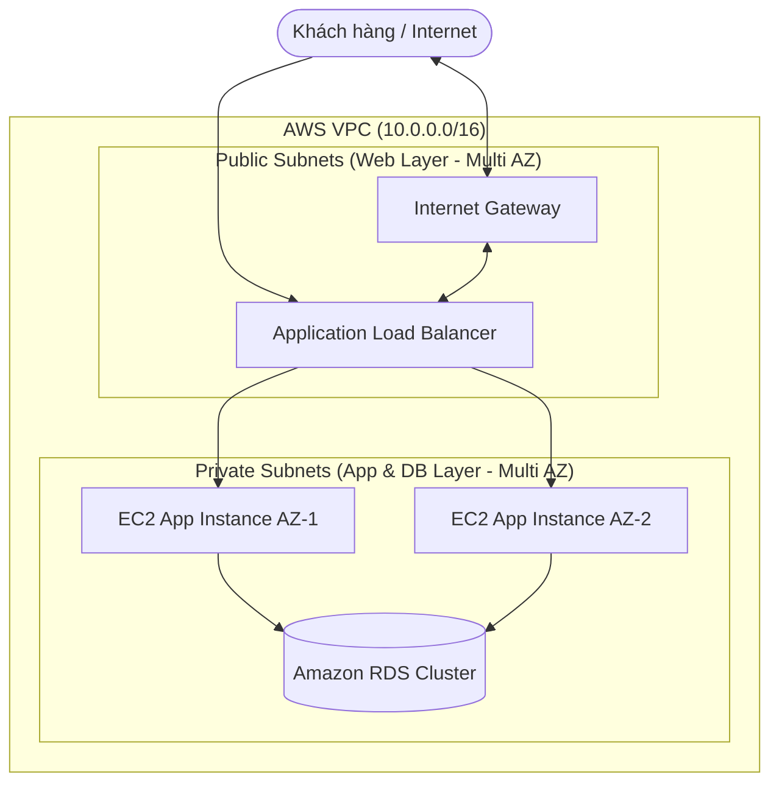

import { Card, Cards } from 'fumadocs-ui/components/card';
import { Callout } from 'fumadocs-ui/components/callout';

# FCJ Workshop Series: Triển khai Ứng dụng Web Chuẩn AWS

Chào mừng bạn đến với chuỗi bài lab thực hành chuẩn hóa dựa trên **FCJ Workshop Template** ([camdao/fcj-workshop-template](https://github.com/camdao/fcj-workshop-template)). Chuỗi bài viết này được biên soạn nhằm hướng dẫn bạn thiết kế, xây dựng và tối ưu hạ tầng ứng dụng điện toán đám mây theo tiêu chuẩn **AWS Well-Architected Framework**.

---

## 🎯 Bạn sẽ Học được gì từ Series này?

- **Hạ tầng Mạng (Networking):** Xây dựng VPC an toàn, phân tách Public/Private Subnets rõ ràng.
- **Tầng Ứng dụng (Compute):** Triển khai EC2 Instances và Application Load Balancer (ALB) hỗ trợ mở rộng.
- **Tầng Dữ liệu (Database):** Cấu hình Amazon RDS an toàn trong vùng mạng nội bộ.
- **Bảo mật & Quản trị (Security & IAM):** Kiểm soát quyền hạn tối thiểu (Least Privilege) với IAM Roles và Security Groups.
- **Tối ưu Chi phí (FinOps & Cleanup):** Hướng dẫn dọn dẹp hạ tầng an toàn, không phát sinh chi phí AWS ngoài ý muốn.

---

## 🏗️ Sơ đồ Kiến trúc Tổng quan (System Architecture)

Dưới đây là mô hình hạ tầng hoàn chỉnh mà bạn sẽ tự tay dựng lên sau khi đi hết chuỗi bài thực hành:

---

## 📋 Điều kiện Tiên quyết (Prerequisites)

Để thực hành thuận lợi nhất, bạn nên chuẩn bị trước:
1. **Tài khoản AWS:** Tài khoản đang hoạt động (khuyên dùng gói AWS Free Tier).
2. **AWS CLI & Git:** Đã cài đặt trên máy cá nhân và cấu hình `aws configure`.
3. **Kiến thức cơ bản:** Đã hiểu sơ bộ về Linux command line và khái niệm IP/CIDR.

<Callout type="warn">
  **Lưu ý quan trọng về chi phí:** Hầu hết các tài nguyên trong workshop đều nằm trong **AWS Free Tier**. Tuy nhiên, bạn bắt buộc phải thực hiện bước **Cleanup ở Part 4** sau khi hoàn thành bài lab để tránh bị tính phí duy trì.
</Callout>

---

## 📚 Danh sách các Bài thực hành (Lab Modules)

Hãy chọn bài thực hành bạn muốn bắt đầu:

<Cards>
  <Card 
    title="Part 1: VPC & Hạ tầng Mạng" 
    href="./work-shop-1/01-vpc-networking"
  >
    Khởi tạo VPC, Public/Private Subnets, Internet Gateway và Route Tables.
  </Card>
  <Card 
    title="Part 2: Compute & Database Layer" 
    href="./work-shop-1/02-compute-rds"
  >
    Triển khai EC2 Instances, Application Load Balancer (ALB) và Amazon RDS.
  </Card>
  <Card 
    title="Part 3: Security & IAM Governance" 
    href="./work-shop-1/03-security-iam"
  >
    Cấu hình Security Groups, IAM Roles và quản lý mật khẩu qua Secrets Manager.
  </Card>
  <Card 
    title="Part 4: Cleanup & Lessons Learned" 
    href="./work-shop-1/04-cleanup-summary"
  >
    Hướng dẫn tiêu hủy tài nguyên an toàn và tổng kết các kiến thức cốt lõi.
  </Card>
</Cards>
