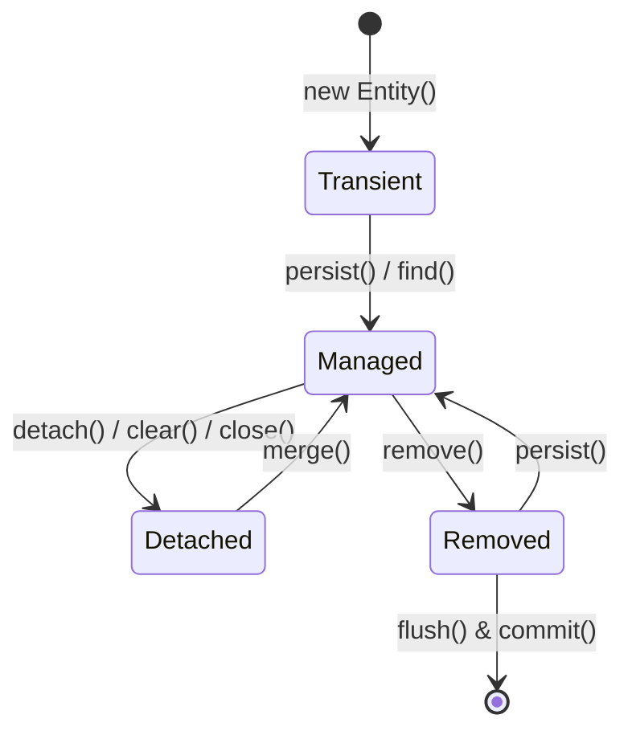
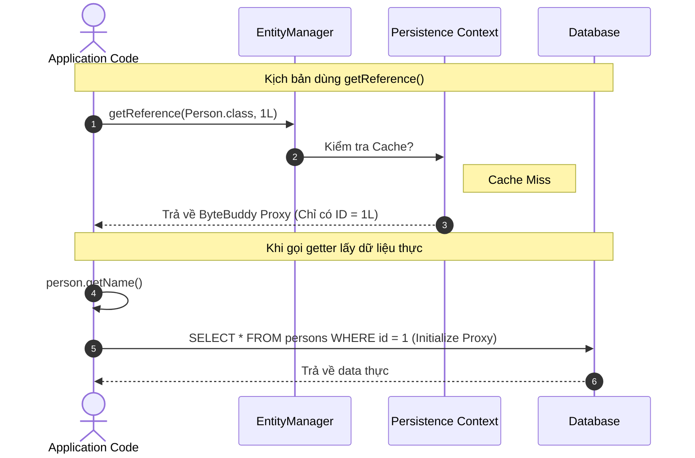
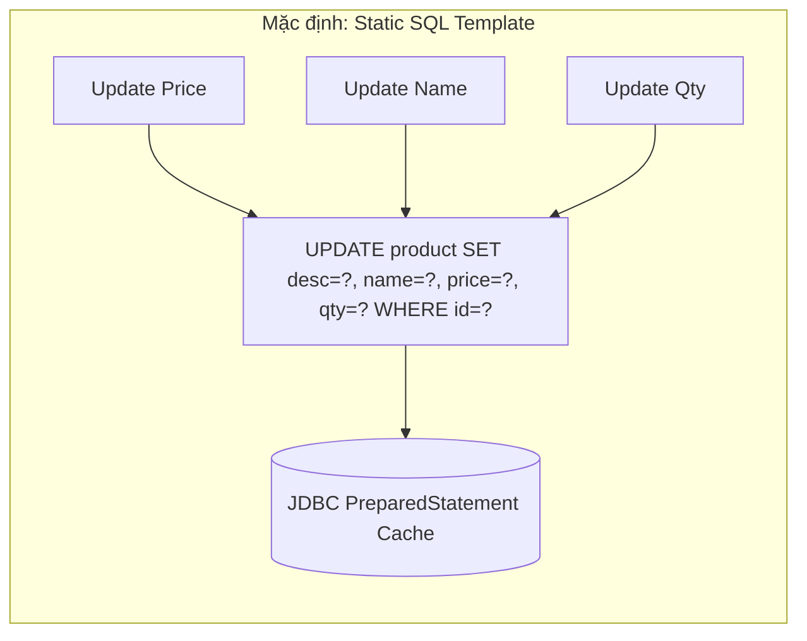

import { Card, Cards } from 'fumadocs-ui/components/card';
import { Callout } from 'fumadocs-ui/components/callout';
import { Tab, Tabs } from 'fumadocs-ui/components/tabs';
import { RefreshCw, Database, Layers, CheckCircle2, AlertTriangle, Cpu, Zap, Box } from 'lucide-react';

**Persistence Context** là "trái tim" của Hibernate ORM. Nó đóng vai trò là một vùng nhớ đệm cấp 1 (**First-Level Cache**) gắn liền với vòng đời của một `EntityManager` (hoặc `Session`). Hiểu rõ cách Persistence Context theo dõi trạng thái entity và cơ chế tự động sinh SQL là chìa khóa để làm chủ hiệu năng của Hibernate.

---

## 1. 4 Trạng thái của Entity trong Vòng đời (Entity Lifecycle)

Tại bất kỳ thời điểm nào, một Java Entity instance chỉ có thể nằm ở một trong 4 trạng thái đối với Persistence Context:



### Chi tiết các trạng thái:

| Trạng thái | Định nghĩa | Có ID? | Được theo dõi thay đổi? |
| :--- | :--- | :---: | :---: |
| **`Transient` (New)** | Entity vừa được khởi tạo bằng từ khóa `new`. Chưa từng liên kết với Persistence Context và chưa có bản ghi trong DB. | ❌ Thường chưa có | ❌ Không |
| **`Managed` (Persistent)** | Entity đang được liên kết và quản lý bởi một Persistence Context. Có ID và đại diện cho 1 row trong DB. | ✅ Có | ✅ **Tự động theo dõi (Dirty Checking)** |
| **`Detached`** | Entity từng ở trạng thái Managed nhưng Session đã đóng (`close()`), bị xóa khỏi cache (`detach()`, `clear()`). | ✅ Có | ❌ Không theo dõi tự động |
| **`Removed`** | Entity được đánh dấu sẽ bị xóa khỏi database khi Session flush (`remove()`). | ✅ Có | ✅ Đang chờ DELETE SQL |

<Callout type="info" title="Bất biến quan trọng trong JPA">
**Tại bất kỳ thời điểm nào, một entity instance cụ thể chỉ có thể được liên kết với tối đa một Persistence Context duy nhất.**
</Callout>

---

## 2. First-Level Cache & Identity Map

Khi bạn gọi `entityManager.find()` nhiều lần cho cùng một ID trong cùng một Transaction/Session:

```java
User user1 = entityManager.find(User.class, 1L); // Sinh câu lệnh SELECT DB
User user2 = entityManager.find(User.class, 1L); // Đọc trực tiếp từ First-Level Cache (Không có SQL)

System.out.println(user1 == user2); // TRUE (Cùng một tham chiếu Object trong Java Heap)
```

```
Persistence Context (First-Level Cache)
┌──────────────┬────────────────────────┬──────────────────────────────────────────┐
│ Entity Class │ Entity Identifier (ID) │ Java Object Reference in Heap            │
├──────────────┼────────────────────────┼──────────────────────────────────────────┤
│ User.class   │ 1L                     │ User@0x7f8b1a (name="Alice", ...)        │
│ Order.class  │ 100L                   │ Order@0x3e2c91 (total=500, ...)          │
└──────────────┴────────────────────────┴──────────────────────────────────────────┘
```

Persistence Context hoạt động như một **Identity Map Pattern**:
1. **Tránh truy vấn thừa:** Lặp lại việc đọc cùng 1 record sẽ không phát sinh thêm câu lệnh SQL xuống DB.
2. **Đảm bảo tính nhất quán (Repeatable Read trong memory):** Tránh hiện tượng 2 object đại diện cho cùng 1 bản ghi DB có dữ liệu bất đồng bộ trong cùng 1 request.

---

## 3. Entity Reference & Lazy Loading Proxy (`find` vs `getReference`)

Hibernate cung cấp 2 phương thức để lấy một Entity:

```java
// Cách 1: Eagerly load từ Database
Person person1 = entityManager.find(Person.class, personId);

// Cách 2: Trả về Proxy rỗng (Chưa gọi DB)
Person person2 = entityManager.getReference(Person.class, personId);
```



### Khi nào nên dùng `getReference()`?
Khi bạn chỉ cần gán **Foreign Key** cho một Entity khác mà không cần đọc dữ liệu thực tế của đối tượng cha.

```java
// Tạo đơn hàng mới cho User có id = 10L
Order order = new Order();
order.setAmount(BigDecimal.valueOf(100));

// Không tốn query SELECT User từ DB chỉ để lấy ID
User userRef = entityManager.getReference(User.class, 10L);
order.setUser(userRef);

entityManager.persist(order); // INSERT INTO orders (user_id, amount) VALUES (10, 100)
```

---

## 4. Dirty Checking & Cơ chế sinh SQL `UPDATE`

### Dirty Checking hoạt động như thế nào?
Khi một Entity chuyển sang trạng thái **Managed**, Hibernate sẽ lưu một **Snapshot (Bản sao)** ban đầu của toàn bộ state entity đó trong Persistence Context.

Khi Transaction chuẩn bị kết thúc hoặc kích hoạt `flush()`:
1. Hibernate duyệt qua toàn bộ Managed Entities.
2. So sánh trạng thái hiện tại của Entity với Snapshot ban đầu.
3. Nếu phát hiện có sự thay đổi (dirty), Hibernate tự động lên lịch sinh câu lệnh SQL `UPDATE`.

```java
@Transactional
public void updateProductPrice(Long productId) {
    Product product = entityManager.find(Product.class, productId); // Loaded & Snapshot
    
    product.setPriceCents(2499); // Thay đổi state
    
    // Không cần gọi entityManager.save() hay update()!
    // Hibernate Dirty Checking sẽ tự động phát hiện và sinh UPDATE khi commit transaction.
}
```

---

## 5. Bí ẩn: Tại sao chỉ sửa 1 field nhưng `UPDATE` toàn bộ cột?

Mặc định, khi bạn chỉ sửa `priceCents`, Hibernate vẫn sinh câu lệnh SQL như sau:

```sql
UPDATE product 
SET description = ?, name = ?, price_cents = ?, quantity = ? 
WHERE id = ?;
```

### Tại sao Hibernate lại làm vậy?



Có 2 lý do kỹ thuật quan trọng:
1. **JDBC PreparedStatement Caching:** Database và JDBC Driver có thể cache lại Query Execution Plan cho cùng một khuôn mẫu SQL. Nếu mỗi field thay đổi sinh ra 1 câu SQL khác nhau, DB phải re-parse và compile lại liên tục.
2. **JDBC Batching:** Khi update nhiều bản ghi khác nhau trong cùng 1 transaction, việc có chung một dạng SQL template giúp Hibernate dễ dàng gộp chúng thành một **Batch Update** duy nhất gửi qua network.

---

## 6. Khi nào nên dùng `@DynamicUpdate`?

Nếu Entity của bạn có **quá nhiều cột (hàng chục cột)** hoặc bảng có nhiều **Index/Trigger**, việc update các cột không thay đổi có thể gây tải thêm cho DB. Lúc này bạn có thể kích hoạt `@DynamicUpdate`:

```java
@Entity
@Table(name = "products")
@DynamicUpdate
public class Product {
    @Id
    private Long id;
    
    private String name;
    private Integer priceCents;
    private String description;
    // ... 30 trường khác
}
```

Khi có `@DynamicUpdate`, Hibernate sẽ tính toán và sinh SQL động tại runtime:
```sql
UPDATE products 
SET price_cents = ? 
WHERE id = ?;
```

| Tiêu chí | Mặc định (Static Update) | `@DynamicUpdate` |
| :--- | :--- | :--- |
| **SQL Shape** | Cố định toàn bộ cột | Động (chỉ cột thay đổi) |
| **PreparedStatement Cache** | ✅ Tận dụng tối đa | ❌ Kém hơn do nhiều biến thể SQL |
| **Batch Updates** | ✅ Rất tốt | ⚠️ Khó batching nếu các entity sửa field khác nhau |
| **Phù hợp cho** | Đa số các Entity thông thường | Entity lớn (nhiều text/blob, nhiều index, bảng rộng) |

---

## 7. Xử lý Detached Data: `merge()`, `refresh()` và `Cascade`

<Tabs items={['merge()', 'refresh()', 'Cascading Types']}>

<Tab value="merge()">

`merge()` nhận vào một Detached Entity, nạp bản ghi tương ứng từ DB vào Persistence Context (nếu chưa có), sau đó copy toàn bộ state từ Detached Entity sang Managed Entity và trả về instance Managed đó.

```java
// userDetached đang ở trạng thái Detached
userDetached.setName("New Name");

// mergedUser là Managed instance, userDetached VẪN LÀ Detached!
User mergedUser = entityManager.merge(userDetached);

mergedUser.setName("Another Update"); // Được theo dõi bởi Dirty Checking
```

<Callout type="warn" title="Lưu ý">
Luôn sử dụng object trả về từ `merge()` (`mergedUser`) để tiếp tục thao tác, không dùng lại biến `userDetached` cũ.
</Callout>
</Tab>

<Tab value="refresh()">

`refresh()` xóa bỏ toàn bộ thay đổi chưa flush trong Persistence Context của Entity và đọc lại nguyên trạng dữ liệu mới nhất từ Database.

```java
User user = entityManager.find(User.class, 1L);
user.setName("Temporary Change");

// Huỷ bỏ thay đổi trong memory, nạp lại từ DB
entityManager.refresh(user);

System.out.println(user.getName()); // Giá trị gốc trong Database
```
</Tab>

<Tab value="Cascading Types">

Cascade xác định các thao tác (`persist`, `merge`, `remove`,...) trên Entity cha có tự động lan truyền sang Entity con hay không:

| CascadeType | Hành vi |
| :--- | :--- |
| **`PERSIST`** | `persist(parent)` $\to$ tự động `persist(child)` |
| **`MERGE`** | `merge(parent)` $\to$ tự động `merge(child)` |
| **`REMOVE`** | `remove(parent)` $\to$ tự động `remove(child)` |
| **`ALL`** | Bao gồm tất cả các thao tác trên |

```java
@OneToMany(mappedBy = "order", cascade = CascadeType.ALL, orphanRemoval = true)
private List<OrderItem> items = new ArrayList<>();
```
</Tab>

</Tabs>

---

## Tóm tắt & Điểm cốt lõi

<Cards>
  <Card title="Dirty Checking" icon={<RefreshCw className="text-blue-500" />}>
    Tự động đồng bộ các thay đổi trong memory xuống DB khi flush mà không cần gọi hàm update thủ công.
  </Card>
  <Card title="Proxy & getReference" icon={<Zap className="text-amber-500" />}>
    Sử dụng proxy để gán khóa ngoại mà không tốn chi phí câu lệnh SELECT không cần thiết.
  </Card>
  <Card title="Trade-off @DynamicUpdate" icon={<Cpu className="text-purple-500" />}>
    Chỉ dùng `@DynamicUpdate` cho các bảng rộng nhiều cột; ưu tiên mặc định để tối ưu Prepared Statement Caching & Batching.
  </Card>
</Cards>
