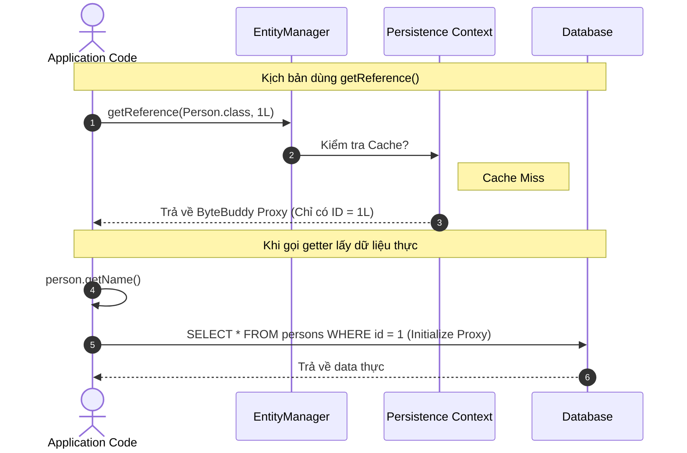

import { Card, Cards } from 'fumadocs-ui/components/card';
import { Callout } from 'fumadocs-ui/components/callout';
import { Tab, Tabs } from 'fumadocs-ui/components/tabs';
import { RefreshCw, Database, Layers, CheckCircle2, AlertTriangle, Cpu, Zap, Box } from 'lucide-react';

Persistence Context là một thành phần cốt lõi của Hibernate ORM. Nó quản lý các Entity trong một Unit of Work và được gắn với vòng đời của EntityManager (hoặc Session).

Persistence Context đồng thời hoạt động như First-Level Cache, giúp Hibernate quản lý identity của Entity, theo dõi thay đổi và thực hiện Dirty Checking để đồng bộ trạng thái Entity với Database khi flush.

Hiểu rõ Persistence Context và vòng đời Entity là nền tảng để hiểu cách Hibernate quản lý dữ liệu, sinh SQL và thực hiện Lazy Loading.

---

## 1. 4 Trạng thái của Entity trong Vòng đời (Entity Lifecycle)

Trong JPA/Hibernate, một Entity instance có thể trải qua 4 trạng thái chính tùy theo mối quan hệ của nó với Persistence Context:


### Chi tiết các trạng thái

| Trạng thái                 | Định nghĩa                                                                                                                                                    |         Có ID?         | Được Persistence Context theo dõi? |
| :------------------------- | :------------------------------------------------------------------------------------------------------------------------------------------------------------ | :--------------------: | :--------------------------------: |
| **`Transient` (New)**      | Entity vừa được tạo bằng `new`. Chưa được Persistence Context quản lý và chưa được persist vào Database.                                                      | ⚠️ Có thể có hoặc chưa |               ❌ Không              |
| **`Managed` (Persistent)** | Entity đang được Persistence Context quản lý. Hibernate theo dõi thay đổi của Entity và có thể đồng bộ các thay đổi xuống Database khi `flush`.               |       ✅ Thường có      |        ✅ **Dirty Checking**        |
| **`Detached`**             | Entity trước đó từng là `Managed` nhưng không còn được Persistence Context quản lý, chẳng hạn sau `detach()`, `clear()` hoặc `EntityManager/Session.close()`. |          ✅ Có          |               ❌ Không              |
| **`Removed`**              | Entity đang được Persistence Context quản lý nhưng đã được đánh dấu để xóa bằng `remove()`. Lệnh `DELETE` thường được thực hiện khi `flush`.                  |          ✅ Có          |        ✅ Đang chờ **DELETE**       |

<Callout type="info" title="Bất biến quan trọng trong JPA">
**Tại bất kỳ thời điểm nào, một entity instance cụ thể chỉ có thể được liên kết với tối đa một Persistence Context duy nhất.**
</Callout>

---

## 2. First-Level Cache & Identity Map

**Persistence Context** cũng hoạt động như **First-Level Cache**, được dùng để quản lý các Entity đang ở trạng thái `Managed`.

Khi gọi `find()` nhiều lần cho cùng một Entity trong **cùng Persistence Context**:

```java
User user1 = entityManager.find(User.class, 1L);
// SELECT ... FROM users WHERE id = 1

User user2 = entityManager.find(User.class, 1L);
// Không phát sinh SELECT

System.out.println(user1 == user2); // true
```

Lần đầu Hibernate truy vấn Database và đưa Entity vào Persistence Context.

Lần sau, Hibernate tìm thấy Entity đã tồn tại trong Persistence Context nên trả về **chính object đó**.

```text
Persistence Context
┌─────────────────────────────────┐
│ User#1 → User@0x7f8b1a          │
│ Order#100 → Order@0x3e2c91      │
└─────────────────────────────────┘
```

### Identity Map

Persistence Context hoạt động theo nguyên tắc **Identity Map**:

* **Tránh SQL dư thừa:** Cùng một Entity trong cùng Context không cần SELECT lại.
* **Đảm bảo Identity:** Một Entity identity chỉ có một Java object tương ứng trong cùng Persistence Context.

```text
Entity Identity
(User.class, 1L)
       ↓
Persistence Context
       ↓
   User Object
       ↓
   Java Heap
```

<Callout type="info" title="Cách nhớ">

**Cùng Persistence Context + cùng Entity ID → cùng Java Object.**

```java
user1 == user2 // true
```

Điều này **chỉ đảm bảo trong cùng Persistence Context**. Hai Persistence Context khác nhau có thể có hai Java object khác nhau nhưng cùng đại diện cho `User#1`.
</Callout>

---

## 3. Entity Reference & Lazy Loading Proxy (`find` vs `getReference`)

Hibernate cung cấp 2 phương thức để lấy một Entity:

```java
// Cách 1: Eagerly load từ Database
Person person1 = entityManager.find(Person.class, personId);

// Cách 2: Trả về Proxy rỗng (Chưa gọi DB)
Person person2 = entityManager.getReference(Person.class, personId);
```



### Khi nào nên dùng `getReference()`?
Một trường hợp phổ biến là khi bạn chỉ cần tham chiếu đến Entity để thiết lập Foreign Key, nhưng không cần đọc dữ liệu của Entity đó.
```java
// Tạo đơn hàng mới cho User có id = 10L
Order order = new Order();
order.setAmount(BigDecimal.valueOf(100));

// Không tốn query SELECT User từ DB chỉ để lấy ID
User userRef = entityManager.getReference(User.class, 10L);
order.setUser(userRef);

entityManager.persist(order); // INSERT INTO orders (user_id, amount) VALUES (10, 100)
```

---

## 4. Dirty Checking & Cơ chế sinh SQL `UPDATE`

### Dirty Checking hoạt động như thế nào?

Khi một Entity ở trạng thái **Managed**, Hibernate sẽ quản lý state của Entity trong **Persistence Context** và thường lưu lại một **Snapshot** của state ban đầu để phục vụ việc so sánh.

Khi Hibernate thực hiện **`flush()`**:

1. Hibernate kiểm tra các Entity đang ở trạng thái `Managed`.
2. So sánh **state hiện tại** của Entity với Snapshot.
3. Nếu phát hiện state đã thay đổi (**dirty**), Hibernate xác định cần thực hiện `UPDATE`.
4. Hibernate sinh SQL `UPDATE` và đưa lệnh đó vào quá trình đồng bộ với Database.

```java
@Transactional
public void updateProductPrice(Long productId) {

    Product product =
        entityManager.find(Product.class, productId);
    // Entity → Managed
    // Hibernate lưu state ban đầu (Snapshot)

    product.setPriceCents(2499);
    // Thay đổi state của Entity trong Java

    // Không cần gọi save() hoặc update()!
    // Khi flush(), Hibernate Dirty Checking
    // sẽ phát hiện price đã thay đổi
}
```

Hibernate có thể sinh:

```sql
UPDATE product
SET price_cents = 2499
WHERE id = ?;
```

### Điều gì thực sự xảy ra?

```text
find()
   ↓
Database
   ↓
Product Entity
   ↓
Managed
   ↓
Snapshot
   │
   │  product.setPriceCents(2499)
   ↓
Entity bị thay đổi
   │
   │ flush()
   ↓
Dirty Checking
   │
   ├── State giống Snapshot
   │       ↓
   │     Không UPDATE
   │
   └── State khác Snapshot
           ↓
        Sinh UPDATE
           ↓
        Database
```


### ⚠️ Dirty Checking không đồng nghĩa với `commit()`

`Dirty Checking` xảy ra trong quá trình **`flush()`**, còn `commit()` là thao tác hoàn tất Transaction.

Có thể hình dung:

```text
Transaction
│
├── thay đổi Entity
│
├── flush()
│    └── Dirty Checking
│         └── sinh SQL UPDATE
│
├── ... có thể flush thêm ...
│
└── commit()
     └── hoàn tất Transaction
```

Vì vậy:

> **Dirty Checking phát hiện thay đổi và chuẩn bị SQL trong quá trình flush. `commit()` không phải là nơi Dirty Checking trực tiếp xảy ra.**

## 5. Dynamic Update: Tại sao sửa 1 field nhưng `UPDATE` nhiều cột?

Giả sử chỉ thay đổi:

```java
product.setPriceCents(2499);
```

Hibernate **mặc định** có thể sinh:

```sql
UPDATE product
SET description = ?,
    name = ?,
    price_cents = ?,
    quantity = ?
WHERE id = ?;
```

### Tại sao?

Mặc định Hibernate sử dụng **Static SQL** — một SQL template cố định cho Entity.

```text
Dirty Checking
      ↓
Biết priceCents thay đổi
      ↓
Static SQL
      ↓
UPDATE nhiều mapped columns
```

SQL có **shape ổn định** giúp:

* Tái sử dụng `PreparedStatement` thuận lợi hơn.
* Hỗ trợ **JDBC batching** tốt hơn khi có nhiều `UPDATE` cùng loại.

Ngoài ra, nếu các column được `UPDATE` thực sự thay đổi và chúng có **Index**, Database có thể phải cập nhật các Index liên quan → tăng chi phí ghi.

### `@DynamicUpdate`

Có thể yêu cầu Hibernate tạo SQL dựa trên các column thực sự thay đổi:

```java
@Entity
@DynamicUpdate
public class Product {
    // ...
}
```

Chỉ thay đổi `priceCents`:

```sql
UPDATE product
SET price_cents = ?
WHERE id = ?;
```

**Ưu điểm:**

* SQL chỉ chứa column cần update.
* Có thể giảm chi phí ghi và duy trì Index không liên quan.

**Nhược điểm:**

* Tạo nhiều SQL shape khác nhau.
* Có thể giảm khả năng `PreparedStatement` reuse và JDBC batching.

---
## 6. Xử lý Detached Data: `merge()`, `refresh()` và `Cascade`

<Tabs items={['merge()', 'refresh()', 'Cascade']}>

<Tab value="merge()">

### `merge()`

`merge()` dùng để đưa state của một **Detached Entity** vào Persistence Context.

Hibernate trả về một **Managed Entity**. Entity Detached ban đầu **vẫn là Detached**.

```java
// userDetached đang ở trạng thái Detached
userDetached.setName("New Name");

User mergedUser = entityManager.merge(userDetached);

// mergedUser → Managed
// userDetached → vẫn Detached

mergedUser.setName("Another Update");
// Được Dirty Checking theo dõi
```

<Callout type="warn" title="Cách dùng">

Sau `merge()`, nên tiếp tục làm việc với **object được trả về**:

```java
User managedUser = entityManager.merge(userDetached);
```

Không nên tiếp tục sử dụng `userDetached` để chờ Dirty Checking.

</Callout>

</Tab>

<Tab value="refresh()">

### `refresh()`

`refresh()` đọc lại dữ liệu từ **Database** và ghi đè state hiện tại của Entity.

Các thay đổi trong memory của Entity đó chưa được flush sẽ bị thay thế.

```java
User user = entityManager.find(User.class, 1L);

user.setName("Temporary Change");

entityManager.refresh(user);

// State của user được đọc lại từ DB
System.out.println(user.getName());
```

```text
Entity trong Memory
      ↓
   refresh()
      ↓
SELECT từ Database
      ↓
Ghi đè state hiện tại
```

> `refresh()` thường dùng khi muốn **bỏ thay đổi trong memory và lấy lại dữ liệu từ DB**.

</Tab>

<Tab value="Cascade">

### Cascade

`Cascade` xác định một thao tác trên Entity có được **tự động lan truyền** sang Entity liên quan hay không.

| `CascadeType` | Hành vi                              |
| :------------ | :----------------------------------- |
| `PERSIST`     | `persist(parent)` → `persist(child)` |
| `MERGE`       | `merge(parent)` → `merge(child)`     |
| `REMOVE`      | `remove(parent)` → `remove(child)`   |
| `ALL`         | Bao gồm các cascade type trên        |

Ví dụ:

```java
@OneToMany(
    mappedBy = "order",
    cascade = CascadeType.ALL,
    orphanRemoval = true
)
private List<OrderItem> items = new ArrayList<>();
```

Khi:

```java
entityManager.persist(order);
```

Cascade `PERSIST` trong `ALL` sẽ tự động persist các `OrderItem` liên quan.

</Tab>

</Tabs>

