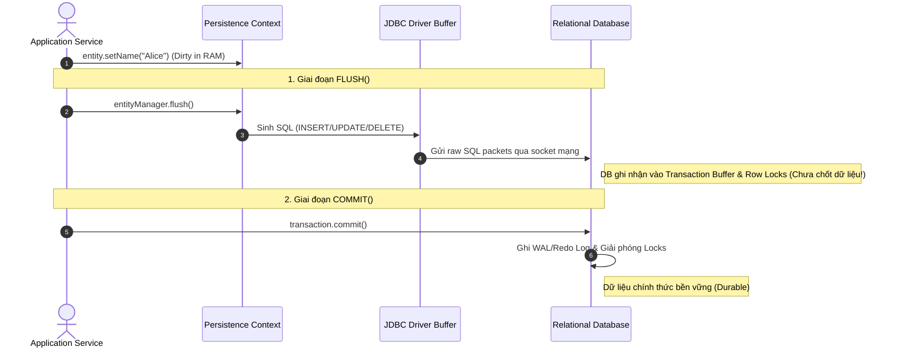
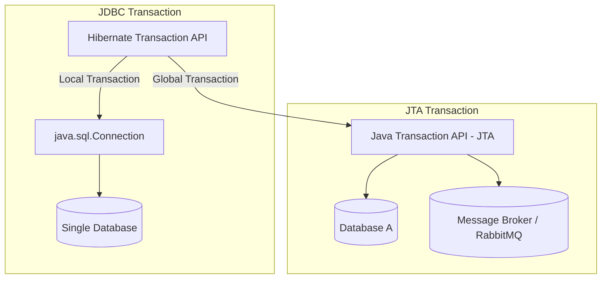

import { Card, Cards } from 'fumadocs-ui/components/card';
import { Callout } from 'fumadocs-ui/components/callout';
import { Tab, Tabs } from 'fumadocs-ui/components/tabs';
import { GitCommit, Database, RefreshCw, AlertTriangle, CheckCircle2, Clock, Layers } from 'lucide-react';

Một trong những sai lầm phổ biến nhất của các lập trình viên khi làm việc với Hibernate là **đánh đồng việc gọi `flush()` với `commit()` Transaction**. 

Hiểu đúng thời điểm Hibernate đẩy SQL xuống Database và cách quản lý vòng đời Transaction là điều kiện tiên quyết để xây dựng hệ thống có độ tin cậy và hiệu năng cao.

---

## 1. Bản chất kỹ thuật: `flush()` vs `commit()`



| Tiêu chí | `flush()` | `commit()` |
| :--- | :--- | :--- |
| **Bản chất** | **Đồng bộ hóa bộ nhớ:** Đẩy các thay đổi đang chờ trong Persistence Context thành các câu lệnh SQL gửi tới Database. | **Xác nhận giao dịch:** Chốt toàn bộ các thay đổi vật lý của Database Transaction. |
| **Phạm vi quản lý** | Do **Hibernate / JPA** quản lý. | Do **Database Transaction Manager** (JDBC / JTA) quản lý. |
| **Dữ liệu có hiển thị với transaction khác?** | ❌ **Chưa** (theo chuẩn Read Committed / Repeatable Read). Transaction khác chỉ thấy row lock. | ✅ **Có** (Sau khi commit thành công). |
| **Nếu xảy ra Rollback sau đó?** | Toàn bộ các câu lệnh SQL đã flush trước đó **sẽ bị Database Rollback hoàn toàn**. | Không thể rollback sau khi đã commit thành công. |

---

## 2. Các chế độ Flush (FlushModeType) trong Hibernate

Hibernate quản lý thời điểm tự động kích hoạt `flush()` thông qua `FlushMode`:

```
FlushMode Hierarchy & Cadence
┌──────────────────────────────────────────────────────────────────┐
│ ALWAYS   : Flush trước MỌI câu query (ít khi dùng)              │
├──────────────────────────────────────────────────────────────────┤
│ AUTO     : (Mặc định) Flush trước Query nếu query đụng dirty row │
│            hoặc Flush khi transaction chuẩn bị Commit            │
├──────────────────────────────────────────────────────────────────┤
│ COMMIT   : Chỉ Flush khi Transaction chuẩn bị Commit             │
├──────────────────────────────────────────────────────────────────┤
│ MANUAL   : Ứng dụng phải tự gọi entityManager.flush() thủ công  │
└──────────────────────────────────────────────────────────────────┘
```

### 1. `FlushModeType.AUTO` (Mặc định & Khuyên dùng)
Hibernate sẽ tự động kích hoạt `flush()` trong 2 trường hợp:
1. **Trước khi kết thúc/commit Transaction:** Đảm bảo toàn bộ state được lưu trước khi đóng giao dịch.
2. **Trước khi thực thi một Query (JPQL/HQL hoặc Native SQL):** Nếu câu query chuẩn bị đọc dữ liệu từ các bảng đang có Entity bị thay đổi (dirty) trong Persistence Context, Hibernate buộc phải flush trước để câu query đọc được dữ liệu mới nhất (**Read-Your-Own-Writes Consistency**).

```java
@Transactional
public void autoFlushDemo() {
    User user = entityManager.find(User.class, 1L);
    user.setName("Bob"); // Đang dirty trong RAM

    // Hibernate phát hiện câu HQL dưới đây đọc bảng 'users'
    // -> Tự động flush() sinh câu UPDATE trước khi chạy SELECT!
    List<User> list = entityManager.createQuery("SELECT u FROM User u WHERE u.name = 'Bob'", User.class)
                                   .getResultList();
}
```

### 2. Trường hợp đặc biệt: `GenerationType.IDENTITY`
<Callout type="error" title="Ngoại lệ phá vỡ cơ chế Flush Trì hoãn (Delayed Flush)">
Khi bạn sử dụng `@GeneratedValue(strategy = GenerationType.IDENTITY)`, Hibernate **bắt buộc phải thực thi câu lệnh SQL INSERT ngay lập tức khi gọi `entityManager.persist(entity)`**, bất kể FlushMode là gì.

Lý do: Hibernate cần giá trị Primary Key được DB tự sinh để đăng ký Entity vào Persistence Context (Identity Map). Do đó, `IDENTITY` không thể tận dụng cơ chế batch insert trì hoãn.
</Callout>

---

## 3. Quản lý Physical Transaction: JDBC vs JTA

Hibernate cung cấp abstraction tầng cao thông qua `Transaction API` để trừu tượng hóa các cơ chế bên dưới:



- **Resource-local (JDBC):** Sử dụng `connection.setAutoCommit(false)`, `connection.commit()`. Phù hợp cho ứng dụng đơn cơ sở dữ liệu.
- **JTA (Java Transaction API / XA):** Cho phép một transaction điều phối nhiều tài nguyên phân tán cùng lúc (Distributed Transactions - 2 Phase Commit).

---

## 4. Transaction Patterns trong Ứng dụng Thực tế

<Tabs items={['Session-per-request (Chuẩn)', 'Anti-pattern: Session-per-operation', 'Anti-pattern: Long Transactions']}>

<Tab value="Session-per-request (Chuẩn)">

Mỗi HTTP Request tương ứng với đúng **một Session duy nhất** và thực thi trong **một Transaction ngắn**:

```
Client Request
      │
      ▼
┌──────────────────────────────────────┐
│ Open Session / EntityManager         │
│ Begin Transaction                    │
│   ├─ Business Logic Execution        │
│   └─ Automatic Flush & Commit        │
│ Close Session                        │
└──────────────────────────────────────┘
      │
      ▼
Client Response (200 OK)
```

* **Spring Framework:** Sử dụng `@Transactional` trên tầng Service kết hợp với `OpenEntityManagerInViewFilter` hoặc đóng session ngay tại service boundary.
</Tab>

<Tab value="Anti-pattern: Session-per-operation">

Mở và đóng Session / Transaction cho **từng câu lệnh DB riêng lẻ**:

```java
// ❌ SAI LẦM: Làm mất hoàn toàn lợi ích của First-Level Cache và Dirty Checking
public void saveUser(User u) {
    Session s = sf.openSession();
    s.beginTransaction();
    s.persist(u);
    s.getTransaction().commit();
    s.close();
}
```
* **Hậu quả:** Tốn overhead mở/đóng kết nối liên tục, không đảm bảo tính toàn vẹn đa bước (Multi-step Atomicity).
</Tab>

<Tab value="Anti-pattern: Long Transactions">

Giữ Database Transaction mở trong suốt thời gian người dùng tương tác hoặc xử lý logic ngoài luồng:

```java
// ❌ NGUY HIỂM: Giữ Transaction mở trong khi gọi API bên thứ 3
@Transactional
public void processPayment() {
    Order order = orderRepo.findById(1L);
    
    // Gọi Network I/O bên thứ ba mất 5 giây -> GIỮ LOCK DATABASE 5 GIÂY!
    paymentGateway.charge(order.getAmount()); 
    
    order.setStatus(PAID);
}
```
* **Hậu quả:** Gây cạn kiệt Connection Pool và tắc nghẽn Lock Contention nghiêm trọng trong database. Hãy luôn tách Network I/O ra ngoài phạm vi `@Transactional`.
</Tab>

</Tabs>

---

## Tóm tắt & Nguyên tắc Vàng

<Cards>
  <Card title="Flush vs Commit" icon={<RefreshCw className="text-blue-500" />}>
    `flush()` chỉ đẩy SQL xuống DB buffer; chỉ `commit()` mới giải phóng lock và lưu dữ liệu vĩnh viễn.
  </Card>
  <Card title="Short Transactions" icon={<Clock className="text-amber-500" />}>
    Giữ transaction càng ngắn càng tốt. Tuyệt đối không thực hiện network call (REST, email, third-party) bên trong transaction.
  </Card>
  <Card title="FlushMode AUTO" icon={<CheckCircle2 className="text-green-500" />}>
    Duy trì FlushMode AUTO mặc định để đảm bảo tính nhất quán dữ liệu trước mỗi câu query.
  </Card>
</Cards>
