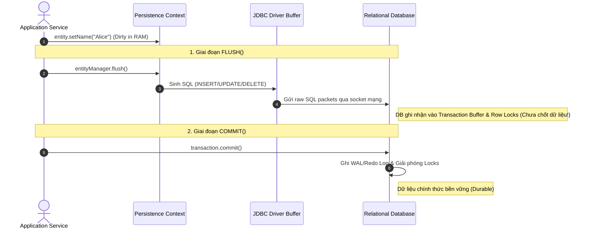

import { Card, Cards } from 'fumadocs-ui/components/card';
import { Callout } from 'fumadocs-ui/components/callout';
import { Tab, Tabs } from 'fumadocs-ui/components/tabs';
import { GitCommit, Database, RefreshCw, AlertTriangle, CheckCircle2, Clock, Layers } from 'lucide-react';

Một trong những sai lầm phổ biến khi làm việc với Hibernate là **đánh đồng `flush()` với `commit()`**.

Hiểu đúng **khi nào Hibernate đồng bộ thay đổi xuống Database (`flush`)** và **khi nào Transaction thực sự hoàn tất (`commit`)** là điều quan trọng để tránh hiểu sai về tính nhất quán dữ liệu và vòng đời Transaction.

> **`flush()`** → đồng bộ các thay đổi từ Persistence Context xuống Database bằng SQL.
>
> **`commit()`** → hoàn tất Transaction và xác nhận các thay đổi của Transaction.

---

## 1. Bản chất kỹ thuật: `flush()` vs `commit()`



### So sánh

| Tiêu chí                     | `flush()`                                      | `commit()`                                            |
| :--------------------------- | :--------------------------------------------- | :---------------------------------------------------- |
| **Mục đích**                 | Đồng bộ Persistence Context → Database         | Hoàn tất Database Transaction                         |
| **Thực hiện SQL?**           | Có thể thực thi `INSERT` / `UPDATE` / `DELETE` | Không phải mục đích chính của `commit()`              |
| **Transaction kết thúc?**    | ❌ Không                                        | ✅ Có                                                  |
| **Có thể rollback sau đó?**  | ✅ Có                                           | ❌ Không thể rollback Transaction đã commit thành công |
| **Ai điều khiển?**           | JPA/Hibernate                                  | Transaction manager / Database                        |
| **Có thể xảy ra nhiều lần?** | ✅ Có                                           | Thông thường một lần khi Transaction kết thúc         |

---
## 2. Các chế độ Flush — `FlushModeType`

Hibernate quản lý thời điểm tự động thực hiện `flush()` thông qua **Flush Mode**.

```text
FlushMode
│
├── ALWAYS  → Flush trước mọi query
│
├── AUTO    → Flush khi cần thiết + trước commit
│
├── COMMIT  → Chủ yếu flush khi commit
│
└── MANUAL  → Application chủ động gọi flush()
```

> Với JPA, `AUTO` là chế độ mặc định. Hibernate native còn có các `FlushMode` riêng như `ALWAYS`, `MANUAL`.

### 1. `FlushModeType.AUTO`

Đây là chế độ mặc định của JPA.

Hibernate có thể tự động `flush()`:

1. Khi transaction chuẩn bị `commit`.
2. Trước một query nếu Hibernate xác định rằng các thay đổi pending trong Persistence Context có thể ảnh hưởng đến kết quả query.

Ví dụ:

```java
@Transactional
public void autoFlushDemo() {

    User user = entityManager.find(User.class, 1L);

    user.setName("Bob");
    // User đang dirty trong Persistence Context

    List<User> users = entityManager.createQuery(
        "SELECT u FROM User u WHERE u.name = 'Bob'",
        User.class
    ).getResultList();

    // Hibernate có thể flush User trước khi chạy query
}
```

Vì query đọc dữ liệu của `User`, Hibernate có thể cần đồng bộ thay đổi pending xuống Database trước khi thực hiện query.

Ngược lại:

```java
user.setName("Bob");

entityManager.createQuery(
    "SELECT p FROM Product p",
    Product.class
).getResultList();
```

Query chỉ đọc `Product`, nên Hibernate có thể không cần flush thay đổi của `User` trước query.

### 2. `IDENTITY` và INSERT sớm

Khi sử dụng:

```java
@GeneratedValue(strategy = GenerationType.IDENTITY)
```

Database tự sinh ID khi thực hiện `INSERT`.

```text
persist(entity)
      ↓
Database phải INSERT
      ↓
Database sinh ID
      ↓
Hibernate lấy generated ID
```

Do đó, với `IDENTITY`, Hibernate thường phải thực hiện `INSERT` sớm hơn thay vì luôn trì hoãn INSERT đến `flush()`.

Điều này làm `IDENTITY` khó tận dụng cơ chế **delayed insert** và có thể hạn chế **JDBC batching** so với các chiến lược như `SEQUENCE`.

---

## 3. Quản lý Physical Transaction: JDBC vs JTA

Hibernate cung cấp `Transaction API` để ứng dụng không cần thao tác trực tiếp với cơ chế transaction bên dưới.

```text id="q7x2km"
Application
     ↓
Hibernate Transaction API
     ↓
┌─────────────────────┬──────────────────────┐
│ Resource-local      │ JTA                  │
│ (JDBC Transaction)  │ (Global Transaction) │
└─────────┬───────────┴──────────┬───────────┘
          ↓                      ↓
      Database              Transaction Manager
                                 ↓
                         ┌───────┴───────┐
                         ↓               ↓
                     Database A      Resource B
```

### 1. Resource-local / JDBC Transaction

Transaction được quản lý bởi một JDBC `Connection`.

```java id="6y8p2n"
connection.setAutoCommit(false);

try {
    // SQL operations

    connection.commit();
} catch (Exception e) {
    connection.rollback();
}
```

Đặc điểm:

* Thường phù hợp khi ứng dụng làm việc với **một database/resource**.
* Transaction được quản lý thông qua JDBC connection.
* Hibernate có thể sử dụng transaction này thông qua `EntityTransaction` hoặc cơ chế transaction của framework.

```text id="9w3kfa"
Application
    ↓
Hibernate
    ↓
JDBC Connection
    ↓
Database
```

### 2. JTA Transaction

**JTA (Jakarta Transactions)** cung cấp API để quản lý transaction có thể trải rộng trên **nhiều transactional resources**.

```text id="h6k2ps"
Application
      ↓
JTA Transaction
      ↓
Transaction Manager
      ├── Database A
      ├── Database B
      └── Resource khác
```

Transaction Manager chịu trách nhiệm điều phối transaction giữa các resource.

Ví dụ:

```text id="e2m7zr"
Transaction
   │
   ├── Update Database A
   │
   └── Update Database B
           ↓
     cùng commit / rollback
```

### JTA và XA

`JTA` là **API/transaction model**.

`XA` là một cơ chế/protocol thường được sử dụng để hỗ trợ **distributed transaction** giữa các resource có khả năng tham gia XA.

Một trường hợp điển hình là:

```text id="c5n8vx"
JTA Transaction Manager
        ↓
   XA resources
     ├── DB A
     └── DB B
        ↓
   Two-Phase Commit (2PC)
```

> Không nên đồng nhất `JTA = XA = 2PC`. JTA là abstraction/API; XA là một cơ chế chuẩn để resource tham gia distributed transaction; 2PC là một protocol commit thường được dùng trong mô hình này.


---
## 4. Transaction Patterns trong Ứng dụng Thực tế

Trong ứng dụng Hibernate, cách xác định **phạm vi của Session/Persistence Context và Transaction** có ảnh hưởng trực tiếp đến hiệu năng, tính nhất quán dữ liệu và khả năng mở rộng của hệ thống.

<Tabs items={['Session-per-request (Phổ biến)', 'Anti-pattern: Session-per-operation', 'Anti-pattern: Long Transactions']}>

<Tab value="Session-per-request (Phổ biến)">

Trong mô hình **Session-per-request**, một HTTP Request được xử lý trong một phạm vi Persistence Context phù hợp và thường đi cùng một **transaction ngắn** cho business operation.

```text
Client Request
      │
      ▼
┌──────────────────────────────────────┐
│ Persistence Context / EntityManager  │
│                                      │
│   Begin Transaction                  │
│          │                           │
│          ├─ Business Logic           │
│          │                           │
│          └─ Flush                    │
│                 │                    │
│                 ▼                    │
│              Commit                  │
│                                      │
│ Close / Release Resources            │
└──────────────────────────────────────┘
      │
      ▼
Client Response
```

Trong Spring, cách phổ biến là đặt `@Transactional` tại **Service Layer**:

```java
@Transactional
public void updateUser(Long id) {

    User user = userRepository.findById(id)
        .orElseThrow();

    user.setName("Bob");
}
```

Khi method kết thúc thành công:

```text
Entity thay đổi
      ↓
Dirty Checking
      ↓
Flush
      ↓
SQL UPDATE
      ↓
Commit
```

> **Lưu ý:** Không nên hiểu cứng rằng `1 HTTP Request = 1 Transaction` hoặc `1 HTTP Request = 1 Session`. Phạm vi thực tế phụ thuộc vào cách ứng dụng cấu hình transaction và Persistence Context.

</Tab>

<Tab value="Anti-pattern: Session-per-operation">

**Session-per-operation** là việc mở và đóng Session/Transaction cho từng thao tác DB riêng lẻ.

```java
// ❌ Không nên

public void saveUser(User user) {

    Session session = sessionFactory.openSession();

    session.beginTransaction();

    session.persist(user);

    session.getTransaction().commit();

    session.close();
}
```

Nếu một business operation có nhiều thao tác:

```text
Operation 1
→ Open Session
→ Transaction
→ Commit
→ Close

Operation 2
→ Open Session
→ Transaction
→ Commit
→ Close

Operation 3
→ Open Session
→ Transaction
→ Commit
→ Close
```

### Vấn đề

* Tăng overhead khi liên tục quản lý Session/Transaction/Connection.
* Các thao tác không nằm trong cùng một transaction.
* Không tận dụng được Persistence Context chung và First-Level Cache.
* Khó đảm bảo **Multi-step Atomicity**.

Ví dụ, nếu một nghiệp vụ cần thực hiện 3 bước:

```text
Create Order
      ↓
Create Order Items
      ↓
Update Inventory
      ↓
    COMMIT
```

thì thường nên đặt chúng trong **cùng một transaction** để có thể rollback toàn bộ khi xảy ra lỗi.

</Tab>

<Tab value="Anti-pattern: Long Transactions">

**Long Transaction** là transaction được giữ mở quá lâu, đặc biệt khi bên trong có các thao tác chậm như Network I/O, gọi API bên thứ ba hoặc chờ người dùng.

Ví dụ:

```java
// ❌ Tránh giữ transaction trong lúc chờ API bên ngoài

@Transactional
public void processPayment() {

    Order order = orderRepo.findById(1L)
        .orElseThrow();

    // Network I/O có thể mất nhiều giây
    paymentGateway.charge(order.getAmount());

    order.setStatus(PAID);
}
```

Flow có thể trở thành:

```text
BEGIN TRANSACTION
       ↓
SELECT Order
       ↓
Gọi Payment API
       ↓
   Chờ vài giây
       ↓
UPDATE Order
       ↓
COMMIT
```

Transaction phải được giữ mở trong toàn bộ thời gian chờ API.

### Hậu quả

* Database Connection bị giữ lâu hơn.
* Connection Pool có thể bị chiếm dụng.
* Nếu transaction đang giữ lock, thời gian lock có thể kéo dài.
* Tăng **Lock Contention** và giảm khả năng xử lý concurrent requests.

Vì vậy, nên tránh thiết kế:

```text
@Transactional
      ↓
Database Operation
      ↓
Network I/O ❌
      ↓
Database Operation
```

Thay vào đó, nên thiết kế transaction có **phạm vi ngắn và rõ ràng**, đồng thời hạn chế đưa các thao tác bên ngoài Database vào bên trong transaction.

</Tab>

</Tabs>

> **Nguyên tắc:** Một transaction nên bao quanh một **business operation hợp lý**, đủ lớn để đảm bảo atomicity nhưng không nên kéo dài bởi các thao tác chậm hoặc không cần thiết.
