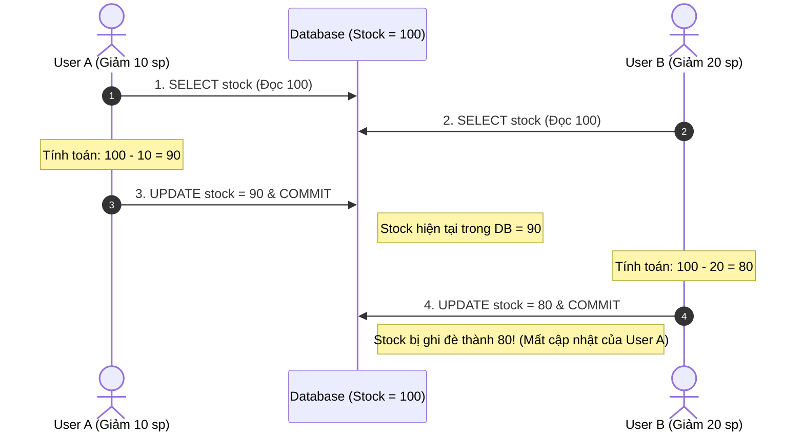
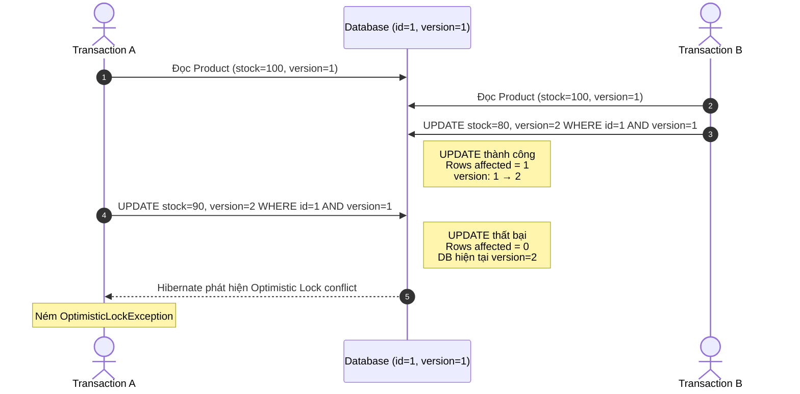
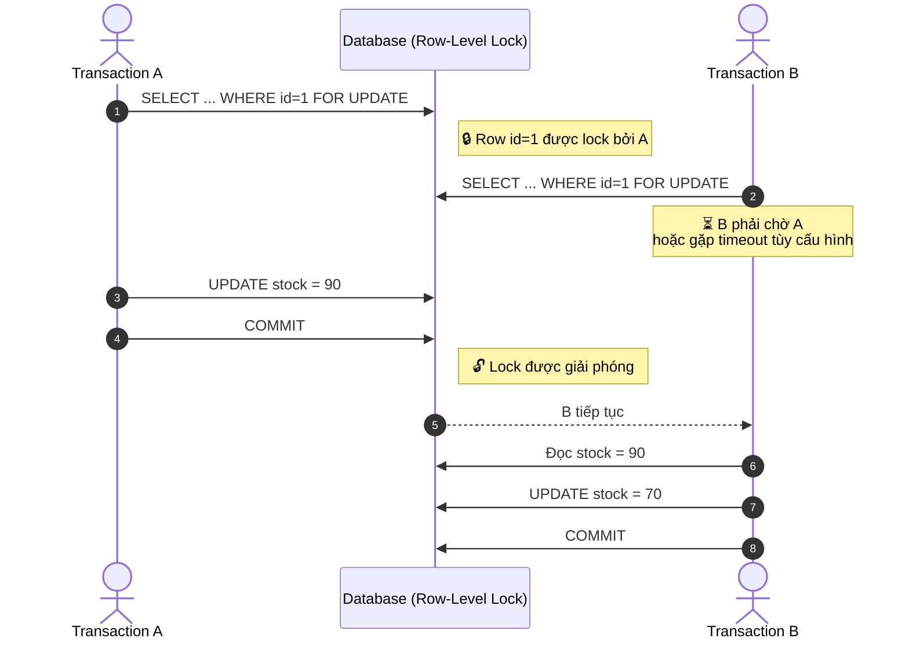

import { Card, Cards } from 'fumadocs-ui/components/card';
import { Callout } from 'fumadocs-ui/components/callout';
import { Tab, Tabs } from 'fumadocs-ui/components/tabs';
import { Lock, Unlock, ShieldAlert, CheckCircle2, RefreshCw, Zap, AlertTriangle, Scale } from 'lucide-react';

Trong các hệ thống phân tán hoặc có lượng truy cập đồng thời cao (High-Concurrency Systems), nhiều transaction có thể cùng đọc và ghi đè lên cùng một bản ghi. Nếu không có cơ chế **Locking (Khóa)** phù hợp, hệ thống sẽ đối mặt với thảm họa dữ liệu nghiêm trọng nhất: **Lost Update (Mất dữ liệu cập nhật)**.

---

## 1. Bài toán Lost Update là gì?

Giả sử hai người dùng (User A và User B) cùng cập nhật tồn kho của một sản phẩm có số lượng ban đầu là `100`:



Kết quả mong đợi: `100 - 10 - 20 = 70`.  
Kết quả thực tế: `80` ->  **Toàn bộ cập nhật của User A bị mất hoàn toàn (Lost Update)**.

---
## 2. Optimistic Locking (Khóa lạc quan) với `@Version`
Optimistic Locking **không khóa bản ghi trước khi đọc**. Thay vào đó, nó giả định rằng xung đột ít xảy ra và chỉ kiểm tra xung đột **tại thời điểm ghi (`UPDATE`/`DELETE`)**.

Hibernate/JPA thường sử dụng `@Version` để thực hiện cơ chế này.

```java
@Entity
@Table(name = "products")
public class Product {

    @Id
    private Long id;

    private String name;

    private Integer stock;

    @Version
    private Long version; // Cột kiểm soát phiên bản
}
```
Giả sử ban đầu:

```text
Product
id      = 1
stock   = 100
version = 1
```



**1. Khi Entity được load**

Hibernate ghi nhận giá trị `version` hiện tại:

```text
version = 1
```

**2. Khi Hibernate thực hiện UPDATE**

Hibernate đưa version cũ vào điều kiện `WHERE`:

```sql
UPDATE products
SET stock = ?, version = ?
WHERE id = ?
  AND version = ?;
```

Ví dụ:

```sql
UPDATE products
SET stock = 90, version = 2
WHERE id = 1
  AND version = 1;
```

**3. Database kiểm tra `version`**

Nếu database vẫn có:

```text
version = 1
```

→ UPDATE thành công:

```text
Rows affected = 1
version: 1 → 2
```

Nếu database đã bị transaction khác cập nhật:

```text
version = 2
```

→ Điều kiện `WHERE version = 1` không còn đúng:

```text
Rows affected = 0
        ↓
Hibernate phát hiện conflict
        ↓
OptimisticLockException
```

### Kết quả

Không có Optimistic Locking:

```text
A đọc 100
B đọc 100

A → 90
B → 80

Final = 80 ❌
→ Lost Update
```

Có `@Version`:

```text
A đọc 100, version=1
B đọc 100, version=1

B → 80, version=2 ✓

A → 90
WHERE version=1
       ↓
DB version=2
       ↓
UPDATE thất bại ❌
       ↓
OptimisticLockException
```

---
## 3. Pessimistic Locking (Khóa bi quan)

Pessimistic Locking giả định rằng **xung đột dữ liệu có khả năng xảy ra**, vì vậy transaction sẽ **yêu cầu Database đặt lock lên dữ liệu** trong quá trình truy cập.

Với `PESSIMISTIC_WRITE`, các transaction khác muốn thực hiện thao tác xung đột trên cùng row có thể phải **chờ (block)** hoặc nhận lỗi/timeout tùy Database và cấu hình.

```java
// Yêu cầu khóa ghi ngay khi đọc
Product product = entityManager.find(
    Product.class,
    productId,
    LockModeType.PESSIMISTIC_WRITE
);
```

Hibernate sẽ tạo SQL tương ứng với cơ chế locking của RDBMS. Với nhiều Database, nó có thể tương đương:

```sql
SELECT id, name, stock
FROM products
WHERE id = 1
FOR UPDATE;
```

`FOR UPDATE` thường yêu cầu Database giữ **row-level lock** cho đến khi transaction kết thúc.



### Các chế độ Pessimistic Lock phổ biến

#### `PESSIMISTIC_WRITE`

Yêu cầu **lock để ghi** trên Entity.

Thường được Database triển khai bằng cơ chế tương đương:

```sql
SELECT ...
FROM products
WHERE id = ?
FOR UPDATE;
```

Transaction khác muốn thực hiện thao tác xung đột trên row có thể phải chờ lock được giải phóng.

> **Dùng khi:** dữ liệu quan trọng và xung đột đồng thời có khả năng xảy ra thường xuyên.

---

#### `PESSIMISTIC_READ`

Yêu cầu **lock để đọc**.

Mục tiêu là cho phép transaction đọc dữ liệu trong khi hạn chế các thao tác ghi xung đột từ transaction khác.

SQL thực tế **phụ thuộc vào RDBMS**, không nên cố định rằng mọi Database đều sử dụng:

```sql
SELECT ...
FROM products
WHERE id = ?
LOCK IN SHARE MODE;
```

Ví dụ một số Database có thể sử dụng cơ chế shared lock khác nhau.

> **Dùng khi:** cần đảm bảo dữ liệu không bị thay đổi bởi transaction khác trong khoảng thời gian đang đọc.

---

#### `PESSIMISTIC_FORCE_INCREMENT`

Kết hợp **pessimistic locking** với việc **tăng `@Version`**.

```java
Product product = entityManager.find(
    Product.class,
    productId,
    LockModeType.PESSIMISTIC_FORCE_INCREMENT
);
```

Entity sẽ được lock theo pessimistic locking và version được tăng lên.

> **Dùng khi:** hệ thống vừa cần pessimistic lock vừa muốn sử dụng version để phát hiện thay đổi đồng thời.

### Optimistic vs Pessimistic

```text
Optimistic Locking
        │
        ├── Không lock row trước
        ├── @Version
        ├── Phát hiện conflict khi ghi
        └── Conflict → OptimisticLockException


Pessimistic Locking
        │
        ├── Yêu cầu Database lock
        ├── PESSIMISTIC_WRITE
        ├── SELECT ... FOR UPDATE
        └── Transaction khác có thể phải chờ
```

> **Cách nhớ:**
> **Optimistic** → *"Cứ làm đi, lúc ghi kiểm tra xem có ai sửa chưa."*
> **Pessimistic** → *"Tôi lấy lock trước, người khác muốn sửa thì chờ."*

---

## 4. So sánh: Optimistic vs Pessimistic Locking

| Tiêu chí | Optimistic Locking | Pessimistic Locking |
| :--- | :--- | :--- |
| **Cơ chế** | "Cứ làm đi, cuối cùng kiểm tra version." | "Khóa trước, làm xong mới nhả." |
| **Database Row Lock** | ❌ Không giữ lock DB | ✅ Giữ Row Lock (`FOR UPDATE`) |
| **Hiệu năng & Throughput** | 🚀 Rất cao khi ít xung đột | ⚠️ Có thể gây nghẽn (Lock Contention / Deadlock) |
| **Xử lý khi Conflict** | Ném ngoại lệ $\to$ Phải retry ở App layer | Transaction khác tự động chờ (blocking) |
| **Phù hợp nhất cho** | • Web App CRUD thông thường<br/>• Read nhiều, Write ít<br/>• Giao dịch nhiều bước kéo dài | • Giữ chỗ vé máy bay / rạp phim<br/>• Trừ số dư ví tiền, tồn kho chớp nhoáng (Flash Sale)<br/>• Tỉ lệ tranh chấp cực kỳ cao |

---

## 5. Xử lý Retry khi gặp `OptimisticLockException`

Khi sử dụng Optimistic Lock, ứng dụng cần có chiến lược xử lý khi bị bắn ngoại lệ conflict, phổ biến nhất là cơ chế **Automatic Retry** của Spring:

```java
@Service
public class StockService {

    @Autowired
    private ProductRepository productRepository;

    @Retryable(
        retryFor = { ObjectOptimisticLockingFailureException.class },
        maxAttempts = 3,
        backoff = @Backoff(delay = 100)
    )
    @Transactional
    public void deductStock(Long productId, int quantity) {
        Product product = productRepository.findById(productId)
            .orElseThrow(() -> new EntityNotFoundException());

        if (product.getStock() < quantity) {
            throw new InsufficientStockException("Hết hàng!");
        }

        product.setStock(product.getStock() - quantity);
        // Khi commit: Nếu version conflict -> Spring tự động retry lại từ đầu method
    }
}
```

---