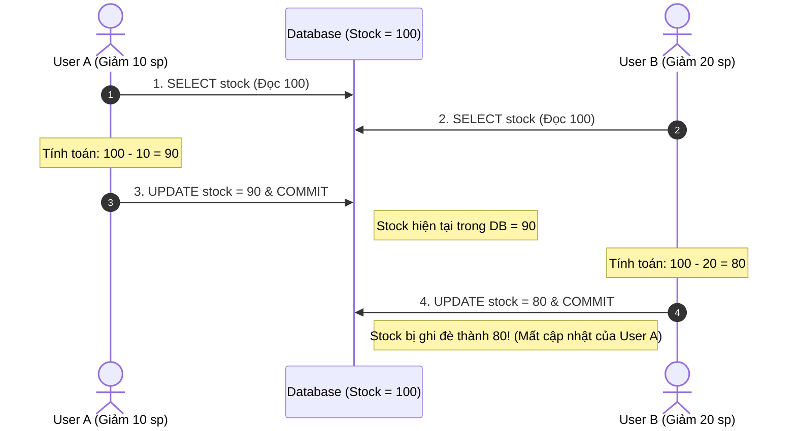
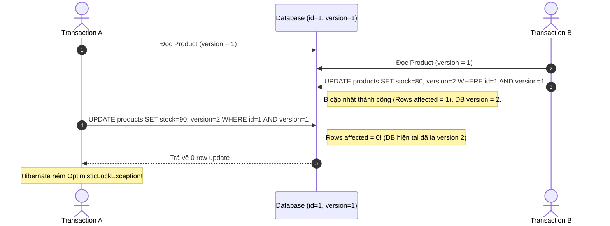
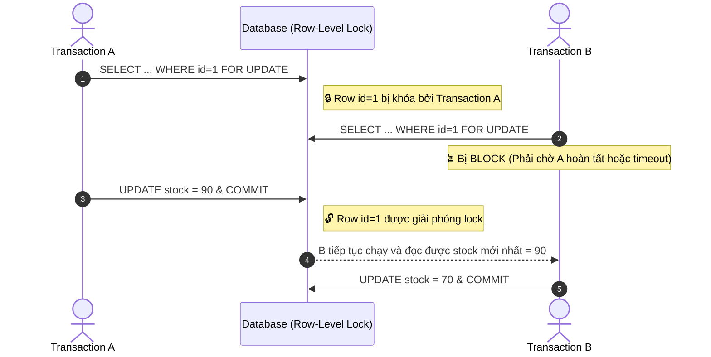

import { Card, Cards } from 'fumadocs-ui/components/card';
import { Callout } from 'fumadocs-ui/components/callout';
import { Tab, Tabs } from 'fumadocs-ui/components/tabs';
import { Lock, Unlock, ShieldAlert, CheckCircle2, RefreshCw, Zap, AlertTriangle, Scale } from 'lucide-react';

Trong các hệ thống phân tán hoặc có lượng truy cập đồng thời cao (High-Concurrency Systems), nhiều transaction có thể cùng đọc và ghi đè lên cùng một bản ghi. Nếu không có cơ chế **Locking (Khóa)** phù hợp, hệ thống sẽ đối mặt với thảm họa dữ liệu nghiêm trọng nhất: **Lost Update (Mất dữ liệu cập nhật)**.

---

## 1. Bài toán Lost Update là gì?

Giả sử hai người dùng (User A và User B) cùng cập nhật tồn kho của một sản phẩm có số lượng ban đầu là `100`:



Kết quả mong đợi: `100 - 10 - 20 = 70`.  
Kết quả thực tế: `80` $\to$ **Toàn bộ cập nhật của User A bị mất hoàn toàn (Lost Update)**.

---

## 2. Optimistic Locking (Khóa lạc quan) với `@Version`

### Bản chất:
Optimistic Locking **không khóa bất kỳ bản ghi nào trong Database trước**. Thay vào đó, nó giả định rằng xung đột rất hiếm khi xảy ra và chỉ kiểm tra tính toàn vẹn tại thời điểm ghi (`UPDATE`).

```java
@Entity
@Table(name = "products")
public class Product {

    @Id
    private Long id;

    private String name;
    private Integer stock;

    @Version
    private Long version; // Cột kiểm soát phiên bản tự động
}
```



### Cơ chế hoạt động:
1. Khi nạp Entity, Hibernate ghi nhớ giá trị `version` hiện tại.
2. Khi sinh câu lệnh SQL `UPDATE`, Hibernate tự động thêm điều kiện:
   ```sql
   UPDATE products 
   SET stock = ?, version = version + 1 
   WHERE id = ? AND version = ?;
   ```
3. Nếu `Rows affected == 0`, Hibernate biết dữ liệu đã bị transaction khác sửa trước đó $\to$ Ném ngoại lệ `OptimisticLockException` (hoặc Spring `ObjectOptimisticLockingFailureException`).

---

## 3. Pessimistic Locking (Khóa bi quan)

### Bản chất:
Pessimistic Locking giả định rằng xung đột dữ liệu xảy ra rất thường xuyên. Nó thực hiện **khóa trực tiếp hàng dữ liệu (Row-Level Lock)** ngay khi đọc từ Database, bắt các transaction khác muốn ghi/sửa phải **chờ đợi (block)**.

```java
// Khóa độc quyền (Exclusive Lock) ngay khi đọc
Product product = entityManager.find(
    Product.class, 
    productId, 
    LockModeType.PESSIMISTIC_WRITE
);
```

Hibernate sẽ sinh câu lệnh SQL tương ứng với cơ chế khóa của RDBMS:
```sql
SELECT id, name, stock 
FROM products 
WHERE id = 1 
FOR UPDATE; -- Khóa độc quyền cấp row
```



### Các chế độ Pessimistic Lock phổ biến:
- **`PESSIMISTIC_WRITE`** (Khuyên dùng nhất): Tương đương `SELECT ... FOR UPDATE`. Ngăn các transaction khác đọc khóa hoặc cập nhật bản ghi.
- **`PESSIMISTIC_READ`**: Tương đương `SELECT ... LOCK IN SHARE MODE` (Shared Lock). Cho phép các bên cùng đọc nhưng ngăn chặn cập nhật.
- **`PESSIMISTIC_FORCE_INCREMENT`**: Khóa row đồng thời tự động tăng cột `@Version` ngay cả khi dữ liệu của entity cha không đổi.

---

## 4. So sánh: Optimistic vs Pessimistic Locking

| Tiêu chí | Optimistic Locking | Pessimistic Locking |
| :--- | :--- | :--- |
| **Cơ chế** | "Cứ làm đi, cuối cùng kiểm tra version." | "Khóa trước, làm xong mới nhả." |
| **Database Row Lock** | ❌ Không giữ lock DB | ✅ Giữ Row Lock (`FOR UPDATE`) |
| **Hiệu năng & Throughput** | 🚀 Rất cao khi ít xung đột | ⚠️ Có thể gây nghẽn (Lock Contention / Deadlock) |
| **Xử lý khi Conflict** | Ném ngoại lệ $\to$ Phải retry ở App layer | Transaction khác tự động chờ (blocking) |
| **Phù hợp nhất cho** | • Web App CRUD thông thường<br/>• Read nhiều, Write ít<br/>• Giao dịch nhiều bước kéo dài | • Giữ chỗ vé máy bay / rạp phim<br/>• Trừ số dư ví tiền, tồn kho chớp nhoáng (Flash Sale)<br/>• Tỉ lệ tranh chấp cực kỳ cao |

---

## 5. Xử lý Retry khi gặp `OptimisticLockException`

Khi sử dụng Optimistic Lock, ứng dụng cần có chiến lược xử lý khi bị bắn ngoại lệ conflict, phổ biến nhất là cơ chế **Automatic Retry** của Spring:

```java
@Service
public class StockService {

    @Autowired
    private ProductRepository productRepository;

    @Retryable(
        retryFor = { ObjectOptimisticLockingFailureException.class },
        maxAttempts = 3,
        backoff = @Backoff(delay = 100)
    )
    @Transactional
    public void deductStock(Long productId, int quantity) {
        Product product = productRepository.findById(productId)
            .orElseThrow(() -> new EntityNotFoundException());

        if (product.getStock() < quantity) {
            throw new InsufficientStockException("Hết hàng!");
        }

        product.setStock(product.getStock() - quantity);
        // Khi commit: Nếu version conflict -> Spring tự động retry lại từ đầu method
    }
}
```

---

## Tóm tắt & Điểm cốt lõi

<Cards>
  <Card title="@Version là mặc định" icon={<ShieldAlert className="text-green-500" />}>
    Hầu hết các Entity quan trọng nên có `@Version` để ngăn ngừa triệt để lỗi Lost Update mà không tốn chi phí khóa DB.
  </Card>
  <Card title="Pessimistic cho Tiền & Vé" icon={<Lock className="text-amber-500" />}>
    Sử dụng `PESSIMISTIC_WRITE` cho các giao dịch nhạy cảm về số dư tài chính hoặc tồn kho có tính cạnh tranh khốc liệt.
  </Card>
  <Card title="Tránh Deadlock" icon={<AlertTriangle className="text-rose-500" />}>
    Khi dùng Pessimistic Lock trên nhiều bản ghi, luôn khóa theo một thứ tự ID nhất quán để tránh hiện tượng Deadlock vòng lặp.
  </Card>
</Cards>
