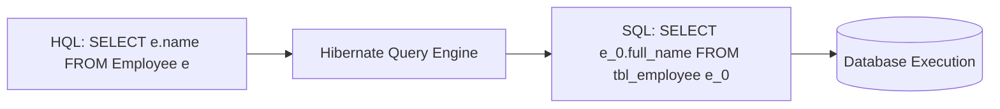

import { Card, Cards } from 'fumadocs-ui/components/card';
import { Callout } from 'fumadocs-ui/components/callout';
import { Tab, Tabs } from 'fumadocs-ui/components/tabs';
import { Zap, Database, Search, AlertOctagon, CheckCircle2, TrendingUp, Layers, Code2 } from 'lucide-react';

Khi ứng dụng Java ORM chạy chậm trong môi trường Production, hơn **80% nguyên nhân xuất phát từ việc lấy dữ liệu không tối ưu (Inefficient Fetching)**. Trong đó, **N+1 Query Problem** là "kẻ giết chết hiệu năng" phổ biến nhất.

---

## 1. Bản chất: EAGER vs LAZY Fetching

Mỗi quan hệ (`@ManyToOne`, `@OneToMany`) trong JPA đều có cấu hình `fetch`:

```java
@ManyToOne(fetch = FetchType.LAZY) // Chỉ load khi được gọi (Khuyên dùng)
private Department department;

@OneToMany(mappedBy = "department", fetch = FetchType.LAZY)
private List<Employee> employees = new ArrayList<>();
```

<Callout type="warn" title="Hiểu lầm kinh điển: 'EAGER = Luôn dùng SQL JOIN'">
Nhiều lập trình viên nghĩ rằng khai báo `FetchType.EAGER` thì Hibernate sẽ luôn tự động `LEFT JOIN` lấy dữ liệu liên quan. 

**Thực tế hoàn toàn không phải vậy!** `EAGER` chỉ có nghĩa là: *"Hãy nạp dữ liệu liên quan ngay lập tức trước khi trả Entity về"*. Khi bạn viết JPQL/HQL: `SELECT e FROM Employee e`, Hibernate sẽ sinh 1 query lấy danh sách Employee, sau đó chạy thêm **N query SELECT riêng lẻ** để nạp Department cho từng Employee $\to$ **Gây ra N+1 Query ngay cả khi dùng EAGER!**
</Callout>

👉 **Nguyên tắc bất di bất dịch:** Luôn đặt `FetchType.LAZY` cho tất cả các quan hệ ở Entity Mapping (Static Mapping), sau đó fetch theo từng use case (Dynamic Fetching).

---

## 2. Vấn đề N+1 Query là gì?

Giả sử bạn cần hiển thị danh sách 100 nhân viên kèm tên phòng ban của họ:

```java
List<Employee> employees = entityManager
    .createQuery("SELECT e FROM Employee e", Employee.class)
    .getResultList(); // Query 1: Lấy danh sách 100 nhân viên

for (Employee e : employees) {
    // Mỗi vòng lặp kích hoạt 1 câu SELECT phụ nếu department chưa được load!
    System.out.println(e.getName() + " - " + e.getDepartment().getName()); 
}
```

```
SQL Logs thực tế phát sinh:
[Query 1]  SELECT * FROM employee;                    -- Trả về 100 rows
[Query 2]  SELECT * FROM department WHERE id = 1;     -- Cho employee 1
[Query 3]  SELECT * FROM department WHERE id = 2;     -- Cho employee 2
...
[Query 101] SELECT * FROM department WHERE id = 100;  -- Cho employee 100

=> Tổng cộng: 1 + 100 = 101 Queries xuống Database!
```

---

## 3. Các giải pháp xử lý N+1 Query

<Tabs items={['1. JOIN FETCH (HQL/JPQL)', '2. JPA EntityGraph', '3. @BatchSize', '4. DTO Projection']}>

<Tab value="1. JOIN FETCH (HQL/JPQL)">

`JOIN FETCH` hướng dẫn Hibernate thực thi một câu lệnh SQL `JOIN` duy nhất và nạp luôn các đối tượng liên quan vào **Persistence Context**.

```java
// HQL Query
String hql = "SELECT e FROM Employee e JOIN FETCH e.department";

List<Employee> employees = entityManager
    .createQuery(hql, Employee.class)
    .getResultList();
```

**SQL sinh ra:**
```sql
SELECT e.id, e.name, e.department_id, d.id, d.name
FROM employee e
INNER JOIN department d ON e.department_id = d.id;
```
$\to$ **Từ 101 queries giảm xuống chỉ còn đúng 1 query duy nhất!**

<Callout type="error" title="Cảnh báo MultipleBagFetchException">
Không được dùng nhiều hơn 1 `JOIN FETCH` trên các Collection kiểu `List` (Bag) trong cùng một câu query, vì nó sẽ tạo ra tích Đề-các (Cartesian Product) làm bùng nổ số lượng bản ghi trong RAM.
</Callout>
</Tab>

<Tab value="2. JPA EntityGraph">

`EntityGraph` cho phép bạn định nghĩa kế hoạch nạp dữ liệu (**Fetch Plan**) một cách linh hoạt mà không cần sửa câu lệnh HQL gốc.

```java
// Khai báo trên Entity
@Entity
@NamedEntityGraph(
    name = "Employee.withDepartmentAndProjects",
    attributeNodes = {
        @NamedAttributeNode("department"),
        @NamedAttributeNode("projects")
    }
)
public class Employee {
    // ...
}
```

**Sử dụng trong code:**
```java
EntityGraph<?> graph = entityManager.getEntityGraph("Employee.withDepartmentAndProjects");

List<Employee> list = entityManager.createQuery("SELECT e FROM Employee e", Employee.class)
    .setHint("jakarta.persistence.fetchgraph", graph) // Chỉ định nạp EAGER cho các node trong graph
    .getResultList();
```

* **`Fetch Graph`**: Các thuộc tính trong graph là `EAGER`, tất cả thuộc tính còn lại là `LAZY`.
* **`Load Graph`**: Các thuộc tính trong graph là `EAGER`, các thuộc tính còn lại giữ nguyên theo mapping gốc của Entity.
</Tab>

<Tab value="3. @BatchSize">

Nếu không thể dùng `JOIN FETCH` (ví dụ đang duyệt collection phân cấp phức tạp), bạn có thể dùng `@BatchSize` để gộp các truy vấn con thành câu lệnh `IN (...)`:

```java
@Entity
public class Department {
    @Id
    private Long id;

    @BatchSize(size = 20) // Gom 20 quan hệ vào 1 câu query
    @OneToMany(mappedBy = "department")
    private List<Employee> employees;
}
```

**SQL sinh ra:**
```sql
SELECT * FROM employee WHERE department_id IN (1, 2, 3, 4, 5, ..., 20);
```
$\to$ Giảm từ 100 queries xuống còn `100 / 20 = 5` queries!
</Tab>

<Tab value="4. DTO Projection (Tối ưu nhất cho Read-Only)">

Nếu use case chỉ phục vụ hiển thị báo cáo hoặc trả về API (không cần dirty checking để update), **DTO Projection** là giải pháp có hiệu năng cao nhất vì nó hoàn toàn bỏ qua overhead của Persistence Context.

```java
// Record DTO bất biến
public record EmployeeSummaryDTO(Long id, String name, String departmentName) {}
```

```java
// Query trực tiếp vào Constructor DTO
List<EmployeeSummaryDTO> result = entityManager.createQuery(
    "SELECT new com.example.dto.EmployeeSummaryDTO(e.id, e.name, d.name) " +
    "FROM Employee e JOIN e.department d", 
    EmployeeSummaryDTO.class
).getResultList();
```

* **Ưu điểm:** Chỉ select đúng các cột cần thiết (tránh `SELECT *`), không tốn RAM quản lý snapshot trong First-Level Cache, tốc độ xử lý nhanh gấp nhiều lần.
</Tab>

</Tabs>

---

## 4. HQL Querying: Những cú pháp cần nắm vững

**HQL (Hibernate Query Language)** là ngôn ngữ truy vấn hướng đối tượng. Bạn query trên tên **Class Entity** và **tên trường (Field)** trong Java, không query trên tên bảng/cột của Database.



### Tổng hợp cú pháp HQL quan trọng:

```java
// 1. Projection chọn lọc trường (Tuple/Object Array)
List<Object[]> rows = entityManager.createQuery(
    "SELECT e.name, e.salary FROM Employee e WHERE e.salary > :minSalary", Object[].class)
    .setParameter("minSalary", 50000.0)
    .getResultList();

// 2. Aggregation & Group By Having
List<Object[]> deptStats = entityManager.createQuery(
    "SELECT e.department.name, COUNT(e), AVG(e.salary) " +
    "FROM Employee e " +
    "GROUP BY e.department.name " +
    "HAVING COUNT(e) >= 5 " +
    "ORDER BY AVG(e.salary) DESC", Object[].class)
    .getResultList();

// 3. Subquery trong HQL
List<Employee> highEarners = entityManager.createQuery(
    "SELECT e FROM Employee e WHERE e.salary > (SELECT AVG(emp.salary) FROM Employee emp)", 
    Employee.class)
    .getResultList();
```

---

## 5. Chiến lược tối ưu tổng thể (Cheatsheet)

```
                       Cần đọc dữ liệu từ DB
                                │
                 ┌──────────────┴──────────────┐
                 ▼                             ▼
       Mục đích chỉ để HIỂN THỊ          Cần UPDATE sau khi đọc
         (Read-Only / API / Report)           (Business Logic)
                 │                             │
                 ▼                             ▼
          DTO Projection                FetchType.LAZY mặc định
     (SELECT new MyDTO(...))                   │
                                               ▼
                                   Cần nạp quan hệ liên quan?
                                               │
                                 ┌─────────────┴─────────────┐
                                 ▼                           ▼
                           Quan hệ đơn lẻ              Collection lớn
                           (@ManyToOne)                (@OneToMany)
                                 │                           │
                                 ▼                           ▼
                            JOIN FETCH                  EntityGraph
                                hoặc                        hoặc
                            EntityGraph                  @BatchSize
```

---

## Tóm tắt & Điểm cốt lõi

<Cards>
  <Card title="Luôn dùng LAZY" icon={<Layers className="text-blue-500" />}>
    Thiết lập `FetchType.LAZY` làm tiêu chuẩn cho mọi quan hệ. Không bao giờ phụ thuộc vào `EAGER`.
  </Card>
  <Card title="JOIN FETCH & EntityGraph" icon={<Zap className="text-green-500" />}>
    Sử dụng `JOIN FETCH` hoặc JPA `EntityGraph` để nạp dữ liệu động theo từng nhu cầu sử dụng cụ thể, triệt tiêu N+1 Query.
  </Card>
  <Card title="DTO Projection cho Read" icon={<TrendingUp className="text-amber-500" />}>
    Tận dụng Constructor Projection (`new MyDTO(...)`) cho các luồng Read-Only để đạt hiệu năng tối đa và giảm tải RAM.
  </Card>
</Cards>
