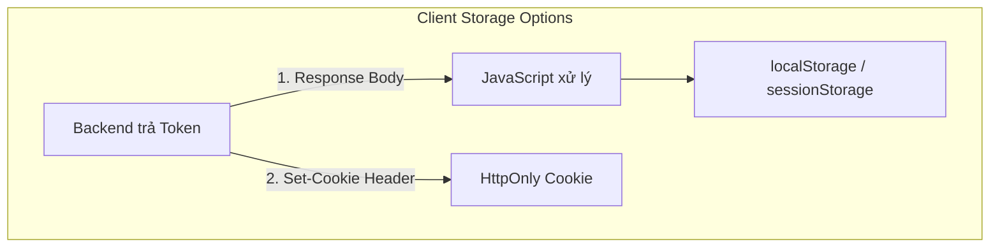
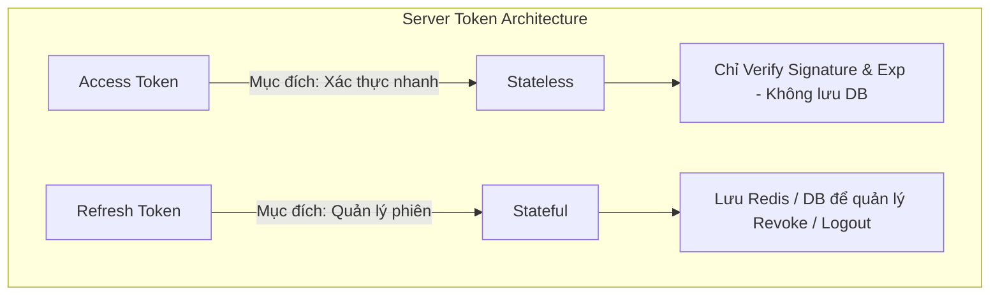
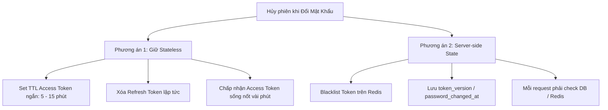

import { Card, Cards } from 'fumadocs-ui/components/card';
import { Callout } from 'fumadocs-ui/components/callout';
import { Step, Steps } from 'fumadocs-ui/components/steps';
import { Tab, Tabs } from 'fumadocs-ui/components/tabs';
import { ShieldCheck, ShieldAlert, Key, Database, RefreshCw, Lock, Server, Cpu, Layers, AlertTriangle, CheckCircle2 } from 'lucide-react';

Khi triển khai cơ chế xác thực với **JSON Web Token (JWT)**, có hai câu hỏi kinh điển trong thiết kế hệ thống:

1. **Phía Client:** Nên lưu Token ở đâu để vừa an toàn vừa tiện lợi?
2. **Phía Server:** Có cần lưu Access Token và Refresh Token vào Database / Redis không? Và nếu lưu thì JWT có còn là **Stateless**?

Bài viết này sẽ đi sâu vào luồng lưu trữ thực tế, cơ chế vận hành của Access Token / Refresh Token và bài toán đánh đổi khi cần quản lý phiên đăng nhập (**Server-side state**).

---

## 1. Phía Client: Lưu Token ở đâu?

Client thường nhận và lưu trữ Token thông qua 2 cơ chế chính:



---

### Cách 1: Lưu trong `localStorage` / `sessionStorage` qua Response Body

Server trả token trực tiếp trong payload của Response (`JSON body`). Frontend nhận dữ liệu bằng JavaScript và lưu vào bộ nhớ trình duyệt.

#### Luồng lưu

```
   Backend
   │
   │ Response Body
   │ {
   │   "accessToken": "eyJhbGciOi...",
   │   "refreshToken": "d8f9a2b1..."
   │ }
   ▼
Frontend JavaScript
   │
   ▼
Browser localStorage / sessionStorage
```

* Mỗi khi gọi các API cần bảo vệ, Frontend chủ động đọc token từ `localStorage` và đính kèm vào HTTP Header:
  ```http
  Authorization: Bearer <accessToken>
  ```

#### Đánh giá
* **Ưu điểm:** Đơn giản, dễ tích hợp với Single Page Application (SPA), Mobile App và hỗ trợ giao tiếp Cross-Domain (CORS) rất linh hoạt.
* **Nhược điểm:** Dễ bị tấn công **XSS (Cross-Site Scripting)**. Nếu website dính mã độc XSS, hacker có thể dùng script đọc trực tiếp `localStorage.getItem('accessToken')` và đánh cắp token.

---

### Cách 2: Lưu trong `HttpOnly Cookie` qua header `Set-Cookie`

Server không trả token qua Body mà gửi kèm trong Header `Set-Cookie` của HTTP Response.

#### Luồng hoạt động

```http
HTTP/1.1 200 OK
Set-Cookie: accessToken=eyJhbGciOiJIUzI1NiJ9...; HttpOnly; Secure; SameSite=Lax; Path=/
Content-Type: application/json

{
  "message": "Login successfully"
}
```

> **Nguyên lý bảo mật:** Server đưa JWT vào **Cookie của trình duyệt**, và đánh dấu Cookie là `HttpOnly` để **JavaScript không đọc được nó**.

```
Client (Browser)                           Server
      │                                       │
      │─── 1. POST /login ───────────────────►│
      │                                       │
      │◄── 2. 200 OK (Set-Cookie: HttpOnly) ──│
      │   (Browser tự lưu vào Cookie Store)   │
      │                                       │
      │─── 3. GET /api/profile ──────────────►│
      │   (Browser tự đính kèm Cookie)        │
```

#### Đánh giá
* **Ưu điểm:** Chống hoàn toàn nguy cơ bị đánh cắp qua **XSS**.
* **Nhược điểm:** 
  * Cần cấu hình phòng chống tấn công **CSRF (Cross-Site Request Forgery)** thông qua cờ `SameSite=Lax/Strict` và CSRF Token.
  * Cấu hình phức tạp hơn nếu Frontend và Backend chạy khác domain (Subdomain / Cross-Origin Cookie).

---

### Bảng so sánh vị trí lưu trữ phía Client

| Tiêu chí | `localStorage` / `sessionStorage` | `HttpOnly Cookie` |
| :--- | :--- | :--- |
| **Vị trí đọc/ghi** | JavaScript tự đọc và tự gắn vào Header | Trình duyệt tự động gửi và quản lý |
| **Nguy cơ XSS** | ❌ **Cao** (JS đọc được dữ liệu) |  **An toàn** (JS không truy cập được) |
| **Nguy cơ CSRF** |  Không bị ảnh hưởng bởi CSRF tự động | ⚠️ Cần cấu hình cờ `SameSite` & CSRF Token |
| **Phù hợp với** | Mobile App, Microservices không cùng domain | Web SPA truyền thống cần độ bảo mật cao |

---

## 2. Phía Server: Khi nào cần lưu Access Token & Refresh Token?

Đây là phần trọng tâm khi thiết kế hệ thống Authentication: **Access Token và Refresh Token có cần lưu ở Server không?**



---

### 1. Access Token: Bản chất Stateless

Bản chất của JWT là **Stateless** (phi trạng thái):

```
Client                         Server
  │                              │
  │──── Access Token JWT ───────►│
  │                              │
  │                         verify signature
  │                         check exp
  │                              │
  │◄─── 200 OK / Data ───────────│
```

* **Server không cần lưu Access Token**. Đây chính là **stateless**.
* Mọi thông tin (`userId`, `roles`, `exp`) đã nằm trọn vẹn trong Payload và được bảo vệ bởi chữ ký số (Signature).
* **Lợi ích:** Server chỉ cần kiểm tra chữ ký và thời hạn hết hạn, không tốn I/O gọi xuống Database/Redis ở mỗi request.

---

### 2. Refresh Token: Tại sao nên lưu ở Server?

Khác với Access Token, thông thường server **có lý do để lưu trạng thái của Refresh Token**.

#### Luồng thu hồi Refresh Token (Logout / Revoke):

```
Logout
  ↓
Xóa refreshToken khỏi Redis / DB
  ↓
Refresh lần nữa
  ↓
Không tìm thấy
  ↓
Unauthorized
```

#### Lý do cần lưu:
1. **Quản lý phiên (Session Management):** Biết được user đang đăng nhập trên những thiết bị nào.
2. **Thu hồi quyền tức thì (Revocation):** Khi user chủ động bấm Đăng xuất hoặc Đăng xuất khỏi mọi thiết bị.
3. **Phát hiện lộ token (Refresh Token Rotation):** Nếu một Refresh Token cũ đã qua sử dụng bị gửi lại, server lập tức vô hiệu hóa toàn bộ chuỗi token của user đó.

---

## 3. Vấn đề khi Đổi Mật Khẩu & Thu hồi Token

**Khi đổi mật khẩu**: Cần hủy cả Refresh Token và Access Token đang hoạt động.

* **Refresh Token:** Có thể hủy ngay lập tức vì được lưu trong DB/Redis.
* **Access Token:** Có 2 lựa chọn kiến trúc:
  1. **Đợi hết hạn (`exp`):** Đặt thời gian sống Access Token ngắn (5–15 phút), chấp nhận rủi ro nhỏ trong khoảng thời gian này để giữ tính chất Stateless hoàn toàn.
  2. **Hủy ngay lập tức:** Phải chấp nhận **trade-off server-side state**.



---

## 4. Server-Side State & Stateful

**Server-side state** nghĩa là:

> Server **lưu một trạng thái liên quan đến phiên đăng nhập/token của user**, thay vì chỉ nhìn vào JWT là đủ.

Ví dụ đơn giản nhất là **Session**:

```
Browser
   │
   │ sessionId=abc123
   ▼
Server
   │
   ▼
Redis / DB

abc123
  ├── userId = 10
  └── loggedIn = true
```

### JWT + Server-Side State

Khi kết hợp JWT với Server-side state, quy trình xác thực trở thành:

```
JWT
 ↓
verify signature
 ↓
check Redis / DB
 ↓
token/session còn hợp lệ?
 ↓
OK
```

**Stateful:**
> Server phải nhớ trạng thái của client/session giữa các request.

<Callout type="info">
Khi thêm bước kiểm tra Redis/DB trên mỗi request của Access Token, chúng ta đã biến mô hình xác thực từ **Stateless** thành **Stateful**. Trade-off ở đây là: **Khả năng kiểm soát và thu hồi tức thì đổi lấy chi phí truy vấn Redis/DB trên mỗi request.**
</Callout>

---

## 5. Bảng tổng kết

| Tiêu chí | Pure Stateless JWT | JWT + Server-side State | Session-based (Stateful) |
| :--- | :--- | :--- | :--- |
| **Access Token** | Không lưu ở Server | Không lưu (hoặc lưu Blacklist ở Redis) | Client giữ `sessionId` |
| **Refresh Token** | Không lưu (rủi ro) | Lưu Redis / DB | N/A (Session tự quản lý) |
| **Xác thực request** | Chỉ verify signature | Verify signature + Check Redis/DB | Query Redis/DB tìm session |
| **Hiệu năng & Scale** |  Rất cao | ⚖️ Phụ thuộc vào Redis Cache | ⚖️ Phụ thuộc vào Session Store |
| **Khả năng Revoke** | Phụ thuộc vào `exp` |  Tức thì |  Tức thì |

---

## Tham khảo
* [Câu hỏi về cách lưu refresh token và quy trình của token và refresh token - Viblo](https://viblo.asia/q/cau-hoi-ve-cach-luu-refresh-token-va-quy-trinh-cua-token-va-refresh-token-eVKBMWVd5kW)
