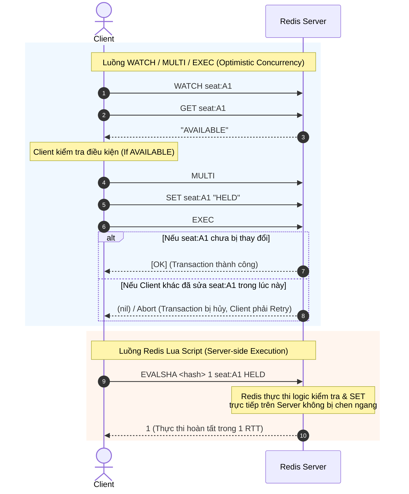
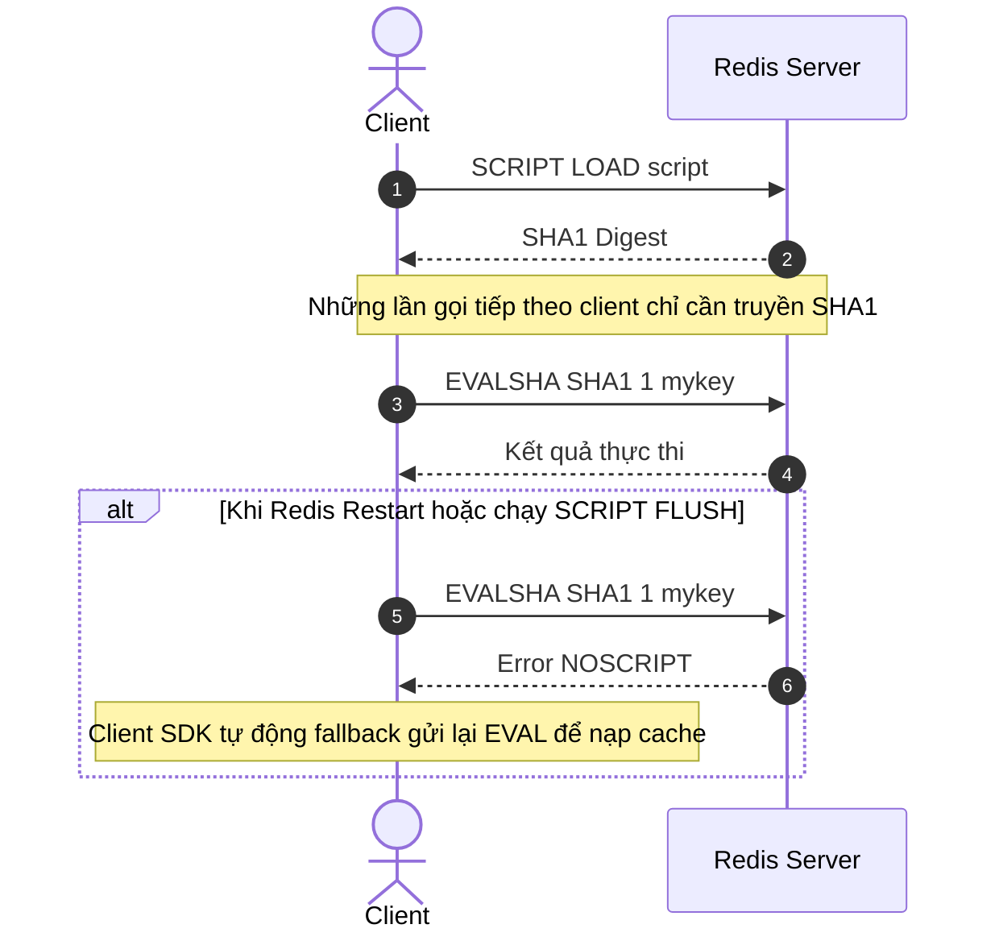

import { Card, Cards } from 'fumadocs-ui/components/card';
import { Callout } from 'fumadocs-ui/components/callout';
import { Step, Steps } from 'fumadocs-ui/components/steps';
import { Tab, Tabs } from 'fumadocs-ui/components/tabs';
import { Zap, ShieldAlert, Cpu, Layers, RefreshCw, AlertTriangle, CheckCircle2, Database, Code2, Terminal, Clock, HardDrive } from 'lucide-react';

Khi một thao tác trên Redis cần thực hiện nhiều bước, việc gửi từng command riêng lẻ từ Client có thể tạo ra **Race Condition**. Vậy làm sao Redis Lua Scripting giúp giải quyết vấn đề này?

---

## Lua Script được thực thi như thế nào?
Khi bạn gửi một Lua Script tới Redis thông qua `EVAL` hoặc `EVALSHA`, Redis sẽ thực thi toàn bộ script như **một đơn vị thực thi duy nhất**. Trong thời gian script đang chạy, các command từ Client khác không được chen vào giữa các thao tác của script.

---

## So sánh Lua Scripting và Transaction (`MULTI` / `EXEC` / `WATCH`)

Trước khi Lua Scripting ra đời (Redis 2.6), lập trình viên thường dùng giao dịch `MULTI` / `EXEC` kết hợp với `WATCH` để xử lý tranh chấp dữ liệu. Tuy nhiên, hai cách tiếp cận này có sự khác biệt căn bản về cơ chế vận hành.



### Điểm khác biệt cốt lõi

1. **Phân nhánh logic:** Trong `MULTI` ... `EXEC`, các command được xếp vào hàng đợi và chưa thực thi ngay. Vì vậy, bạn không thể lấy kết quả của `GET` để quyết định có thực hiện `SET` hay không ngay bên trong transaction. Với Lua Script, bạn có thể đọc dữ liệu, kiểm tra điều kiện và thực hiện `if/else` trực tiếp trên Redis.

2. **Xử lý tranh chấp:** `WATCH` sử dụng cơ chế **Optimistic Concurrency Control**. Nếu một key được theo dõi bị thay đổi trước khi `EXEC`, transaction sẽ bị hủy và Client phải thực hiện lại logic. Với Lua Script, toàn bộ logic được thực thi liên tục trên Redis nên không cần `WATCH` để bảo vệ chuỗi thao tác này.

3. **Lua Script vẫn có thể cần Retry:** Lua Script không có nghĩa là ứng dụng không bao giờ cần retry. Khi xảy ra lỗi mạng như timeout hoặc mất kết nối, Client có thể không biết chắc script đã được thực thi trên Redis hay chưa. Vì vậy, các thao tác quan trọng vẫn nên được thiết kế phù hợp với retry và idempotency.
### Bảng so sánh

| Tiêu chí | MULTI / EXEC (`WATCH`) | Redis Lua Script |
| :--- | :--- | :--- |
| **Isolation (Cô lập)** | Có | Có |
| **Phân nhánh logic** | **Không** (Các command được queue trước khi thực thi) | **Có** (Có thể đọc dữ liệu và thực hiện `if/else` ngay trong script) |
| **Xử lý xung đột** | `WATCH` có thể Abort transaction → Client Retry | Không cần `WATCH`; toàn bộ script được thực thi atomic trên Redis |
| **Network Round Trip Time** | Có thể cần nhiều lượt trao đổi, đặc biệt khi dùng `WATCH` để đọc và kiểm tra dữ liệu | **Có thể hoàn thành trong 1 RTT** khi `EVALSHA` được thực thi thành công |
| **Tự động Rollback khi lỗi** | **Không** | **Không** |

<Callout type="warn">
Redis thực thi Lua Script trên cùng execution thread xử lý các command. Vì vậy, một script chạy quá lâu sẽ ngăn Redis xử lý các command khác cho đến khi script hoàn tất. Tránh sử dụng Lua Script cho các vòng lặp lớn hoặc các phép tính tốn nhiều thời gian.
</Callout>

### Atomicity không đồng nghĩa với Rollback

Một điểm quan trọng cần hiểu khi làm việc với Redis Lua Scripting là **Atomicity không đồng nghĩa với Rollback**.

<Callout type="error" icon={<ShieldAlert className="text-red-500" />}>

**Atomicity** của Redis Lua Script có nghĩa là script được thực thi **không bị command từ Client khác chen vào giữa**. Nó **không có nghĩa là Redis sẽ tự động Rollback** các thay đổi nếu script gặp lỗi.

</Callout>

Nếu Lua Script gặp runtime error, Redis sẽ **dừng script tại vị trí xảy ra lỗi**. Những thao tác ghi đã hoàn thành trước đó **không được tự động hoàn tác**.
#### Ví dụ:
```lua
-- KEYS[1] = "user:balance"
-- KEYS[2] = "user:details"
redis.call('SET', KEYS[1], ARGV[1]) -- (1) Thành công
redis.call('INCR', KEYS[2])         -- (2) Lỗi nếu value là "hello"
```
**Kết quả:**
- `SET` ở bước (1) thực thi thành công, cập nhật `user:balance` thành `100`.
- `INCR` ở bước (2) thất bại với lỗi `ERR value is not an integer or out of range` vì `user:details` đang chứa chuỗi `"hello"`.
- Script dừng tại bước (2), nhưng thay đổi từ bước (1) **không được Rollback**.

Do đó, `user:balance` vẫn có giá trị `100` dù thao tác tiếp theo đã thất bại.**.
#### Thiết kế Script an toàn

<Steps>

<Step>

### Validate First, Write Last

Thực hiện các thao tác đọc và kiểm tra điều kiện trước khi thay đổi dữ liệu.

Chỉ thực hiện các command ghi như `SET`, `HSET` hoặc `INCR` sau khi các điều kiện cần thiết đã hợp lệ.

</Step>

<Step>

### Thiết kế phù hợp với Retry

Nếu ứng dụng có thể gọi lại script sau lỗi hoặc timeout, cần cân nhắc **Idempotency** để việc thực thi lại không tạo ra trạng thái sai lệch.

</Step>

</Steps>
---
## Cơ chế Thực thi: EVAL, EVALSHA và Script Cache

Client tương tác với Redis Lua Script thông qua hai cơ chế chính: `EVAL` và `EVALSHA`.

### 1. Lệnh `EVAL`

```bash
EVAL "return redis.call('GET', KEYS[1])" 1 mykey
```

Sau khi thực thi, script được lưu trong Script Cache, cho phép Client sử dụng EVALSHA để gọi lại mà không cần gửi lại toàn bộ source code.

**Lưu ý:** Nếu script dài và được gọi thường xuyên, EVAL phải gửi lại source code trong mỗi request, làm tăng network overhead.

### 2. `SCRIPT LOAD` + `EVALSHA`

Redis duy trì một bộ nhớ đệm script (**Script Cache**) lưu trong RAM để tối ưu hóa hiệu năng truyền tải.



- **Hiệu năng:** Khi script đã có trong Script Cache, Client chỉ cần gửi SHA1 qua `EVALSHA`, nên toàn bộ thao tác có thể được thực hiện trong **1 RTT**.

- **Lỗi `NOSCRIPT`:** Script Cache chỉ tồn tại trong RAM và có thể mất khi Redis restart hoặc chạy `SCRIPT FLUSH`. Khi đó, `EVALSHA` sẽ trả về `NOSCRIPT`; Client cần nạp lại script bằng `EVAL` hoặc `SCRIPT LOAD`.
---

## Quy tắc `KEYS` và `ARGV`

Khi gọi Lua Script, các tham số được chia thành hai nhóm:

- `KEYS`: Danh sách các Redis key mà script sẽ truy cập.
- `ARGV`: Các tham số khác như giá trị, số lượng hoặc thời gian.

Ví dụ:

```lua
-- KEYS[1] = "inventory"
-- ARGV[1] = số lượng cần trừ

local stock = tonumber(redis.call('GET', KEYS[1]))
local amount = tonumber(ARGV[1])

if stock == nil or stock < amount then
    return -1
end

return redis.call('DECRBY', KEYS[1], amount)
```
### Tại sao phải phân biệt `KEYS` và `ARGV`?

Sự phân biệt này đặc biệt quan trọng khi Lua Script chạy trên **Redis Cluster**.

Redis Cluster chia toàn bộ dữ liệu thành **16,384 Hash Slot**. Khi một Lua Script truy cập nhiều key, tất cả các key đó **bắt buộc phải thuộc cùng một Hash Slot** để script có thể thực thi nguyên tử trên một node đơn lẻ.

Vì vậy, các Redis key mà script sử dụng phải được truyền minh bạch qua mảng `KEYS`, thay vì đưa vào `ARGV` hoặc hardcode trực tiếp trong script:

```bash
EVAL <script> <numkeys> <key1> <key2> ... <arg1> <arg2> ...
                         └── KEYS ──┘   └─── ARGV ───┘
```

Nếu các key mà script truy cập thuộc các Hash Slot khác nhau (do không khai báo trong `KEYS` hoặc truyền qua `ARGV`), Redis Cluster sẽ từ chối request và ném lỗi:

```text
(error) CROSSSLOT Keys in request don't hash to the same slot
```

<Callout type="info" icon={<CheckCircle2 className="text-green-500" />}>
  **Kỹ thuật Hash Tag `{...}`:** Khi cần làm việc với nhiều key liên quan trên cùng một Hash Slot, bạn có thể sử dụng cú pháp Hash Tag. Ví dụ: `{user:100}:profile` và `{user:100}:orders` sẽ cùng thuộc một slot vì Redis Cluster chỉ tính mã hash cho phần chuỗi nằm trong ngoặc nhọn `{user:100}`.
</Callout>

<Callout type="warn" icon={<AlertTriangle className="text-amber-500" />}>
  **Lưu ý về Hot Slot:** Không nên lạm dụng Hash Tag quá mức. Nếu quá nhiều key dùng chung một Hash Tag, chúng sẽ bị dồn toàn bộ vào cùng một Hash Slot, tạo thành **Hot Slot** làm mất cân bằng tải giữa các node trong Redis Cluster.
</Callout>

---

## Chuyển đổi Kiểu Dữ Liệu (Lua vs RESP Type Conversion)

Khi Lua script `return` kết quả, Redis sẽ chuyển đổi kiểu dữ liệu từ Lua sang giao thức RESP (Redis Serialization Protocol) để trả về client.

| Lua Return Type | Redis Trả về (RESP Output) | Quy tắc chuyển đổi |
| :--- | :--- | :--- |
| `number` | Integer | **Phần thập phân bị cắt bỏ** trong RESP2 (vd: `3.7` chuyển thành `3`). Cần chuyển sang String (`tostring()`) nếu muốn giữ số thực. |
| `string` | Bulk String | Giữ nguyên chuỗi ký tự. |
| `table` (mảng) | Array | Mảng dừng lại ngay khi gặp phần tử `nil` đầu tiên. Các phần tử có string key trong associative table bị loại bỏ. |
| `boolean` | `true -> 1`, `false -> nil` (RESP2) | Trả về kiểu boolean chuẩn trong giao thức RESP3. |
| `redis.error_reply(msg)` | Error Object | Client nhận trực tiếp Exception/Error từ Redis. |
| `redis.status_reply(msg)` | Simple String | Trả về chuỗi trạng thái như `OK`. |

---

## Xử lý Lỗi: `redis.call()` vs `redis.pcall()`

Khi gọi lệnh Redis bên trong Lua Script, bạn có 2 phương thức phổ biến để thực thi:

### `redis.call()`

Nếu lệnh Redis gặp lỗi (ví dụ: thao tác sai kiểu dữ liệu), `redis.call()` sẽ lập tức tung ra exception và **dừng thực thi script ngay tại vị trí đó**, đồng thời chuyển error về cho Client.

```lua
local stock = redis.call('GET', KEYS[1])

-- Nếu KEYS[1] không phải số nguyên, script dừng ngay lập tức tại đây
local result = redis.call('INCR', KEYS[1])

return result
```

### `redis.pcall()`

Khác với `redis.call()`, `redis.pcall()` (Protected Call) không làm dừng script khi lệnh Redis bị lỗi. Thay vào đó, nó trả về một Lua `table` chứa trường `err`, cho phép script chủ động kiểm tra và rẽ nhánh xử lý.

```lua
local result = redis.pcall('INCR', KEYS[1])

-- Kiểm tra xem lệnh INCR có bị lỗi không
if type(result) == 'table' and result.err then
    return redis.error_reply("Increment failed: " .. result.err)
end

return result
```

### Bảng so sánh `redis.call()` và `redis.pcall()`

| Tiêu chí | `redis.call()` | `redis.pcall()` |
| :--- | :--- | :--- |
| **Khi Redis command lỗi** | Dừng script ngay lập tức | Script vẫn tiếp tục chạy |
| **Kết quả trả về khi lỗi** | Exception | Table chứa thuộc tính `err` |
| **Khả năng tự bắt lỗi** | Không | Có |

<Callout type="warn" icon={<AlertTriangle className="text-amber-500" />}>
  **Lưu ý quan trọng:** `redis.pcall()` chỉ giúp bạn bắt và xử lý lỗi bằng mã Lua. Nó **KHÔNG cung cấp cơ chế Rollback** cho những thao tác ghi đã thực hiện thành công trước đó trong script.
</Callout>

---

## Redis Functions (`FCALL`) trong Redis 7.0+

Từ Redis 7.0, Redis cung cấp **Redis Functions** (thực thi qua lệnh `FCALL` và `FCALL_RO`) để lưu và quản lý các Lua function trực tiếp trên Redis Server.

Khác với script nạp qua `EVALSHA` chỉ lưu tạm thời trong RAM của Script Cache, Function Library được lưu cùng dữ liệu Persistence (AOF/RDB) và cho phép gọi trực tiếp qua tên hàm thay vì mã SHA1.

### Cách khai báo và gọi Redis Function

Một Function Library được nạp vào Redis Server bằng lệnh `FUNCTION LOAD`:

```lua
#!lua name=mylib

redis.register_function('get_stock', function(keys, args)
    return redis.call('GET', keys[1])
end)
```

Sau khi library được nạp thành công, bạn có thể gọi hàm bằng lệnh `FCALL`:

```bash
FCALL get_stock 1 inventory
```

### Ưu điểm vượt trội của Redis Functions

<Cards>
  <Card title="Tính Trường Tồn (Persistence)" icon={<HardDrive className="text-blue-500" />}>
    Function Library được lưu cùng với file AOF/RDB snapshot, tự động khôi phục hoàn toàn khi Redis Server restart.
  </Card>
  <Card title="Định danh qua Tên (Named Functions)" icon={<Code2 className="text-green-500" />}>
    Gọi hàm theo tên rõ ràng (namespace / function name) giúp code đọc hiểu dễ hơn nhiều so với việc quản lý các mã SHA1 ngẫu nhiên của `EVALSHA`.
  </Card>
  <Card title="Đồng bộ Cụm (Replication & Cluster)" icon={<RefreshCw className="text-purple-500" />}>
    Khi chạy `FUNCTION LOAD` trên nốt Master, hàm sẽ tự động được Replicate sang các nốt Replica và Cluster node khác.
  </Card>
</Cards>

<Callout type="info" icon={<CheckCircle2 className="text-green-500" />}>
  **Lưu ý:** Redis Functions vẫn chạy trên engine Lua và vẫn giữ nguyên cơ chế thực thi **Atomic / Non-interleaving**. Lệnh `FCALL` không làm cho script chạy bất đồng bộ hay song song với các lệnh khác.
</Callout>

---

## Tổng kết

- **Atomicity:** Lua Script được thực thi **non-interleaving**, không bị command từ Client khác chen vào trong quá trình chạy. Atomicity không đồng nghĩa với **rollback**.

- **Validate First, Write Last:** Kiểm tra điều kiện trước khi ghi để hạn chế trạng thái dữ liệu bị cập nhật dở dang khi script gặp lỗi.

- **Script nên ngắn:** Lua Script chạy trực tiếp trên execution thread của Redis, vì vậy script chạy lâu có thể làm tăng latency của các request khác.

- **`KEYS` và `ARGV`:** Đưa các Redis key mà script sử dụng vào `KEYS`, đặc biệt khi chạy trên Redis Cluster.

- **Redis Functions:** Redis 7.0+ cung cấp `FCALL` để lưu trữ và quản lý Lua function trên Redis Server. Đây là lựa chọn phù hợp khi cần quản lý các server-side function một cách lâu dài.

---

## Tài liệu tham khảo

- [Redisson - Redis Lua Scripting Glossary](https://redisson.pro/glossary/redis-lua-scripting.html)