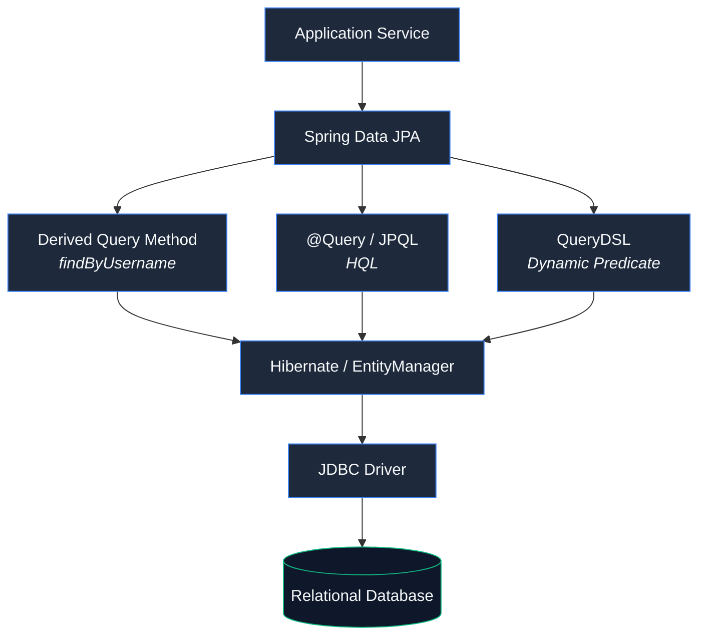
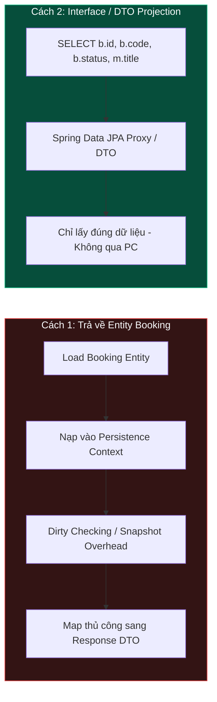
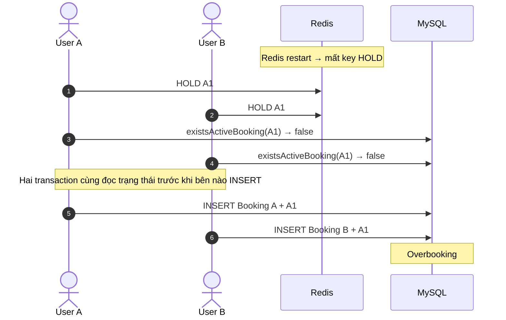
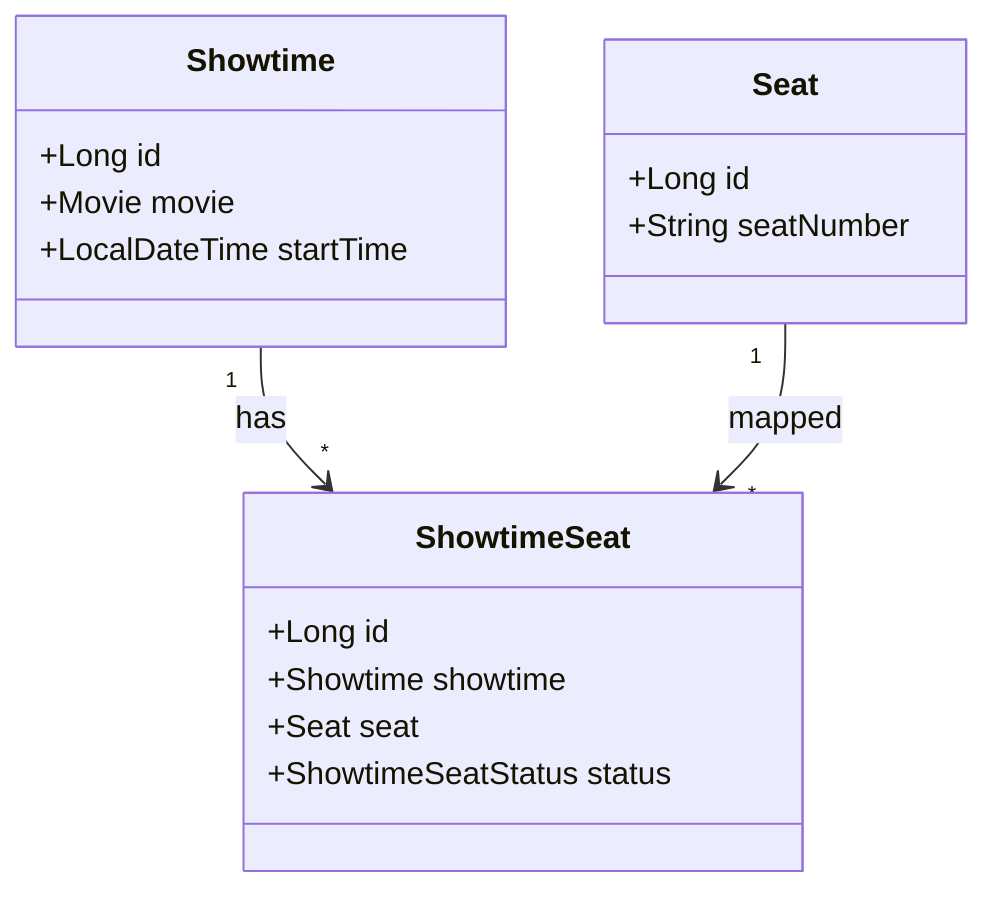
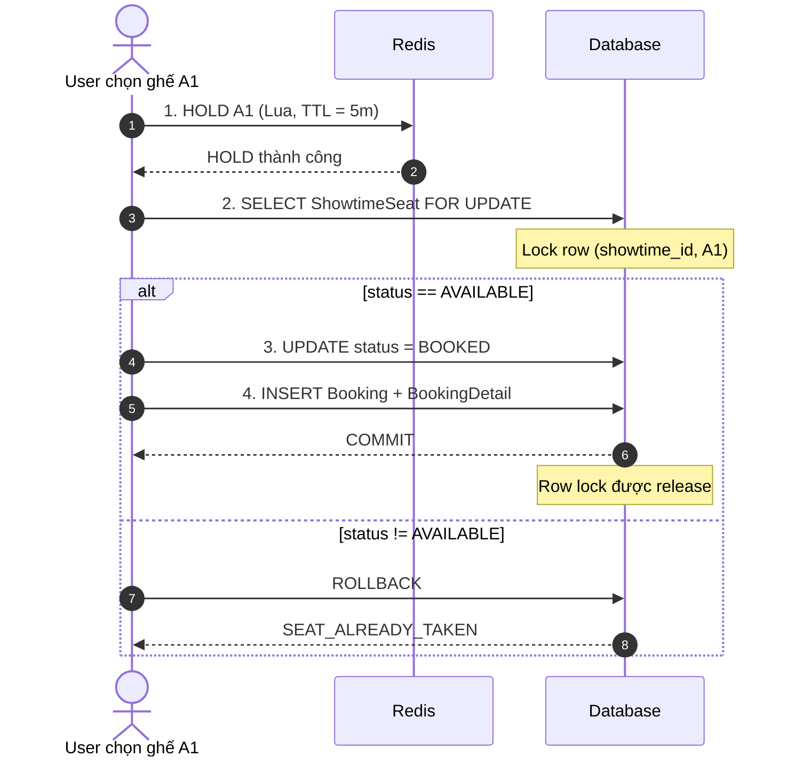
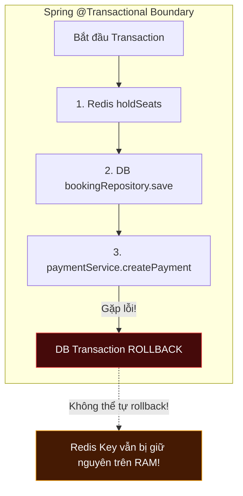

import { Card, Cards } from 'fumadocs-ui/components/card';
import { Callout } from 'fumadocs-ui/components/callout';
import { Step, Steps } from 'fumadocs-ui/components/steps';
import { Tab, Tabs } from 'fumadocs-ui/components/tabs';
import { Zap, ShieldAlert, AlertTriangle, CheckCircle2, Lock, Ticket, RefreshCw, Layers, Database, Code2, Server, Scale, ArrowRightLeft, FileCode2, Search } from 'lucide-react';

Sau khi tìm hiểu sâu hơn về các cơ chế nội tại của Hibernate ORM — từ [Domain Model & Architecture](/blogs/hibernate-orm/01-architecture-and-domain-model), [Persistence Context & Lifecycle](/blogs/hibernate-orm/02-persistence-context-and-lifecycle), [Flushing & Transactions](/blogs/hibernate-orm/03-flushing-and-transactions), [Locking Mechanisms](/blogs/hibernate-orm/04-locking-mechanisms) đến [Fetching & Query Tuning](/blogs/hibernate-orm/05-fetching-and-query-tuning) — tôi quay lại **đánh giá và rà soát toàn bộ tầng dữ liệu** của dự án [ticket-online](https://github.com/camdao/ticket-online).

Nhìn lại hệ thống dưới góc độ bản chất của ORM, tôi nhận ra một số cách triển khai trước đây tuy vẫn hoạt động đúng về mặt chức năng nhưng chưa thực sự tối ưu:

* **Lạm dụng xử lý In-Memory** thay vì tận dụng khả năng tính toán và lọc dữ liệu của Database Engine.
* **Phát sinh N+1 Query** do duyệt danh sách Entity và thực hiện các truy vấn lồng nhau.
* **Over-fetching Entity** vào Persistence Context đối với các API chỉ có nhu cầu đọc một phần dữ liệu.
* **Tiềm ẩn vấn đề Concurrency** khi phối hợp cơ chế giữ ghế bằng Redis với Database Transaction.

Từ những vấn đề trên, tôi tiến hành refactor lại một số thành phần của tầng dữ liệu, đồng thời đánh giá các quyết định thiết kế dựa trên **trade-off thực tế giữa hiệu năng, độ phức tạp và tính nhất quán của hệ thống**.

Bài viết này là một bản **retrospective** về quá trình đó: từ việc nhận diện vấn đề, phân tích nguyên nhân đến lựa chọn giải pháp và những đánh đổi đi kèm.

---
## 1. Chọn công cụ truy vấn trong Data Access Layer

Trong hệ sinh thái **Spring Boot + Spring Data JPA**, có nhiều cách để xây dựng và thực thi truy vấn. Dù sử dụng **Derived Query Method**, **JPQL** hay **QueryDSL**, truy vấn vẫn được xử lý thông qua **JPA Provider (Hibernate)** trước khi được chuyển thành SQL và gửi xuống Database.



Mỗi cách tiếp cận phù hợp với một mức độ phức tạp khác nhau:

<Cards>

  <Card
    title="Derived Query Method"
    icon={<FileCode2 className="text-blue-500" />}
  >
    Phù hợp với các truy vấn đơn giản, có điều kiện cố định dựa trên thuộc tính của Entity, chẳng hạn `findByUsername` hoặc `findByEmail`.

    Spring Data JPA phân tích tên method và xây dựng truy vấn tương ứng, giúp giảm đáng kể lượng code phải viết thủ công.
  </Card>

  <Card
    title="@Query / JPQL"
    icon={<Code2 className="text-emerald-500" />}
  >
    Phù hợp với các truy vấn có cấu trúc cố định nhưng phức tạp hơn, chẳng hạn cần `JOIN`, `GROUP BY`, subquery hoặc các phép tính tổng hợp.

    Khi cần tối ưu dữ liệu trả về, có thể kết hợp truy vấn với **Interface Projection hoặc DTO Projection** để chỉ lấy các trường cần thiết thay vì tải toàn bộ Entity.
  </Card>

  <Card
    title="QueryDSL"
    icon={<Layers className="text-purple-500" />}
  >
    Phù hợp với các truy vấn động có nhiều điều kiện tùy chọn, chẳng hạn `status`, `cinemaId`, `date` hoặc `sort`.

    QueryDSL cung cấp API **Type-Safe**, giúp hạn chế lỗi về tên thuộc tính và kiểu dữ liệu ngay từ compile time.
  </Card>

</Cards>

### Nguyên tắc lựa chọn

Thay vì cố gắng sử dụng một công cụ cho mọi trường hợp, nên lựa chọn giải pháp dựa trên **độ phức tạp và tính chất của truy vấn**:

- **Truy vấn đơn giản, ít điều kiện** → **Derived Query Method**.
- **Truy vấn cố định nhưng phức tạp, cần `JOIN`, `GROUP BY` hoặc các biểu thức JPQL** → **`@Query` / JPQL**.
- **Truy vấn chỉ phục vụ việc đọc và hiển thị dữ liệu** → Kết hợp **JPQL / QueryDSL + Interface / DTO Projection** để giới hạn dữ liệu được load.
- **Truy vấn động, nhiều điều kiện lọc hoặc sắp xếp tùy chọn** → **QueryDSL**.

> **Nguyên tắc:** Không phải truy vấn nào cũng cần QueryDSL. Hãy sử dụng công cụ có mức độ trừu tượng vừa đủ cho bài toán: **đơn giản → Derived Query, cố định nhưng phức tạp → JPQL, động → QueryDSL**.

---
## 2. Vấn đề 1: N+1 Query và xử lý In-Memory trong `getAllMovies`

### Hiện trạng cũ: Xử lý dữ liệu trong RAM và phát sinh N+1 Query

Trong phiên bản ban đầu, `MovieService` chịu trách nhiệm xử lý nhiều loại logic: lọc phim theo rạp chiếu (`cinemaId`), lọc theo trạng thái (`NOW_SHOWING`, `UPCOMING`), sắp xếp dữ liệu và sau đó tiếp tục truy vấn danh sách rạp tương ứng với từng bộ phim.

```java title="MovieService.java (Code cũ - Có vấn đề về hiệu năng)"

public MovieListResponse getAllMovies(MovieStatus status, Long cinemaId, Sort sort) {

    List<Movie> movies;

    if (cinemaId != null) {

        // Query 1: Lấy danh sách phim theo cinemaId
        movies = showtimeRepository.findMoviesByCinemaId(cinemaId);

        // Lọc trạng thái trong bộ nhớ
        if (status != null) {
            LocalDate today = LocalDate.now();

            movies = movies.stream()
                    .filter(movie -> status == MovieStatus.NOW_SHOWING
                            ? movie.isNowShowing()
                            : movie.isUpcoming())
                    .collect(Collectors.toList());
        }

        // Sắp xếp trong bộ nhớ
        movies = applySorting(movies, sort);

    } else {

        if (status == null) {
            movies = movieRepository.findAll(sort);
        } else {
            LocalDate today = LocalDate.now();

            movies = switch (status) {
                case NOW_SHOWING ->
                        movieRepository.findByReleaseDateLessThanEqual(today, sort);

                case UPCOMING ->
                        movieRepository.findByReleaseDateAfter(today, sort);
            };
        }
    }

    // N+1 Query: mỗi Movie lại thực hiện thêm một query
    List<MovieResponse> movieResponses = movies.stream()
            .map(movie -> {

                List<Cinema> cinemas =
                        showtimeRepository.findCinemasByMovieId(movie.getId());

                List<CinemaResponse> cinemaResponses = cinemas.stream()
                        .map(CinemaResponse::from)
                        .collect(Collectors.toList());

                return MovieResponse.from(movie, cinemaResponses);
            })
            .collect(Collectors.toList());

    return new MovieListResponse(
            movieResponses,
            movieResponses.size()
    );
}
```

### Phân tích những điểm bất hợp lý

<Steps>

<Step>

### 1. N+1 Query do truy vấn bên trong vòng lặp

Vấn đề rõ nhất nằm ở việc gọi Repository bên trong `stream().map()`:

```java
showtimeRepository.findCinemasByMovieId(movie.getId());
```

Nếu query đầu tiên trả về **N bộ phim**, hệ thống sẽ tiếp tục thực hiện thêm **N query** để lấy danh sách rạp tương ứng.

Luồng thực thi trở thành:

- `1` query lấy danh sách Movie.
- `N` query lấy Cinema cho từng Movie.
- Tổng cộng: **`1 + N` queries**.

Ví dụ, với 50 bộ phim, có thể phát sinh tới **51 lần truy vấn Database** chỉ cho một request.

Điều này làm tăng số lượng round-trip giữa Application và Database, từ đó làm tăng latency và tạo thêm áp lực lên **Connection Pool** khi số lượng request đồng thời tăng cao.

> **Điểm cần lưu ý:** Đây là N+1 do code chủ động gọi Repository trong vòng lặp, không nhất thiết phải liên quan đến cơ chế `LAZY` của Hibernate.

</Step>

<Step>

### 2. Lọc và sắp xếp In-Memory

Khi `cinemaId != null`, hệ thống lấy danh sách Movie về Application trước, sau đó mới thực hiện:

```java
movies.stream().filter(...)
```

và:

```java
applySorting(movies, sort);
```

Cách tiếp cận này khiến Database không được tận dụng để thực hiện những thao tác mà nó vốn được tối ưu tốt:

- **Filtering** thông qua `WHERE`.
- **Sorting** thông qua `ORDER BY`.
- **Index** để giảm lượng dữ liệu cần quét.
- **Query Optimizer** để lựa chọn execution plan phù hợp.
- **Pagination** trực tiếp trên tập dữ liệu tại Database.

Khi số lượng bản ghi tăng, Application phải tải nhiều dữ liệu hơn vào RAM và xử lý chúng trước khi trả về kết quả.

</Step>

<Step>

### 3. Service Layer đang chứa quá nhiều Data Access Logic

`MovieService` không chỉ điều phối use case mà còn phải quyết định:

- Khi nào query theo `cinemaId`.
- Khi nào query theo `status`.
- Cách lọc dữ liệu.
- Cách sắp xếp dữ liệu.
- Cách lấy Cinema cho từng Movie.

Điều này khiến Service Layer ngày càng phình to khi xuất hiện thêm các tiêu chí lọc mới như `genre`, `ageRating`, `format` hoặc khoảng thời gian.

Thay vì để Service quản lý từng trường hợp `if/else`, phần **xây dựng điều kiện truy vấn** nên được đưa xuống Data Access Layer.

</Step>

</Steps>

### Giải pháp: Đưa Dynamic Query xuống Data Access Layer

Sau khi phân tích lại bài toán, tôi chuyển phần điều kiện lọc động sang **QueryDSL**.

Thay vì tạo nhiều Repository Method cho từng tổ hợp điều kiện, QueryDSL cho phép xây dựng một `Predicate` dựa trên những filter mà request thực sự truyền vào:

```java title="MovieRepositoryCustomImpl.java"

@Override
public List<Movie> findMovies(
        MovieStatus status,
        Long cinemaId,
        Sort sort) {

    BooleanBuilder predicate = new BooleanBuilder();

    // Lọc theo Cinema
    if (cinemaId != null) {
        predicate.and(cinema.id.eq(cinemaId));
    }

    // Lọc theo trạng thái
    LocalDate today = LocalDate.now();

    if (status == MovieStatus.NOW_SHOWING) {
        predicate.and(movie.releaseDate.loe(today));

    } else if (status == MovieStatus.UPCOMING) {
        predicate.and(movie.releaseDate.gt(today));
    }

    return queryFactory
            .selectFrom(movie)
            .join(showtime)
            .on(showtime.movie.eq(movie))
            .join(showtime.room, room)
            .join(room.cinema, cinema)
            .where(predicate)
            .distinct()
            .fetch();
}
```

Ở đây, các điều kiện `cinemaId` và `status` được chuyển thành điều kiện SQL để **Database thực hiện filtering**, thay vì tải toàn bộ dữ liệu về Application rồi mới xử lý.

Service Layer sau khi refactor chỉ còn tập trung vào việc điều phối use case:

```java title="MovieService.java (Sau khi Refactor)"

public MovieListResponse getAllMovies(
        MovieStatus status,
        Long cinemaId,
        Sort sort) {

    List<Movie> movies =
            movieRepository.findMovies(status, cinemaId, sort);

    return MovieListResponse.of(movies);
}
```

### Kết quả sau Refactor

Sau refactor, trách nhiệm giữa các layer được phân tách rõ hơn:

- **Service Layer** → Điều phối use case.
- **Repository / QueryDSL** → Xây dựng và thực thi điều kiện truy vấn.
- **Database** → Filtering, JOIN và các phép xử lý dữ liệu phù hợp.
- **Hibernate** → Mapping kết quả truy vấn thành Object/Entity.

Quan trọng hơn, việc chuyển filtering xuống Database giúp giảm lượng dữ liệu phải đưa lên Application và tạo nền tảng tốt hơn cho **Pagination** khi dữ liệu tăng lên.

Tuy nhiên, **QueryDSL ở trên mới giải quyết phần truy vấn Movie và điều kiện JOIN**. Nếu bước mapping `Movie → Cinema` vẫn tiếp tục gọi `findCinemasByMovieId()` cho từng Movie thì N+1 vẫn tồn tại. Để loại bỏ hoàn toàn N+1, cần tiếp tục refactor phần **fetch dữ liệu Cinema**, chẳng hạn bằng một query phù hợp với **Projection / DTO Projection** hoặc thiết kế lại query để lấy toàn bộ dữ liệu cần thiết trong cùng một lần truy vấn.

---

## 3. Vấn đề 2: DTO / Interface Projection vs Entity

Ở chức năng xem lịch sử đặt vé của người dùng (`findUserBookings`), câu hỏi đặt ra là: **Nên trả về Entity `Booking` rồi map sang DTO, hay truy vấn thẳng ra Projection?**



### So sánh chi tiết hai cách tiếp cận

| Tiêu chí | Sử dụng Entity `Booking` | Sử dụng `BookingListProjection` / DTO |
| :--- | :--- | :--- |
| **Dữ liệu SELECT** | Mặc định lấy toàn bộ các cột trong bảng `bookings` | Chỉ `SELECT` đúng các cột được định nghĩa trong Interface |
| **Persistence Context** | Entity ở trạng thái *Managed*, chiếm bộ nhớ First-level Cache | Không tạo Entity snapshot, giải phóng bộ nhớ ngay sau khi đọc |
| **Dirty Checking** | Hibernate phải duy trì bản sao để theo dõi thay đổi | Bỏ qua hoàn toàn cơ chế Dirty Checking |
| **Rủi ro Lazy Loading** | Dễ gặp `LazyInitializationException` nếu truy cập quan hệ ngoài Transaction | Không xảy ra lỗi vì các trường cần thiết đã được `JOIN` lúc query |
| **Mục đích sử dụng** | Phù hợp khi cần sửa đổi dữ liệu và thực thi Domain Logic | Tối ưu cho các API chỉ đọc (Listing, Phân trang, Báo cáo) |

### Triển khai với Interface Projection

Với màn hình danh sách vé đã đặt, ta định nghĩa một **Interface Projection** gọn nhẹ:

```java title="BookingListProjection.java"
public interface BookingListProjection {
    Long getId();
    String getBookingCode();
    BookingStatus getStatus();
    String getMovieTitle();
}
```

Sau đó viết câu JPQL ánh xạ trực tiếp các alias vào interface:

```java title="BookingRepository.java"
@Query("""
    SELECT
        b.id AS id,
        b.bookingCode AS bookingCode,
        b.status AS status,
        m.title AS movieTitle
    FROM Booking b
    JOIN b.showtime s
    JOIN s.movie m
    WHERE b.user.id = :userId
    ORDER BY b.createdAt DESC
""")
Page<BookingListProjection> findUserBookings(
        @Param("userId") Long userId,
        Pageable pageable
);
```

### Đúc kết

- **Entity**: Đại diện cho Domain Model, phù hợp cho quy trình **Read-to-Write** (đọc lên, thay đổi trạng thái, lưu lại).
- **Projection**: Phục vụ cho giao diện hiển thị, tối ưu cho quy trình **Read-only View**.

Việc sử dụng Projection cho các API Listing/Pagination giúp giảm băng thông truyền tải giữa Database và ứng dụng, đồng thời tiết kiệm đáng kể CPU và RAM của JVM.

---
## 4. Vấn đề 3: Concurrency Control — Redis HOLD và Database Lock

Trong bài viết [Redis Lua Scripting](/blogs/ticket-project/lua-seat), tôi đã sử dụng **Lua Script** để thực hiện thao tác giữ ghế trên Redis một cách nguyên tử, với TTL nhằm tự động giải phóng ghế sau một khoảng thời gian.

Tuy nhiên, khi nhìn lại toàn bộ flow `createBooking`, Redis không thể là lớp bảo vệ duy nhất cho bài toán **concurrency**.

Redis đang đóng vai trò **temporary seat hold**, trong khi Database mới là nơi lưu trữ trạng thái Booking mang tính lâu dài. Vì vậy, hệ thống vẫn cần một cơ chế đảm bảo rằng **hai transaction không thể đồng thời tạo Booking cho cùng một ghế** nếu lớp Redis xảy ra sự cố hoặc mất dữ liệu.

### Luồng tạo Booking ban đầu

Ở phiên bản hiện tại, flow xử lý được thực hiện theo thứ tự:

```java title="BookingService.java"

@Transactional
public BookingResponse createBooking(
        CreateBookingRequest request,
        Long userId,
        String ipAddress) {

    Showtime showtime = showtimeRepository
            .findById(request.getShowtimeId())
            .orElseThrow(() ->
                    new CustomException(ErrorCode.SHOWTIME_NOT_FOUND));

    List<Seat> seats =
            seatRepository.findByIdIn(request.getSeatIds());

    if (seats.size() != request.getSeatIds().size()) {
        throw new CustomException(ErrorCode.SEATS_NOT_FOUND);
    }

    User user = userRepository.findById(userId)
            .orElseThrow(() ->
                    new CustomException(ErrorCode.USER_NOT_FOUND));

    // 1. Giữ ghế trên Redis bằng Lua Script (TTL = 5 phút)
    redisSeatScripts.holdSeats(
            request.getSeatIds(),
            request.getShowtimeId(),
            userId
    );

    // 2. Kiểm tra Booking đang active trong Database
    if (bookingDetailRepository.existsActiveBooking(
            request.getShowtimeId(),
            request.getSeatIds())) {

        throw new CustomException(
                ErrorCode.SEATS_ALREADY_BOOKED);
    }

    BigDecimal totalAmount =
            calculateTotalAmount(showtime, seats);

    String bookingCode = generateBookingCode();

    Booking booking = Booking.createBooking(
            bookingCode,
            user,
            showtime,
            totalAmount
    );

    booking = bookingRepository.save(booking);

    createBookingDetails(
            booking,
            showtime,
            seats
    );

    Payment payment = paymentService.createPayment(
            booking,
            request.getPaymentMethod(),
            ipAddress
    );

    return BookingResponse.from(payment);
}
```

Nhìn qua, flow này có vẻ an toàn vì Redis đã đảm nhiệm việc **HOLD ghế nguyên tử**, sau đó Database tiếp tục kiểm tra xem ghế đã được đặt hay chưa.

Tuy nhiên, hai bước này vẫn chưa tạo thành một cơ chế concurrency hoàn chỉnh.

### Race Condition khi Redis gặp sự cố

Giả sử Redis bị restart đột ngột hoặc mất dữ liệu HOLD trong lúc hệ thống đang có nhiều request đặt vé.

Khi đó, hai user có thể đồng thời gửi request cho cùng một ghế `A1`:



Vấn đề nằm ở đoạn:

```java
bookingDetailRepository.existsActiveBooking(
        request.getShowtimeId(),
        request.getSeatIds()
);
```

Đây chỉ là một thao tác **check**, không phải một cơ chế **lock**.

Giả sử cả Transaction A và Transaction B cùng thực hiện:

```text
T1: SELECT ... → không tồn tại
T2: SELECT ... → không tồn tại
```

Sau đó:

```text
T1: INSERT Booking A
T2: INSERT Booking B
```

Cả hai transaction đều có thể tiếp tục vì tại thời điểm kiểm tra, Database chưa nhìn thấy bản ghi mà transaction còn lại chưa commit.

Do đó:

> **Check-then-insert không đảm bảo tính atomicity trong môi trường concurrent.**

### Tại sao Redis Lua vẫn chưa đủ?

Lua Script giúp thao tác HOLD trên Redis có tính **atomic trong phạm vi Redis**. Tuy nhiên, nó không thể trực tiếp bảo vệ transaction đang diễn ra trong Database.

Có thể hình dung hệ thống đang có hai nguồn trạng thái:

```text
Redis
└── Temporary HOLD
    └── TTL 5 phút

        ↓

Database
└── Booking / BookingDetail
    └── Persistent State
```

Nếu Redis hoạt động bình thường, HOLD giúp ngăn các request thông thường tranh chấp cùng một ghế.

Nhưng khi Redis mất trạng thái:

```text
Redis HOLD
    ↓
    X  (state lost)

Database
    ↓
existsActiveBooking()
    ↓
false
    ↓
INSERT
```

Database vẫn cần có **cơ chế bảo vệ cuối cùng** để đảm bảo invariant:

> **Một ghế của một suất chiếu không được đồng thời thuộc về nhiều Booking đang active.**

### Giải pháp: Database Lock làm lớp bảo vệ cuối cùng

Từ đó, tôi bổ sung **Pessimistic Lock** ở Database như một lớp bảo vệ cho critical section.

Thay vì:

```text
Check
  ↓
Insert
```

ta chuyển thành:

```text
Acquire DB Lock
      ↓
Check active booking
      ↓
Create Booking
      ↓
Commit
      ↓
Release Lock
```

Khi hai transaction cùng tranh chấp một ghế, một transaction sẽ phải chờ transaction còn lại hoàn thành thay vì cả hai cùng vượt qua bước kiểm tra.

Điều này tạo ra mô hình **Defense in Depth**:

```text
             Request
                │
                ▼
        ┌───────────────┐
        │ Redis Lua HOLD │
        │ TTL = 5 mins   │
        └───────┬───────┘
                │
                ▼
        ┌───────────────┐
        │  Database Lock │
        │  Concurrency   │
        └───────┬───────┘
                │
                ▼
        ┌───────────────┐
        │ Create Booking │
        └───────────────┘
```

Redis chịu trách nhiệm **giảm tranh chấp và quản lý trạng thái HOLD ngắn hạn**, trong khi Database chịu trách nhiệm **đảm bảo tính nhất quán cuối cùng của dữ liệu**.

### Đúc kết

Qua bài toán này, vấn đề không nằm ở việc **Redis hay Database tốt hơn**, mà ở việc mỗi tầng có một vai trò khác nhau:

- **Redis Lua** → Atomic Seat Hold, TTL và giảm contention.
- **Database Transaction** → Persistent State.
- **Database Lock / Constraint** → Bảo vệ invariant khi xảy ra concurrent access hoặc Redis failure.

Đây là một ví dụ điển hình của **trade-off giữa hiệu năng và tính nhất quán**: Redis giúp xử lý nhanh và giảm tải Database, nhưng không nên được xem là lớp bảo vệ duy nhất cho dữ liệu Booking quan trọng.

> **Nguyên tắc:** Redis có thể là lớp concurrency control đầu tiên, nhưng Database vẫn cần một cơ chế bảo vệ cuối cùng cho những invariant quan trọng của hệ thống.
## 5. Vấn đề 4: Thiết kế DB cho Pessimistic Lock — `showtime_seats` và Trade-off

Ở phần trước, chúng ta đã xác định `existsActiveBooking()` chỉ là một **check**, không thể tự bảo vệ khỏi Race Condition giữa nhiều transaction đồng thời.

Để sử dụng `Pessimistic Lock` một cách rõ ràng và có kiểm soát, Database cần một bản ghi cố định đại diện cho **một ghế trong một suất chiếu**.

Trong schema cũ, thông tin `(showtime, seat)` chỉ tồn tại gián tiếp thông qua `BookingDetail`. Khi chưa có booking, Database không có một row cố định để lock.

Giải pháp là bổ sung bảng `showtime_seats`:



Bảng này biến mỗi cặp:

```text
(showtime_id, seat_id)
```

thành một **resource có trạng thái độc lập**.

Ví dụ:

```text
Showtime #100
├── A1 → AVAILABLE
├── A2 → BOOKED
├── A3 → AVAILABLE
└── A4 → AVAILABLE
```

Nhờ đó, Database luôn có một row cụ thể để khóa, ngay cả khi ghế chưa từng được đặt.

### 5.1. Khóa row bằng Pessimistic Lock

Khi tạo một `Showtime`, hệ thống có thể khởi tạo trước toàn bộ `showtime_seats` tương ứng với các ghế của phòng chiếu:

```text
Showtime #100
    ↓
Room #10
    ↓
A1, A2, A3, ..., A100

→ tạo 100 bản ghi showtime_seats
→ status = AVAILABLE
```

Khi người dùng đặt ghế, transaction sẽ lock các row tương ứng:

```sql
SELECT *
FROM showtime_seats
WHERE showtime_id = :showtimeId
  AND seat_id IN (:seatIds)
FOR UPDATE;
```

Trong Spring Data JPA, có thể biểu diễn bằng:

```java
@Lock(LockModeType.PESSIMISTIC_WRITE)
@Query("""
    SELECT ss
    FROM ShowtimeSeat ss
    WHERE ss.showtime.id = :showtimeId
      AND ss.seat.id IN :seatIds
""")
List<ShowtimeSeat> findForUpdate(
        @Param("showtimeId") Long showtimeId,
        @Param("seatIds") List<Long> seatIds);
```

Khi transaction thực hiện query này, Database sẽ giữ row lock cho đến khi transaction `COMMIT` hoặc `ROLLBACK`.

Luồng xử lý trở thành:



Điểm quan trọng ở đây là **DB Lock không khóa “câu query” mà khóa các row cụ thể**.

Ví dụ hai request cùng đặt A1:

```text
Transaction A
    └── lock ShowtimeSeat(A1)

Transaction B
    └── cố lock ShowtimeSeat(A1)
            ↓
        phải chờ A commit/rollback
```

Sau khi A cập nhật trạng thái và commit, B mới tiếp tục. B sẽ đọc được trạng thái mới và từ chối việc đặt ghế nếu A1 đã không còn `AVAILABLE`.

Như vậy, Race Condition được serialize tại chính resource cần bảo vệ.

### 5.2. Tại sao không thể chỉ thêm `FOR UPDATE` vào `existsActiveBooking()`?

Đây là điểm quan trọng trong thiết kế.

Nếu schema không có row cố định cho `(showtime, seat)`, việc lock một `BookingDetail` chưa tồn tại không đơn giản tương đương với việc lock resource.

Ví dụ:

```sql
SELECT *
FROM booking_details
WHERE showtime_id = 100
  AND seat_id = 1
FOR UPDATE;
```

Nếu chưa có booking nào cho A1, query có thể trả về **0 row**.

Khi đó, không thể đơn giản kết luận rằng:

```text
0 row → row đã được lock → request khác không thể INSERT
```

Khả năng bảo vệ còn phụ thuộc vào Database engine, isolation level, index và loại locking/gap locking được áp dụng.

Do đó, cách thiết kế rõ ràng hơn là tạo một **lockable resource**:

```text
showtime_seats
        ↓
(Showtime #100, Seat A1)
        ↓
một row cố định
        ↓
PESSIMISTIC_WRITE
```

Database lúc này có một resource cụ thể để serialize các transaction cạnh tranh cùng một ghế.

### 5.3. Trade-off của `showtime_seats`

Việc thêm bảng `showtime_seats` giải quyết bài toán concurrency tốt hơn, nhưng không phải không có chi phí.

| Tiêu chí                  | Không có `showtime_seats`                      | Có `showtime_seats`                          |
| ------------------------- | ---------------------------------------------- | -------------------------------------------- |
| **Schema**                | Đơn giản hơn                                   | Phức tạp hơn, thêm resource state            |
| **Storage**               | Chỉ lưu dữ liệu khi phát sinh booking          | Phải tạo row cho từng `(showtime, seat)`     |
| **Pessimistic Lock**      | Khó xác định row đại diện cho ghế chưa đặt     | Có row cố định để `FOR UPDATE`               |
| **Concurrency**           | Phải dựa nhiều vào Redis + DB check/constraint | Có thể serialize trực tiếp tại DB resource   |
| **DB Contention**         | Thấp hơn                                       | Có thể tăng khi nhiều request tranh cùng ghế |
| **Read/Write Complexity** | Đơn giản                                       | Phải quản lý lifecycle của `ShowtimeSeat`    |
| **Khả năng mở rộng**      | Schema nhẹ hơn                                 | Storage và write workload lớn hơn            |

Một vấn đề đáng chú ý là **số lượng row có thể tăng rất nhanh**.

Nếu hệ thống có:

```text
10.000 showtimes
× 100 seats
= 1.000.000 showtime_seats
```

thì đây không nhất thiết là vấn đề đối với một RDBMS được thiết kế và index đúng cách, nhưng rõ ràng làm tăng:

* dung lượng Database;
* chi phí tạo dữ liệu khi tạo Showtime;
* số lượng row cần quản lý;
* index size;
* workload khi cập nhật trạng thái ghế.

Vì vậy, `showtime_seats` là một **trade-off về mô hình dữ liệu**, chứ không đơn thuần là “thêm một bảng để lock”.

### 5.4. Redis và Database có vai trò khác nhau

Sau khi bổ sung `showtime_seats`, kiến trúc concurrency có thể được nhìn dưới dạng **Defense in Depth**:

```text
                    Booking Request
                           │
                           ▼
                ┌─────────────────────┐
                │ Redis Lua Script    │
                │ HOLD + TTL 5 phút   │
                └──────────┬──────────┘
                           │
                    HOLD thành công
                           │
                           ▼
                ┌─────────────────────┐
                │ Database Transaction│
                │                     │
                │ PESSIMISTIC_WRITE   │
                │        ↓            │
                │ ShowtimeSeat        │
                │        ↓            │
                │ Booking             │
                └──────────┬──────────┘
                           │
                           ▼
                        COMMIT
```

Hai tầng này không thay thế nhau:

**Redis** phù hợp với trạng thái HOLD ngắn hạn:

* tốc độ cao;
* TTL tự động;
* Lua Script đảm bảo atomicity trong Redis;
* giảm số request phải cạnh tranh trực tiếp tại Database.

**Database** phù hợp với trạng thái booking có tính bền vững:

* Transaction;
* ACID;
* row-level locking;
* lưu trạng thái cuối cùng của booking.

Vì vậy, có thể xem Redis là **lớp kiểm soát cạnh tranh ở phía trước**, còn Database là **nguồn dữ liệu bền vững và lớp bảo vệ cuối cùng cho invariant của hệ thống**.

### 5.5. Trade-off thực tế của Ticket Online

Về mặt lý thuyết, `showtime_seats + Pessimistic Lock` là mô hình rất rõ ràng cho bài toán inventory theo từng suất chiếu.

Tuy nhiên, với Ticket Online hiện tại, hệ thống đã sử dụng Redis Lua Script để xử lý HOLD và chỉ sử dụng Database để kiểm tra booking.

Do đó, việc chuyển sang `showtime_seats` sẽ mang lại khả năng kiểm soát concurrency mạnh hơn nhưng đồng thời phải trả giá bằng:

1. **Thay đổi schema.**
2. **Tăng số lượng dữ liệu cần quản lý.**
3. **Tăng workload khi tạo Showtime.**
4. **Tăng khả năng Row Lock Contention khi một suất chiếu hot được mở bán.**
5. **Tăng độ phức tạp của lifecycle trạng thái ghế.**

Vì vậy, quyết định kiến trúc không nên đơn giản là:

> “Pessimistic Lock an toàn hơn nên luôn phải dùng.”

Mà cần cân bằng giữa:

```text
Consistency
     ↕
Concurrency
     ↕
Database Load
     ↕
Schema Complexity
     ↕
Operational Cost
```

**Quyết định của Ticket Online:**

> Với quy mô hiện tại, hệ thống ưu tiên mô hình schema đơn giản và giảm áp lực Row Lock tại Database. Redis Lua Script được sử dụng làm cơ chế HOLD và kiểm soát concurrency chính ở lớp phân tán, trong khi Database `existsActiveBooking()` đóng vai trò kiểm tra bổ sung.
>
> Tuy nhiên, đây là một **trade-off**, không phải cơ chế đảm bảo tuyệt đối. Nếu hệ thống mở rộng đến mức yêu cầu Database phải là lớp bảo vệ cuối cùng cho inventory, hoặc cần đảm bảo mạnh hơn trước các failure của Redis, `showtime_seats` kết hợp với `Pessimistic Lock` là hướng thiết kế phù hợp hơn.

---

**Bài học rút ra:** Concurrency Control không chỉ là lựa chọn giữa Redis Lock và Database Lock. Trước khi chọn locking strategy, cần xác định **resource nào thực sự cần được serialize** và Database có một **stable row** đại diện cho resource đó hay không.

Trong bài toán đặt vé, resource thực sự cần bảo vệ không phải là `Booking`, mà là:

```text
(Showtime, Seat)
```

Việc tạo `showtime_seats` chính là cách biến resource logic này thành một resource vật lý mà Database có thể lock một cách rõ ràng.


## 6. Vấn đề 5: Transaction Boundary & Xử lý Rollback với Redis

Khi kết hợp Spring `@Transactional` với hệ thống lưu trữ ngoài như Redis, một lỗi phổ biến là nhầm lẫn về **ranh giới transaction**:

```java
@Transactional
public BookingResponse createBooking(...) {
    // Thao tác 1: Ghi vào Redis (Lua Script)
    redisSeatScripts.holdSeats(request.getSeatIds(), request.getShowtimeId(), userId);

    // Thao tác 2: Ghi dữ liệu vào Database
    bookingRepository.save(booking);
    
    // Giả sử bước này xảy ra Exception:
    paymentService.createPayment(...); // 💥 Lỗi xảy ra ở đây!
}
```



### Bản chất vấn đề
- Spring `@Transactional` chỉ quản lý transaction của **Relational Database** thông qua JDBC Connection.
- **Redis không nằm trong JDBC Transaction**. Do đó, khi Database rollback, các key ghế đã `SET` trên Redis vẫn tồn tại, khiến ghế bị khóa oan dù đơn đặt vé chưa được tạo.

### Chiến lược xử lý bù trừ (Compensating Action)

1. **Chủ động giải phóng ghế qua `try/catch`:**
   Bọc các thao tác nghiệp vụ trong `try/catch`. Nếu tầng Database hoặc Payment xảy ra lỗi, lập tức kích hoạt hành động bù trừ gọi `redisSeatScripts.releaseSeats(...)` để trả lại ghế.
2. **Cơ chế TTL tự động (Fallback an toàn):**
   Nếu ứng dụng bị crash đột ngột (OOM, đứt nguồn) trước khi kịp chạy khối `catch`, **TTL của Redis (5 phút)** sẽ là lưới bảo vệ cuối cùng tự động giải phóng key mồ côi (Orphan Key).

```java title="Xử lý bù trừ an toàn khi gặp sự cố"
try {
    // Thực hiện lưu DB và tạo giao dịch Payment
} catch (Exception ex) {
    // Chủ động rollback trạng thái ghế trên Redis nếu DB thất bại
    redisSeatScripts.releaseSeats(request.getShowtimeId(), request.getSeatIds());
    throw ex;
}
```

---

## Tài liệu tham khảo

- [Hibernate ORM Series - camdao.dev](/blogs/hibernate-orm/01-architecture-and-domain-model)
- [05. Tối ưu Hibernate: Giải quyết N+1 Query](/blogs/hibernate-orm/05-fetching-and-query-tuning)
- [04. Hibernate Locking: Optimistic & Pessimistic Lock](/blogs/hibernate-orm/04-locking-mechanisms)
- [Redis Lua Scripting - Ticket Online](/blogs/ticket-project/lua-seat)
- [Mã nguồn dự án Ticket Online (GitHub)](https://github.com/camdao/ticket-online)
