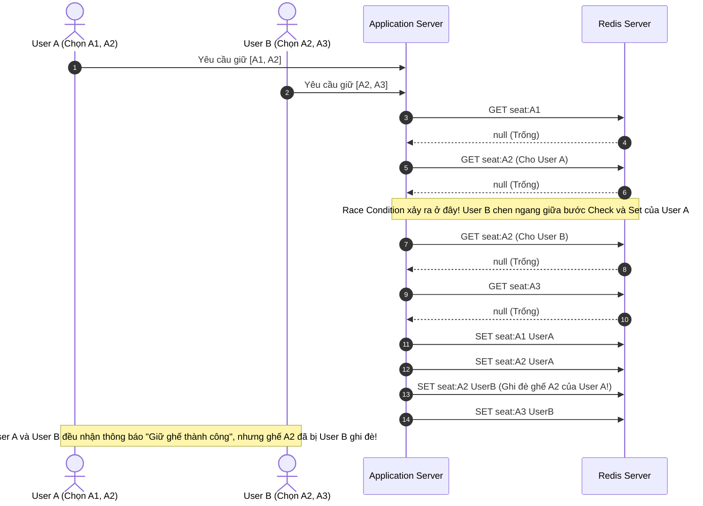

import { Card, Cards } from 'fumadocs-ui/components/card';
import { Callout } from 'fumadocs-ui/components/callout';
import { Step, Steps } from 'fumadocs-ui/components/steps';
import { Tab, Tabs } from 'fumadocs-ui/components/tabs';
import { Zap, ShieldAlert, AlertTriangle, CheckCircle2, Lock, Ticket, RefreshCw, Layers, Database, Code2, Server } from 'lucide-react';

Trong các hệ thống bán vé trực tuyến (Ticket Booking System) cho các sự kiện có lượng truy cập cao, **Seat Holding** là một trong những bài toán khó về **Concurrency Control**. Khi hàng nghìn người dùng đồng thời yêu cầu giữ các cụm ghế trong cùng một thời điểm, việc xử lý thiếu tính nguyên tử (automic) tại Application Layer có thể dẫn đến **Race Condition**, khiến nhiều request cùng xác nhận một ghế và gây ra tình trạng **Overbooking**.

Trong dự án [ticket-online](https://github.com/camdao/ticket-online), cơ chế giữ ghế đã được triển khai bằng **Redis Lua Script**. Bài viết này sẽ phân tích chi tiết lý do tại sao các lệnh Redis cơ bản lại không đủ, mô hình thực thi Lua Script nguyên tử và mã nguồn thực tế trong dự án.

> Để hiểu sâu hơn về lý thuyết nền tảng của Lua Scripting, cú pháp `EVAL`/`EVALSHA`, cùng cơ chế quản lý bộ nhớ Redis, bạn có thể tham khảo bài viết [Redis Lua Scripting](/blogs/redis/redis-lua).

---

## Bài toán Giữ Ghế và Nguy cơ Race Condition

Trong hệ thống đặt vé, khi một người dùng chọn danh sách ghế (ví dụ: ghế `A1`, `A2`, `A3`) cho một suất chiếu (`showId`), hệ thống cần:

1. Kiểm tra toàn bộ ghế trong danh sách để xác định chúng vẫn đang trống và chưa được người dùng khác giữ.
2. Giữ toàn bộ ghế cho userId nếu tất cả ghế đều khả dụng, đồng thời thiết lập TTL (Time To Live), ví dụ 5 phút, để tự động giải phóng ghế khi hết thời gian giữ..
3. Thất bại toàn bộ thao tác nếu chỉ một ghế trong danh sách đã bị người khác giữ. Không được xảy ra trường hợp giữ thành công một phần (All-or-Nothing)..

### Kịch bản thất bại khi dùng lệnh Redis rời rạc

Giả sử ứng dụng Java gọi lần lượt từng command Redis thông qua `RedisTemplate`:

```java
// Kịch bản SAI: Xử lý kiểm tra và ghi rời rạc ở Application Layer
public boolean holdSeatsNaive(List<String> seatKeys, String userId, int ttlSeconds) {
    // Bước 1: Kiểm tra xem có ghế nào đã bị giữ chưa
    for (String key : seatKeys) {
        String holder = redisTemplate.opsForValue().get(key);
        if (holder != null && !holder.equals(userId)) {
            return false; // Ghế đã bị người khác giữ
        }
    }

    // Bước 2: Giữ từng ghế
    for (String key : seatKeys) {
        redisTemplate.opsForValue().set(key, userId, Duration.ofSeconds(ttlSeconds));
    }
    return true;
}
```

Mã nguồn trên gặp phải 2 vấn đề nghiêm trọng:



### Hậu quả

<Cards>

  <Card
    title="Race Condition & Overbooking"
    icon={<ShieldAlert className="text-red-500" />}
  >
    Khoảng thời gian giữa bước kiểm tra trạng thái ghế và bước ghi trạng thái mới tạo cơ hội cho các request đồng thời cùng đọc một trạng thái cũ. Khi nhiều Thread hoặc Instance xử lý request song song, nhiều request có thể cùng xác nhận một ghế đang trống và sau đó cùng thực hiện thao tác giữ, dẫn đến **Race Condition** và **Overbooking**.
  </Card> 

  <Card
    title="Trạng thái dở dang (Partial Hold)"
    icon={<AlertTriangle className="text-amber-500" />}
  >
    Ví dụ User A giữ thành công `A1`, nhưng khi xử lý đến `A2` thì phát hiện ghế đã bị người khác giữ. Hệ thống phải **rollback** thao tác đã thực hiện trên `A1`. Nếu quá trình rollback thất bại do lỗi mạng hoặc service gặp sự cố, `A1` có thể bị giữ lại ngoài ý muốn và trở thành **Orphan Hold**.
  </Card>

  <Card
    title="Network Overhead"
    icon={<Layers className="text-blue-500" />}
  >
    Nếu mỗi ghế được kiểm tra và cập nhật bằng các request Redis riêng biệt, việc đặt nhiều ghế sẽ tạo ra nhiều **network round trips** giữa Application và Redis. Khi số lượng ghế tăng và lưu lượng truy cập cao, overhead này làm tăng latency và giảm throughput của hệ thống.
  </Card>

</Cards>

---
## Giải pháp: Giữ Ghế Nguyên Tử với Lua Script

Redis thực thi Lua Script theo cơ chế **atomic execution**. Trong thời gian một script đang được thực thi, Redis sẽ không xen kẽ các command khác vào giữa các lệnh trong script. Nhờ đó, toàn bộ quá trình kiểm tra và giữ ghế có thể được thực hiện như một thao tác nguyên tử.

Vì Lua Script **không có cơ chế rollback tự động** cho các lệnh ghi đã thực hiện nếu script gặp lỗi giữa chừng, script giữ ghế được thiết kế thành hai giai đoạn:

<Steps>

<Step>

### Giai đoạn 1: Validation — Đọc & Kiểm tra

Duyệt qua toàn bộ Redis Key tương ứng với các ghế trong mảng `KEYS`.

Với mỗi key, script kiểm tra giá trị hiện tại:

- Nếu ghế chưa tồn tại, ghế đang khả dụng.
- Nếu ghế đang thuộc về `userId` khác, script lập tức trả về `0` (**thất bại**) và chưa thực hiện bất kỳ thao tác ghi nào.

</Step>

<Step>

### Giai đoạn 2: Execution — Ghi & Thiết lập TTL

Chỉ khi **tất cả các ghế đều vượt qua validation**, script mới bắt đầu thực hiện thao tác ghi.

Script duyệt lại toàn bộ danh sách và sử dụng `SET` với giá trị `userId` cùng tùy chọn `PX` để thiết lập TTL.

Sau khi tất cả các ghế được ghi thành công, script trả về `1` (**thành công**).

</Step>

</Steps>

#### Chức năng Giữ Ghế (`holdSeats`)

```java
public HoldSeatResult holdSeats(List<Long> seatIds, Long showId, Long userId, int ttlSeconds) {
    List<String> keys = seatIds.stream()
            .map(seatId -> key(showId, seatId))
            .toList();

    RedisScript<Long> HOLD_SEATS = RedisScript.of(
            """
            for i = 1, #KEYS do
                local v = redis.call("GET", KEYS[i])
                if v and v ~= ARGV[1] then
                    return 0
                end
            end
            for i = 1, #KEYS do
                redis.call("SET", KEYS[i], ARGV[1], "PX", ARGV[2])
            end
            return 1
            """,
            Long.class
    );

    Long r = redisTemplate.execute(
            HOLD_SEATS, 
            keys, 
            userId.toString(), 
            String.valueOf(ttlSeconds * 1000)
    );

    if (r == 0) {
        throw new CustomException(ErrorCode.SEAT_ALREADY_HELD);
    }
    return HoldSeatResult.SUCCESS;
}
```
#### Chức năng Giải Phóng Ghế (`releaseSeats`)

Khi người dùng chủ động hủy giữ ghế, hoặc khi ứng dụng cần dọn dẹp trạng thái sau khi đơn hàng thanh toán thành công (hoặc thất bại), hàm `releaseSeats` sẽ được gọi:

```java
public void releaseSeats(Long showId, List<Long> seatIds) {
    if (seatIds == null || seatIds.isEmpty()) {
        return;
    }

    List<String> keys = seatIds.stream()
            .map(seatId -> key(showId, seatId))
            .toList();

    RedisScript<Long> RELEASE_SEATS = RedisScript.of(
            """
            for i = 1, #KEYS do
                redis.call("DEL", KEYS[i])
            end
            return #KEYS
            """,
            Long.class
    );

    redisTemplate.execute(RELEASE_SEATS, keys);
}
```

#### Tại sao `releaseSeats` cũng sử dụng Lua Script?

Mặc dù lệnh `DEL` có thể xóa key, nhưng nếu giải phóng nhiều ghế cùng lúc bằng các lệnh riêng lẻ, việc bọc các thao tác xóa trong một Lua Script giúp:
- Đảm bảo **tất cả các ghế trong danh sách được xóa đồng thời** trong cùng một RTT.
- Tránh tình trạng ứng dụng bị sập giữa chừng khi mới chỉ xóa được 1 phần danh sách ghế.

---

## Tài liệu tham khảo

- [Mã nguồn dự án Ticket Online - RedisSeatScripts.java](https://github.com/camdao/ticket-online/blob/main/src/main/java/com/ticket_online/global/util/RedisSeatScripts.java)
- [Bài viết lý thuyết Redis Lua Scripting](/blogs/redis/redis-lua)
